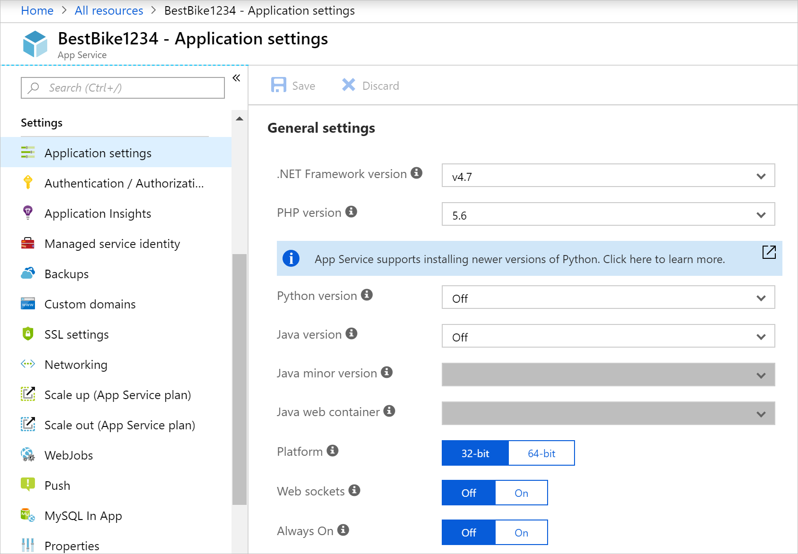
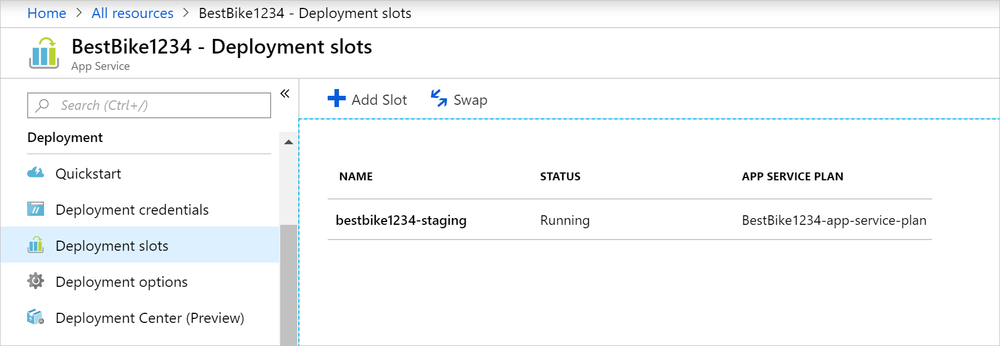
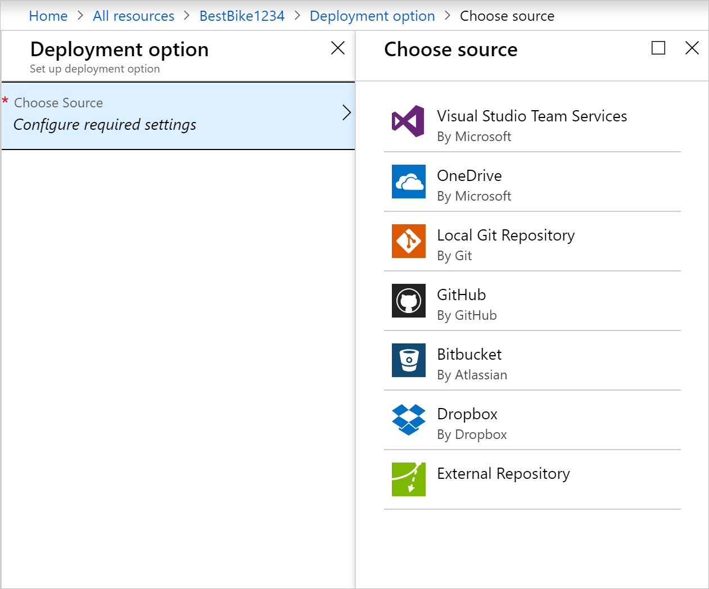

Here, you'll learn how to create an Azure App Service web app using the Azure portal.

## Why use the Azure portal?

The first step in hosting your web application is to create a web app (an App Service app) inside your Azure subscription.

There are several ways you can create a web app. You can use the Azure portal, the Azure CLI, a script, or an IDE.

Here, we are going to use the portal because it's a graphical experience, which makes it a great learning tool. The portal helps you discover available features, add additional resources, and customize existing resources.

## What is Azure App Service?

Azure App Service is a fully managed computing platform within the Azure environment that is optimized for hosting web apps, REST APIs, and mobile back ends.

This platform as a service (PaaS) offered by Microsoft Azure allows you to focus on the build side of things while Azure takes care of the infrastructure to run and scale your applications.

## How to create a web app

When it's time to host your own app, you visit the Azure portal and create a **Web App**. By creating a **Web App** in the Azure portal, you are actually creating a set of hosting resources in App Service, which you can use to host any web-based application that is supported by Azure, whether it be ASP.NET Core, Node.js, PHP, etc. The figure below shows how easy it is to configure the framework/language used by the app.

The Azure portal provides a template to create a web app. This template requires the following fields:

- **App name**: The name of the web app.
- **Subscription**: A valid and active subscription.
- **Resource group**: A valid resource group. The sections below explain in detail what a resource group is.
- **OS**: The operating system. The options are: Windows, Linux, and Docker containers. On Windows, you can host any type of application from a variety of technologies. The same applies to Linux hosting, though on Linux, any ASP.NET apps must be ASP.Net Core on the .NET Core framework. The final option is Docker containers, where you can deploy your containers directly over containers hosted and maintained by Azure. 
- **App Service plan/location**: A valid Azure App Service plan. The sections below explain in detail what an App Service plan is.
- **Applications Insights**: You can turn on the Azure Application Insights option and benefit from the monitoring and metric tools that the Azure portal offers to help you keep an eye on the performance of your apps.

The Azure portal gives you the upper hand in managing, monitoring, and controlling your web app through the many available tools.

### Deployment slots

Using the Azure portal, you can easily add **deployment slots** to an App Service web app. For instance, you can create a **staging** deployment slot where you can push your code to test on Azure. Once you are happy with your code, you can easily **swap** the staging deployment slot with the production slot. You do all this with a few simple mouse clicks in the Azure portal.

### Continuous integration/deployment support

The Azure portal provides out-of-the-box continuous integration and deployment with Visual Studio Team Services, GitHub, Bitbucket, Dropbox, OneDrive, or a local Git repository on your development machine. You connect your web app with any of the above sources and App Service will do the rest for you by auto-syncing code and any future changes on the code into the web app. Furthermore, with Visual Studio Team Services, you can define your own build and release process that ends up compiling your source code, running the tests, building a release, and finally pushing the release into a web app every time you commit the code. All that happens implicitly without any need to intervene.

### Integrated Visual Studio publishing and FTP publishing

In addition to being able to set up continuous integration/deployment for your web app, you can always benefit from the tight integration with Visual Studio to publish your web app to Azure via Web Deploy technology. Also, Azure supports FTP, although you are better off not using FTP for publishing because it lacks some capability in Web Deploy to pick and choose only those files that were changed or added, and not just publish everything to Azure!

### Built-in auto scale support (automatic scale-out based on real-world load)

Baked into the web app is the ability to scale up/down or scale out. Depending on the usage of the web app, you can scale your app up/down by increasing/decreasing the resources of the underlying machine that is hosting your web app. Resources can be number of cores or the amount of RAM available.

Scaling out, on the other hand, is the ability to increase the number of machine instances that are running your web app.

## What is a resource group?

A resource group is a method of grouping interdependent resources and services such as virtual machines, web apps, databases, and more for a given application and environment. Think of it as a **folder**, a place to group elements of your app.

Resource groups allow you to easily manage and delete resources. They also provide a way to monitor, control access, provision, and manage billing for collections of resources that are required to run an application or are used by a client.

## What is an App Service plan?

An App Service plan is a set of physical resources and capacity available to deploy your App Service apps into.

The Azure portal provides a template to create a new App Service plan. This template requires the following basic information:

- Region (West US, Central US, North Europe, etc.)
- Scale count (one, two, three instances, etc.)
- Instance size (Small, Medium, or Large)
- SKU, or pricing tier (Free, Shared, Basic, Standard, Premium, PremiumV2, and Isolated)

Web apps, mobile apps, and API apps hosted in Azure App Service, as well as Azure Functions, all run in an App Service plan. While you can deploy an unlimited number of applications into an App Service plan, the number you use greatly depends on the types of applications deployed and their required resources in CPU utilization.

You can always use your App Service plan in the Azure portal to visualize your CPU and memory utilization to help determine your needs for scaling or moving applications into another App Service plan.
