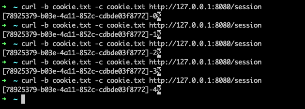

In this unit, add Spring Session to your existing Spring Boot application to store HTTP session data in Azure Cache for Redis.

## Configure Spring Session

1. To add Spring Session support to your application, add the following dependency in the `<dependencies>` section of your *pom.xml* file:

   ```xml
   <dependency>
       <groupId>org.springframework.session</groupId>
       <artifactId>spring-session-data-redis</artifactId>
   </dependency>
   ```

1. To configure Spring Session to use Redis for session replication, add the following line to the *src/main/resources/application.properties* file:

   ```yaml
   spring.session.store-type=redis
   ```

## Add a new controller to test session replication

Add a new Spring MVC REST controller to your application to use for testing session replication.

1. Create a new controller called *SessionReplicationController* next to *TodoController*.

   ```java
   package com.example.demo;
   
   import org.springframework.context.annotation.Bean;
   import org.springframework.session.data.redis.config.ConfigureRedisAction;
   import org.springframework.web.bind.annotation.GetMapping;
   import org.springframework.web.bind.annotation.RequestMapping;
   import org.springframework.web.bind.annotation.RestController;
   
   import javax.servlet.http.HttpSession;
   
   @RestController
   @RequestMapping("/")
   public class SessionReplicationController {
   
       @Bean
       public static ConfigureRedisAction configureRedisAction() {
           return ConfigureRedisAction.NO_OP;
       }
   
       @GetMapping("/session")
       public String session(HttpSession session) {
           Integer test = (Integer) session.getAttribute("test");
           if (test == null) {
               test = 0;
           } else {
               test++;
           }
           session.setAttribute("test", test);
           return "[" + session.getId() + "]-" + test;
       }
   }
   ```

   > [!NOTE]
   > You configure a specific `ConfigureRedisAction.NO_OP` Spring bean because by default, Spring Session tries to set up [Redis keyspace notifications](https://redis.io/topics/notifications), which won't work on secured Azure Cache for Redis instances. If you need keyspace notifications for Azure Cache for Redis, you must apply them manually through the Redis CLI.
   >
   > Keyspace notifications are useful for WebSockets, but they consume more resources. The current scenario doesn't use WebSockets and shouldn't enable keyspace notifications.

1. Restart your application to benefit from HTTP session replication.

## Test session replication

HTTP sessions are user-specific and are maintained through a cookie. You can use either of the following methods to test whether sessions are working correctly:

- Point your browser to `http://localhost:8080/session` and reload the page several times.
- Run the following command line several times:

  ```bash
  curl -b cookie.txt -c cookie.txt http://127.0.0.1:8080/session
  ```
  
  The preceding command saves your cookie in a file called *cookie.txt*.

Either method produces output that displays your HTTP session ID with a number that increments after each request, as shown in the following example:



To check whether sessions are persisted correctly, restart your server and verify that your session data isn't lost.

In the next unit, you deploy your application to the cloud, and cluster HTTP sessions between your local machine and the cloud service.
