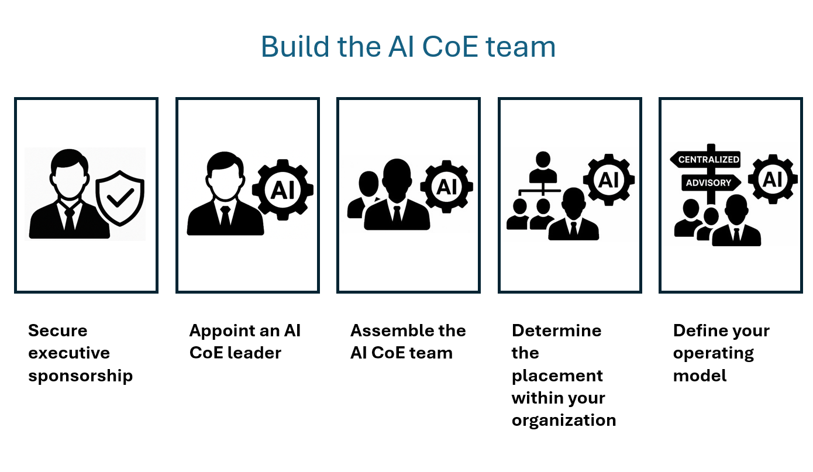

An AI Center of Excellence (CoE) fosters broad adoption of AI by driving organizational and technical readiness. Organizational readiness takes into account use case prioritization, skilling, change management, and solution adoption. Technical readiness takes into account the platform, data, infrastructure, Trustworthy AI, and genAI ops. It's a strategic hub within an organization for AI strategy and governance to standardize and facilitate solution teams who are implementing solutions. This team establishes best practices, reusable frameworks, and standardized tools
that accelerate AI development while ensuring compliance, transparency, and value alignment. By centralizing knowledge, fostering innovation, and promoting responsible experimentation, the CoE acts as both a catalyst and a safeguard, enabling teams to deploy AI solutions efficiently and ethically across diverse domains.

### How an AI Center of Excellence (CoE) can support AI agent projects

An AI CoE can support agent projects in the following ways:

- Promotes consistency and quality in AI agent development
- Facilitates knowledge sharing and reuse of components
- Ensures alignment with enterprise goals and compliance standards
- Accelerates adoption through standardized frameworks and onboarding
- Monitors performance to guide continuous improvement and investment

### Building the AI CoE team

An AI CoE team helps ensure consistent AI adoption across your organization. The CoE brings together cross-functional expertise including data scientists, engineers, business leaders, and ethicists. To be effective, the AI CoE needs the right leadership, expertise, and organizational alignment. To build your team, follow these steps:

1. **Secure executive sponsorship** Executive sponsorship provides the budget, authority, and organizational     credibility that the AI CoE needs to succeed.
1. **Appoint an AI CoE leader** Assign a dedicated leader who drives AI initiatives and acts as the single point of contact for AI strategy implementation.
1. **Assemble the AI CoE team** Build a multidisciplinary team that has advanced skills to support enterprise AI adoption.
1. **Determine the placement within your organization** Proper organizational alignment ensures effective collaboration with existing teams and access to resources.
1. **Define your operating model** Companies at an early stage of their AI journey benefit from a centralized CoE to consolidate expertise and foundational practices. As your AI adoption matures, you should move towards an advisory approach to provide more flexibility.
