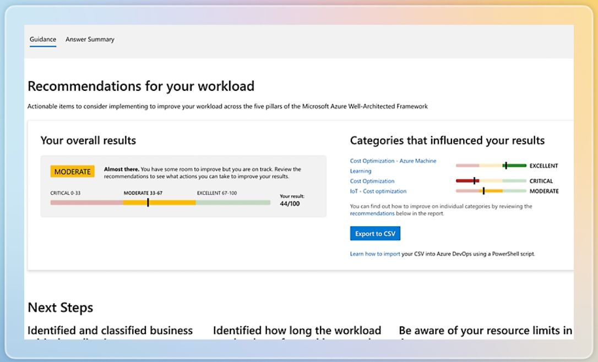

*"FinOps is an operational framework and cultural practice, which maximizes the business value of cloud and technology, enables timely data-driven decision making, and creates financial accountability through collaboration between engineering, finance, and business teams"* - FinOps Foundation Technical Advisory Council.

Created by The FinOps Foundation, the FinOps Framework helps organizations to enhance the cost-effectiveness of AI agents by embedding financial accountability and operational transparency into their lifecycle, from development to deployment and scaling. It enables cross-functional teams (engineering, data science, finance, and product) to collaborate on cost tracking, usage optimization, and value alignment. By applying capabilities, such as cost allocation, budget forecasting, and performance-to-cost benchmarking, organizations can identify underutilized models, right-size compute resources, and prioritize lightweight, modular architectures over monolithic ones. This not only reduces cloud spend and technical debt but also ensures that AI agents deliver measurable ROI while remaining scalable and sustainable.

### Some ways FinOps can support AI agent projects

- Provides visibility into AI agent costs
- Enables cost-efficient scaling and resource allocation
- Supports financial accountability across teams
- Identifies cost optimization opportunities through usage analysis
- Aligns AI investments with business value metrics

FinOps for AI is identified as a scope of the FinOps Framework, exploring the alignment of FinOps capabilities and AI workloads. This allows FinOps practitioners to prioritize the most relevant capabilities, such as cost data ingestion, cost allocation, anomaly management, etc., and apply them through the lens of AI resource characteristics and tooling. For organizations without an established FinOps practice, AI agents may be the catalyst for implementing a more
structured approach to cost management, which can then expand across other cloud, SaaS and data center environments.
