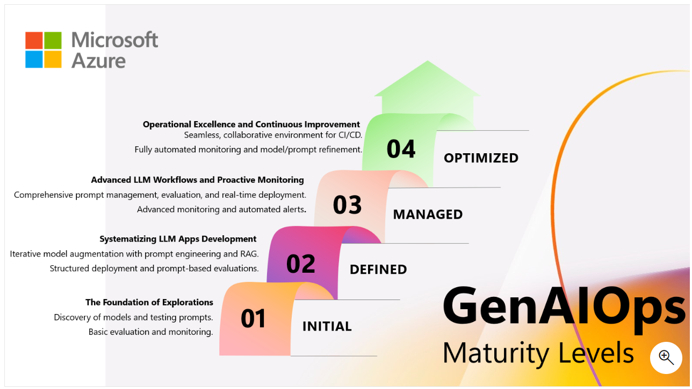

Generative Artificial Intelligence Operations, or GenAI Ops (sometimes
called LLMOps), describes the operational practices and strategies for
managing large language model (LLM) based applications in production.
This framework adapts traditional MLOps principles to the unique demands
of generative AI agents, including prompt engineering, agent
orchestration, and human-AI interaction.

Some ways GenAI Ops can support AI agent projects

- Ensures operational reliability and ethical compliance
- Supports continuous monitoring, retraining, and versioning
- Enables scalable deployment and governance of GenAI models
- Standardizes workflows for prompt engineering and model release
- Promotes agility through modular architectures and reusable components

## GenAI Ops maturity levels

These are the four GenAI Ops maturity levels, with suggested steps to
move to the next level.

### Level 1 - Initial

Your organization is at the initial foundational stage of GenAIOps
maturity. You're exploring the capabilities of LLMs but haven't yet
developed structured practices or systematic approaches.

Begin by familiarizing yourself with different LLM APIs and their
capabilities. Next, start experimenting with structured prompt design
and basic prompt engineering.

### Level 2 - Defined

Your organization has started to systematize LLM operations, with a
focus on structured development and experimentation. You have
implemented safety guardrails and content filtering with manual
evaluations, to minimize fabrications and apply RAI best practices.
However, there's room for more sophisticated integration and
optimization.

To improve your capabilities and skills, learn how to develop more
complex prompts and begin integrating them effectively into
applications.

### Level 3 - Managed

Your organization is managing advanced LLM workflows with proactive
monitoring, evaluation pipelines with built-in and/or custom evaluators,
and structured deployment strategies. You're close to achieving
operational excellence.

To expand your base knowledge, focus on continuous improvement and
innovation in your LLM applications.

### Level 4 - Optimized

Your organization demonstrates operational excellence in GenAIOps. You
have a sophisticated approach to LLM application development,
deployment, safety, security, and monitoring.

As LLMs evolve, you want to maintain your cutting-edge position by
staying updated with the latest LLM advancements.
