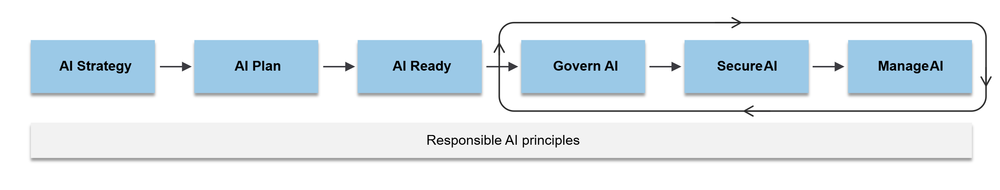

The Cloud Adoption Framework (CAF) provides a structured process for adopting AI solutions in Azure. This framework outlines clear steps, many of which apply to Microsoft Copilot adoption.

The Microsoft Cloud Adoption Framework (CAF) provides a structured approach to cloud transformation, and it plays a critical role in guiding successful Microsoft Copilot deployments. By aligning Copilot adoption with CAF's phases of Strategy, Plan, Ready, Govern, Secure, and Manage, organizations can ensure that AI integration supports business
goals, maintains compliance, and delivers measurable value.

The CAF AI adoption process supports organizations ranging from large enterprises to startups. You learn how to identify AI use cases, select appropriate AI solutions, and build effective AI workloads. The guidance
also covers operational processes required for governance, management, and security of AI implementations.

Some ways CAF can support AI agent projects

- Aligns AI agent initiatives with organizational strategy
- Supports change management and stakeholder engagement
- Establishes governance and risk mitigation practices
- Provides structured guidance for cloud readiness and AI workload
  planning
- Enables consistent architecture and deployment practices

## AI checklists

Use these AI checklists as a practical roadmap for adopting and managing AI. The enterprise checklist equips your organization to scale AI effectively. The startup checklist helps you quickly move toward production while adopting governance, management, and security best practices.

|AI adoption step  |Applicable AI technology  |Startup checklist  |Enterprise checklist  |
|-----------------|-------------------|--------------------|-------------------------------|
|AI Strategy     |Copilots; Azure         | Define an AI technology strategy| Identify AI use cases; Define an AI technology strategy; Develop an AI data strategy; Develop a responsible AI strategy|
|AI Plan     |Copilots; Azure          | Access AI resources; Establish responsible AI         | Assess AI skills; Acquire AI skills; Access AI resources; Prioritize AI use cases; Create an AI proof of concept; Establish responsible AI; Estimate delivery timelines|
|AI Ready     |Azure         | Build an AI environment; Choose an architecture| Establish AI governance; Establish AI connectivity; Establish AI reliability; Establish an AI foundation; Choose an architecture; Use AI design areas|
|Govern AI     |Copilots; Azure         | Enforce AI governance policies| Assess AI organizational risks; Document AI governance policies; Enforce AI policies; Monitor AI organizational risks|
|Manage AI     |Copilots; Azure         | Manage AI models; Manage AI costs| Manage AI operations; Manage AI deployment; Manage AI models; Manage AI costs; Manage AI data; Manage AI business continuity|
|Secure AI     |Copilots; Azure         | Protect AI resources and data| Discover AI security risks; Protect AI resources and data; Detect AI security threats|
