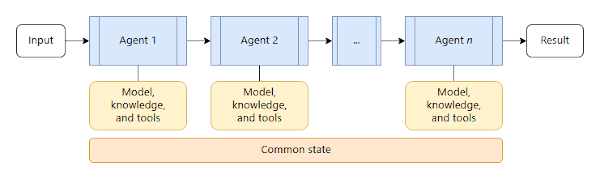
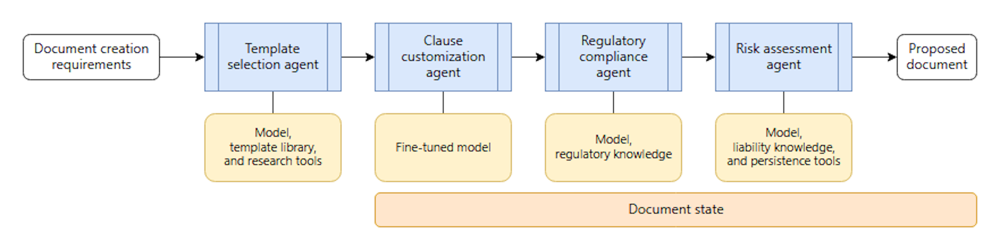

The sequential orchestration pattern chains AI agents in a predefined, linear order. Each agent processes the output from the previous agent in the sequence, which creates a pipeline of specialized transformations. The choice of which agent gets invoked next is deterministically defined as part of the workflow. This choice isn't delegated to agents in the process.

An example of sequential orchestration might be a legal firm's document management process. The legal firm needs to have a sequence performed when generating contracts. This might be approached by having an intelligent application use a pipeline of four specialized agents where each agent works with the complete output from the previous stage.

1. The _template selection agent_ receives client specifications, like contract type, jurisdiction, and parties involved, and selects the appropriate base template from the firm's library.
1. The _clause customization agent_ takes the selected template and modifies standard clauses based on negotiated business terms, including payment schedules and liability limitations.
1. The _regulatory compliance agent_ reviews the customized contract against applicable laws and industry-specific regulations.
1. The _risk assessment agent_ performs comprehensive analysis of the complete contract. It evaluates liability exposure and dispute resolution mechanisms while providing risk ratings and protective language recommendations.

You should consider implementing the sequential orchestration pattern in the following scenarios:

- Multistage processes that have clear linear dependencies and predictable workflow progression
- Data transformation pipelines, where each stage adds specific value that the next stage depends on
- Workflow stages that can't be parallelized
- Progressive refinement requirements, such as draft, review, polish workflows
- Systems where you understand the availability and performance characteristics of every AI agent in the pipeline, and where failures or delays in one AI agent's processing are tolerable for the overall task to be accomplished

You should avoid the sequential orchestration pattern in the following scenarios:

- Stages are embarrassingly parallel. You can parallelize them without compromising quality or creating shared state contention
- Processes that include only a few stages that a single AI agent can accomplish effectively
- Early stages might fail or produce low-quality output, and there's no reasonable way to prevent later steps from processing by using accumulated error output
- AI agents need to collaborate rather than hand off work
- The workflow requires backtracking or iteration
- You need dynamic routing based on intermediate results
