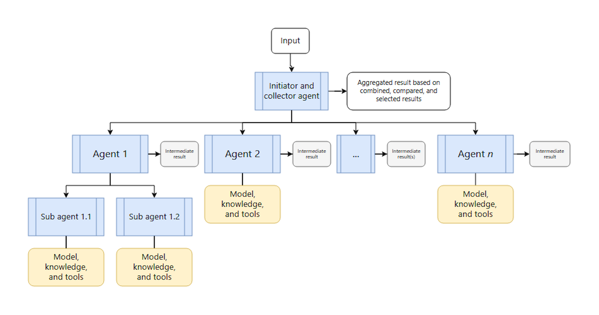
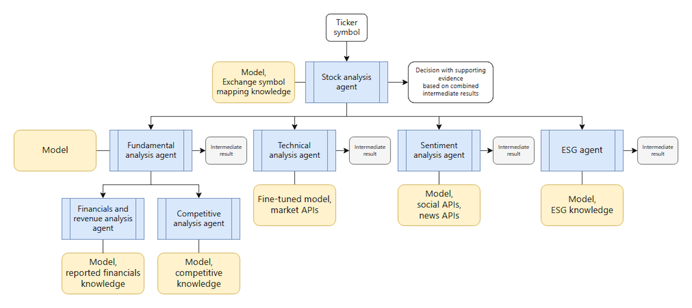

The concurrent orchestration pattern is appropriate when you need multiple AI agents to run simultaneously on the same task. You choose this approach when each agent needs to provide independent analysis or processing from its unique perspective or specialization.

The concurrent orchestration pattern has all agents work in parallel. Each agent can independently produce its own results within the workload, such as invoking tools to accomplish tasks or updating different data stores in parallel. Agents operate independently and don't hand off results to each other. An agent might invoke extra AI agents by using its own orchestration approach as part of its independent processing. The available agents must know which agents are available for processing. This pattern supports both deterministic calls to all registered agents and dynamic selection of which agents to invoke based on the task requirements.

An example of concurrent orchestration is a financial services firm that needs an intelligent application that uses concurrent agents that specialize in different types of analysis to evaluate the same stock simultaneously. Each agent contributes insights from its specialized perspective.

The system processes stock analysis requests by dispatching the same ticker symbol to four specialized agents that run in parallel.

- The fundamental analysis agent evaluates financial statements, revenue trends, and competitive positioning to assess intrinsic value.
- The technical analysis agent examines price patterns, volume indicators, and momentum signals to identify trading opportunities.
- The sentiment analysis agent processes news articles, social media mentions, and analyst reports to gauge market sentiment and investor confidence.
- The environmental, social, and governance (ESG) agent reviews environmental impact, social responsibility, and governance practice reports to evaluate sustainability risks and opportunities.
- These independent results are then combined into a comprehensive investment recommendation, which enables portfolio managers to make informed decisions quickly.

The concurrent orchestration pattern is appropriate in the following scenarios:

- Tasks that you can run in parallel, either by using a fixed set of agents or by dynamically choosing AI agents based on specific task requirements
- Tasks that benefit from multiple independent perspectives or different specializations, such as technical, business, and creative approaches, that can all contribute to the same problem. This collaboration typically occurs in scenarios that feature the following multi-agent decision-making techniques: Brainstorming, ensemble reasoning, quorum and voting-based decisions
- Time-sensitive scenarios where parallel processing reduces latency

You should avoid this orchestration pattern in the following scenarios:

- Agents need to build on each other's work or require cumulative context in a specific sequence
- The task requires a specific order of operations or deterministic, reproducible results from running in a defined sequence
- Resource constraints, such as model quota, make parallel processing inefficient or impossible
- Agents can't reliably coordinate changes to shared state or external systems while running simultaneously
- There's no clear conflict resolution strategy to handle contradictory or conflicting results from each agent
- Result aggregation logic is too complex or lowers the quality of the results
