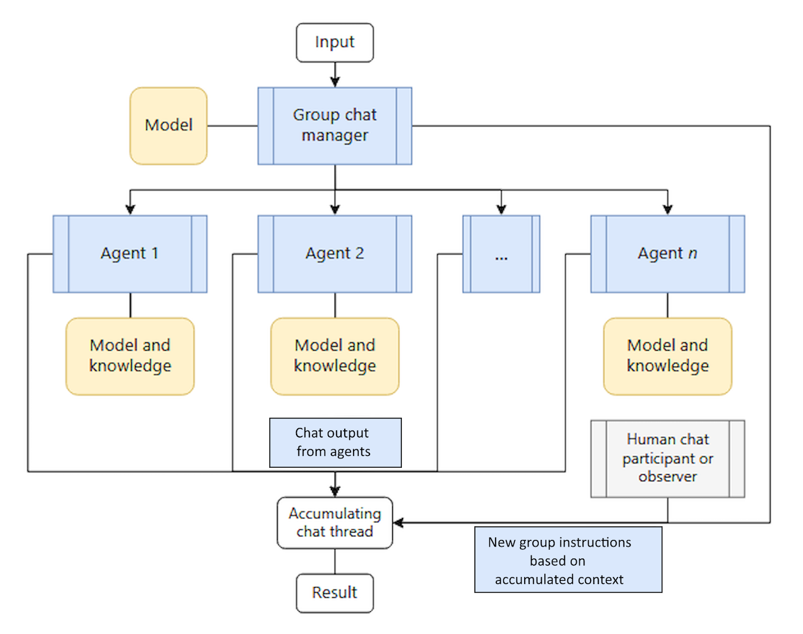

The group chat orchestration pattern enables multiple agents to solve problems, make decisions, or validate work by participating in a shared conversation thread where the agents collaborate through discussion. A chat manager coordinates the flow by determining which agents can respond next and by managing different interaction modes, from collaborative brainstorming to structured quality gates.

This pattern addresses scenarios that are best accomplished through group discussion to reach decisions. These scenarios might include collaborative ideation, structured validation, or quality control processes. The pattern supports various interaction modes, from free-flowing brainstorming to formal review workflows that have fixed roles and approval gates.

This pattern works well for human-in-the-loop scenarios where humans can optionally take on dynamic chat manager responsibilities and guide conversations toward productive outcomes. In this orchestration pattern, agents are typically in a _read-only_ mode. They don't use tools to make changes in running systems.

The maker-checker loop is a specific type of group chat orchestration where one agent, the _maker_, creates or proposes something. Another agent, the _checker_, provides a critique of the result. This pattern is iterative, with the checker agent pushing the conversation back to the maker agent to make updates and repeat the process. Although the group chat pattern doesn't require agents to _take turns_ chatting, the maker-checker loop requires a formal turn-based sequence that the chat manager drives.

An example of where the group chat orchestration pattern is appropriate is a city parks and recreation department that needs to evaluate new park development proposals. The software reads the draft proposal, and multiple specialist agents perform a hypothetical debate with agents representing different community impact perspectives. This simulation process occurs before the proposal opens for community review to help anticipate the feedback that it might receive.

Each agent may have the following approach:

- The _community engagement agent_ evaluates accessibility requirements, anticipated resident feedback, and usage patterns to ensure equitable community access
- The _environmental planning agent_ assesses ecological impact, sustainability measures, native vegetation displacement, and compliance with environmental regulations
- The _budget and operations agent_ analyzes construction costs, ongoing maintenance expenses, staffing requirements, and long-term operational sustainability
- The chat manager facilitates structured debate where agents challenge each other's recommendations and defend their reasoning. A parks department employee participates in the chat thread to add insight and respond to agents' knowledge requests in real time. This process enables the employee to update the original proposal to address identified concerns and better prepare for community feedback

Consider group chat orchestration when your scenario can be solved through spontaneous or guided collaboration or iterative maker-checker loops. All of these approaches support real-time human oversight or participation. Because all agents and humans in the loop emit output into a single accumulating thread, this pattern provides transparency and auditability. It's useful in the following scenarios:

- Creative brainstorming sessions where agents that have different perspectives and knowledge sources build on each other's contributions to the chat
- Decision-making processes that benefit from debate and consensus-building
- Decision-making scenarios that require iterative refinement through discussion
- Multidisciplinary problems that require cross-functional dialogue
- Quality assurance requirements that involve structured review processes and iteration
- Compliance and regulatory validation that requires multiple expert perspectives
- Content creation workflows that require editorial review with a clear separation of concerns between creation and validation

This agent orchestration pattern is inappropriate in the following scenarios:

- Simple task delegation or linear pipeline processing is sufficient.
- Real-time processing requirements make discussion overhead unacceptable.
- Clear hierarchical decision-making or deterministic workflows without discussion are more appropriate.
- The chat manager has no objective way to determine whether the task is complete.
- To maintain effective control, consider limiting group chat orchestration to three or fewer agents.