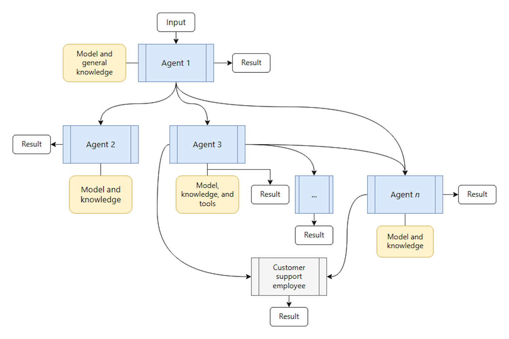
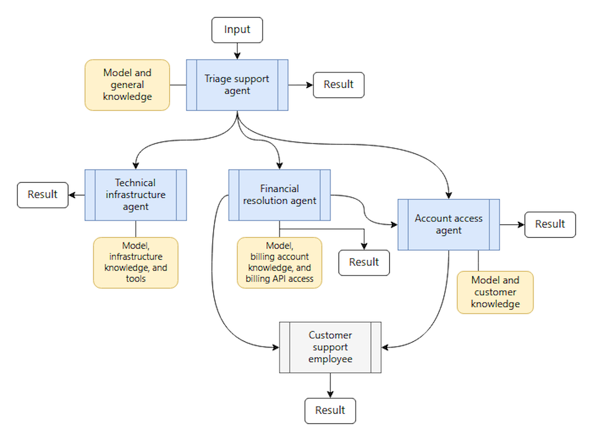

The handoff orchestration pattern enables dynamic delegation of tasks between specialized agents. Each agent can assess the task at hand and decide whether to handle it directly or transfer it to a more appropriate agent based on the context and requirements.

The handoff orchestration pattern addresses scenarios where:

- The optimal agent for a task isn't known upfront
- Where the task requirements become clear only during processing

The handoff orchestration pattern enables intelligent routing and ensures that tasks reach the most capable agent. Agents in this pattern don't typically work in parallel. Full control transfers from one agent to another agent.

An example of where it's appropriate to implement the agent handoff orchestration pattern is with a  customer support web portal. An initial agent begins helping customers but discovers that it needs specialized expertise during the conversation. The initial agent passes the task to the most appropriate agent to address the customer's concern. Only one agent at a time operates on the original input, and the handoff chain results in a single result.

In this system, the _triage support agent_ interprets the request and tries to handle common problems directly. When it reaches its limits, it hands network problems to a _technical infrastructure agent_, billing disputes to a _financial resolution agent_, and so on. Further handoffs occur within those agents when the current agent recognizes its own capability limits and knows another agent can better support the scenario.

Each agent is capable of completing the conversation if it determines that customer success has been achieved or that no other agent can further benefit the customer. Some agents are also designed to hand off the user experience to a human support agent when the problem is important to solve but no AI agent currently has the capabilities to address it.

Consider the agent handoff pattern in the following scenarios:

- Tasks that require specialized knowledge or tools, but where the number of agents needed or their order can't be predetermined
- Scenarios where expertise requirements emerge during processing, resulting in dynamic task routing based on content analysis
- Multiple-domain problems that require different specialists who operate one at a time
- Logical relationships and signals that you can predetermine to indicate when one agent reaches its capability limit and which agent should handle the task next

Don't consider the agent handoff pattern if:

- The appropriate agents and their order are always known upfront
- Task routing is simple and deterministically rule-based, not based on dynamic context window or dynamic interpretation
- Suboptimal routing decisions might lead to a poor or frustrating user experience
- Multiple operations should run concurrently to address the task
- Avoiding an infinite handoff loop or avoiding excessive bouncing between agents is challenging
