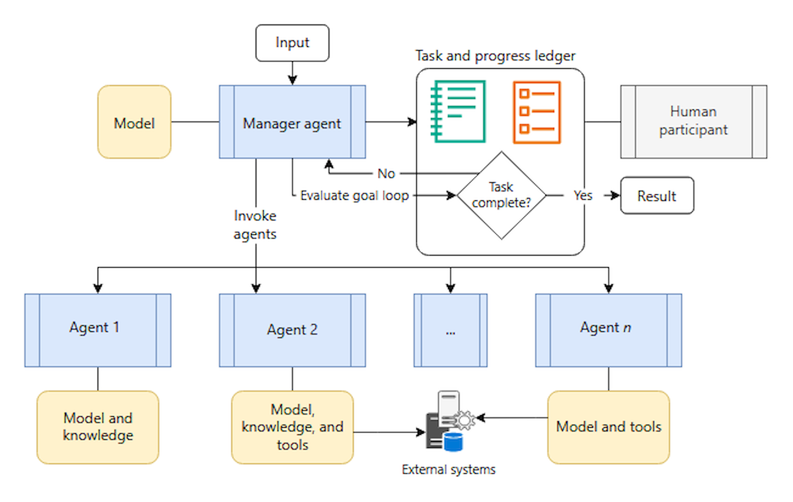
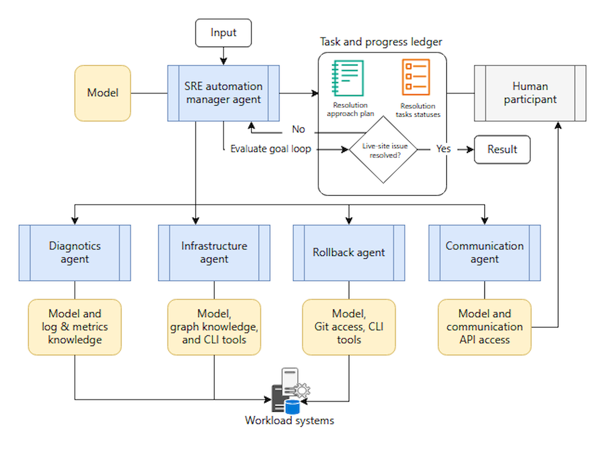

The magentic orchestration pattern is designed for open-ended and complex problems that don't have a predetermined plan of approach. Agents in this pattern typically have tools that allow them to make direct changes in external systems. The focus is as much on building and documenting the approach to solve the problem as it is on implementing that approach. The task list is dynamically built and refined as part of the workflow through collaboration between specialized agents and a magentic manager agent. As the context evolves, the magentic manager agent builds a task ledger to develop the approach plan with goals and subgoals, which is eventually finalized, followed, and tracked to complete the desired outcome.

The manager agent communicates directly with specialized agents to gather information as it builds and refines the task ledger. It iterates, backtracks, and delegates as many times as needed to build a complete plan that it can successfully carry out. The manager agent frequently evaluates whether the original request is fully satisfied or stalled. It updates the ledger to adjust the plan.

An example of where magnetic orchestration would be used as a pattern is in an application that handles low-risk incident response scenarios for a site reliability engineering (SRE) team. In this example, when a service outage occurs within the scope of the automation, the system must dynamically create and implement a remediation plan. The system must be able to do this without knowing the specific steps needed to implement the remediation at the start.

When the automation detects a qualifying incident, the _magentic manager agent_ begins by creating an initial task ledger with high-level goals such as restoring service availability and identifying the root cause. The manager agent then consults with specialized agents to gather information and refine the remediation plan.

1. The _diagnostics agent_ analyzes system logs, performance metrics, and error patterns to identify potential causes. It reports findings back to the manager agent
1. Based on diagnostic results, the manager agent updates the task ledger with specific investigation steps and consults the _infrastructure agent_ to understand current system state and available recovery options
1. The _communication agent_ provides stakeholder notification capabilities, and the manager agent incorporates communication checkpoints and approval gates into the evolving plan according to the SRE team's escalation procedures
1. As the scenario becomes clearer, the manager agent might add the _rollback agent_ to the plan if deployment reversion is needed, or escalate to human SRE engineers if the incident exceeds the automation's scope

Throughout this process, the manager agent continuously refines the task ledger based on new information. It adds, removes, or reorders tasks as the incident evolves. For example, if the diagnostics agent discovers a database connection problem, the manager agent might switch the entire plan from a deployment rollback strategy to a plan that focuses on restoring database connectivity.

The manager agent might watch for excessive stalls in restoring service and guards against infinite remediation loops. It maintains a complete audit trail of the evolving plan and the implementation steps, which provides transparency for post-incident review. This transparency ensures that the SRE team can improve both the workload and the automation based on lessons learned.

The magnetic orchestration pattern is appropriate in the following scenarios:

- A complex or open-ended use case that has no predetermined solution path.
- A requirement to consider input and feedback from multiple specialized agents to develop a valid solution path.
- A requirement for the AI system to generate a fully developed plan of approach that a human can review before or after implementation.
- Agents equipped with tools that interact with external systems, consume external resources, or can induce changes in running systems. A documented plan that shows how those agents are sequenced can be presented to a user before allowing the agents to follow the tasks.

You should avoid using the magnetic orchestration pattern when:

- The solution path is developed or should be approached in a deterministic way
- There's no requirement to produce a ledger
- The task has low complexity and a simpler pattern can solve it
- The work is time-sensitive, as the pattern focuses on building and debating viable plans, not optimizing for end results
- You anticipate frequent stalls or infinite loops that don't have a clear path to resolution
