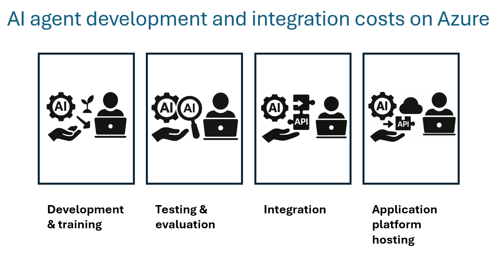

Building and deploying AI agents involves multiple cost centers beyond model selection. To maximize ROI and ensure long-term scalability, organizations must account for development, testing, integration, and hosting expenses. This unit breaks down each stage with actionable guidance.

## Model development and customization

Model development is one of the most resource-intensive phases. Costs are driven by compute usage, orchestration complexity, and model selection.

### Key cost drivers

|**Factor**            | **Description**                                    |
|----------------------|----------------------------------------------------|
|**Compute type**      | GPU-optimized VMs (for example, ND-series) for training and fine-tuning.|
|**Environment tools** | Azure Machine Learning, CycleCloud, or Databricks for batch scheduling.|
|**Model selection**   | Smaller models (for example, Phi, Hugging Face) reduce customization time and cost.|
|**Transient  usage**  | Use spot instances or serverless compute for interruptible workloads.|
|**Benchmarking**      | Model benchmark feature in Azure AI Foundry enables  model comparison to optimize cost-performance.|

### Strategic considerations to improve cost efficiency

- Use application platform for AI workloads on Azure for orchestrated training with batch endpoints.
- Benchmark models via Azure AI Foundry to avoid over-provisioning.
- Avoid full-time GPU usage unless necessary.

## Testing and evaluation

Testing ensures model reliability, performance, and alignment with business goals, but it also incurs costs. Testing includes A/B experimentation, telemetry, and performance benchmarking.

### Key cost drivers

 |  **Factor**          |   **Description**                               |
 |----------------------|------------------------------------------------|
 |**Experimentation tools** | MLflow, Azure AI Foundry |
 |**Telemetry and monitoring** | Azure Monitor, App Insights, and logging infrastructure |
 |**Evaluation pipelines**     | Batch endpoints and traffic mirroring for robust testing |

### Strategic considerations to improve cost efficiency

- Use MLflow for reproducibility and collaborative evaluation.
- Leverage Azure AI Foundry SDK to run local or cloud-based evaluations on small sets of test data.
- Monitor inference latency and throughput to avoid noisy neighbor effects.

## Integration with other systems or APIs

AI agents rarely operate in isolation. Integration with enterprise systems, APIs, and data platforms introduces additional complexity and cost. You can add integration with agent tools including Model Context Protocol (MCP) Server tools in Visual Studio Code. MCP is an open
standard that defines how applications provide tools for LLMs, and the servers are maintained by developers and organizations.

### Key cost drivers

 | **Factor**             | **Description**                                |
 | -----------------------| -----------------------------------------------|
 | **API Gateway usage**  | Secure endpoints behind Azure API Management or Application Gateway |
 | **Authentication and security** | Azure Key Vault, Microsoft Entra ID, RBAC |
 | **Data connectivity**  | Private networking, VNet peering, and regional compliance |
 | **Orchestration layer** | Microsoft Agent Framework, LangChain, or Semantic Kernel for workflow automation |

### Strategic considerations to improve cost efficiency

- Treat AI APIs as microservices with independent lifecycles.
- Use containerized endpoints with traceability and tagging.
- Centralize model hosting to enable chargeback and governance.
- Microsoft Agent Framework is an open-source SDK and runtime designed to let developers build, deploy, and manage sophisticated multi-agent systems with ease.

## Application platform hosting

Hosting determines scalability, reliability, and operational overhead. Azure offers multiple options based on workload type.

### Hosting scenarios

|**Scenario**      | **Recommended platform**      | **Cost strategy** |
|------------------|------------------------------|----------------------|
|**EDA and prototyping**        | Azure Machine Learning compute instances, Azure Databricks   | Transient usage, team-level sharing|
|**Training and tuning**   | Azure ML in Azure AI Foundry, CycleCloud | Batch orchestration, spot pricing|
|**Batch inference**           | Azure Machine Learning batch endpoints, Synapse, Databricks     | Parallelization,  isolated compute|
|**Online  inference**         | Azure AI Foundry Models, Azure Machine Learning managed endpoints | Elastic scaling, quota-aware design|
|**Self-hosting**  | AKS or IaaS (Data Science Virtual Machine)    | Predictable latency,  isolated node pool|

### Strategic considerations to improve cost efficiency

- Prefer PaaS or serverless for ease of management and cost control.
- Use AKS for high-performance, self-hosted inferencing with strict SLAs.
- Monitor quotas and service limits to avoid performance bottlenecks.
