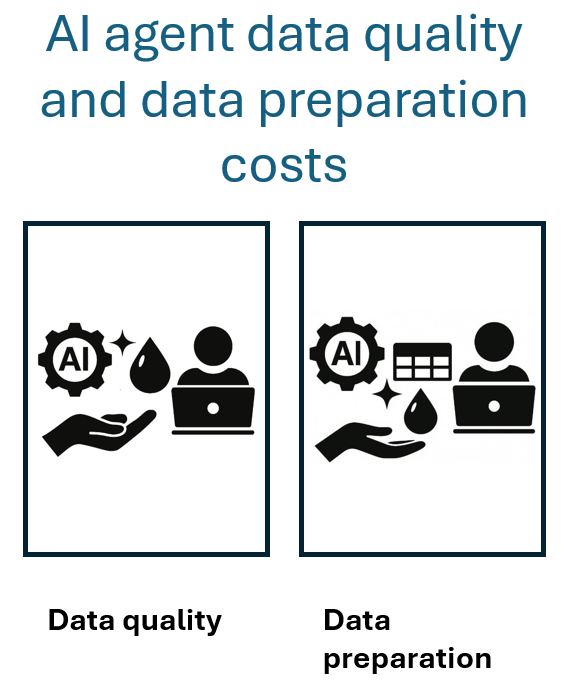

Data quality and preparation are foundational to the performance, reliability, and cost-efficiency of AI agents. Clean, well-governed data reduces inference costs, improves model relevance, and supports scalable deployment. This unit outlines the cost implications and strategic considerations of preparing clean, deduplicated data for AI workloads on Azure.

## Importance of clean and deduplicated data

High-quality data directly impacts model accuracy, token efficiency, and operational cost. Clean datasets reduce noise, improve indexing efficiency, and minimize unnecessary compute cycles during inference. For example, if an agent has to retrieve all of the sales records for a
customer, if the agent needs to remove duplicate records after retrieval, then this causes additional cost.

### Cost implications

| Data issue         | Impact on cost                          | Strategic mitigation                     |
|--------------------|------------------------------------------|------------------------------------------|
| Duplicate records  | Increases storage and indexing overhead. | Apply deduplication during ingestion.     |
| Noisy data         | Reduces model relevance, inflates token usage. | Filter and normalize during preprocessing. |
| Sensitive data     | Triggers compliance overhead.             | Apply classification and masking policies. |

Clean data reduces the need for excessive chunking, reranking, and semantic filtering, each of which consumes compute and increases cost.

## Preprocessing and data governance

Preprocessing transforms raw data into structured, searchable, and compliant assets. Governance ensures that data is used responsibly and
remains aligned with organizational policies. If you have raw, unstructured data, preprocessing is necessary, but it can be expensive.

### Preprocessing tasks

| Task                        | Description                                                                 | Cost strategy                          |
|-----------------------------|-----------------------------------------------------------------------------|----------------------------------------|
| Normalization               | Standardize formats, fix typos, unify casing                                | Automate with Azure Data Factory or ML pipelines |
| Chunking                    | Split documents into semantically meaningful units                          | Optimize for model context window size |
| Embedding generation        | Create vector representations for semantic search                          | Use batch processing to reduce token cost |
| Metadata tagging            | Add searchable attributes and security filters                              | Store only essential metadata to reduce index size |
| Sensitive data handling     | Mask or exclude personal information                                        | Use Microsoft Purview for classification |

Preprocessing is compute intensive. Saving intermediate results (for example, embeddings, entity recognition) can reduce reprocessing costs during index rebuilds.

### Governance frameworks

Governance is another cost that you should consider, but it's a necessary cost for all industries, especially regulated industries and regions. The governance strategy should include:

- Classification schemes based on sensitivity and exposure levels.
- Lifecycle management for retention, archival, and disposal.
- Lineage tracking for transparency and auditability.
- Bias detection using Responsible AI tools.

Governance reduces long-term risk and supports responsible AI development across regulated industries.

## Strategic considerations to improve cost efficiency

To optimize data quality and preparation costs:

- Scope data volume tightly to what's relevant for the AI use case.
- Use enrichment to improve label density and semantic clarity.
- Automate preprocessing pipelines with reusable components.
- Externalize grounding data to search indexes for efficient retrieval.
- Monitor index growth and prune stale or unused fields regularly.
