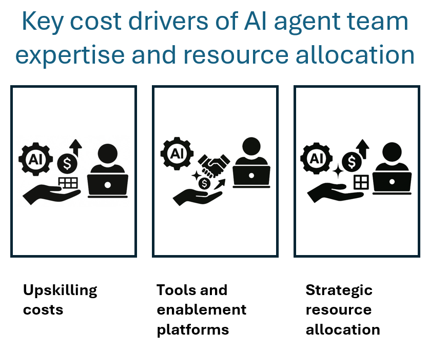

AI agent success depends not only on infrastructure and models, but on the expertise and enablement of the cross-functional teams who build, test, and deploy them. This unit outlines the key cost drivers associated with upskilling and collaboration for AI engineers, software developers, and UX designers, drawing from Microsoft's guidance and enterprise best practices.

## Upskilling costs across core roles

Upskilling is a strategic investment that directly impacts AI adoption velocity, model quality, and operational efficiency. Microsoft's AI Skills Fest, Microsoft Learn AI learning hub, and LinkedIn Learning pathways offer scalable training options for technical and nontechnical roles.

### Role-specific learning paths

| Role               | Focus areas                                                                 | Cost considerations                          |
|--------------------|------------------------------------------------------------------------------|----------------------------------------------|
| **AI engineers**   | Model selection, benchmarking, MLOps, LLMOps, AI security.                    | Specialized training, certifications, lab time. |
| **Software developers** | Prompt engineering, API integration, prompt driven development, debugging workflows, agent orchestration, interoperability protocols, Retrieval Augmented Generation (RAG) patterns. | GitHub Copilot licenses, sandbox environments. |
| **UX designers**   | Conversational design, agent personality, accessibility, feedback loops.     | Design tools, user testing platforms.          |

Upskilling costs include direct expenses (course fees, licenses) and indirect costs (time away from delivery, mentoring overhead).

### Tools and enablement platform costs to develop AI agents

Effective collaboration across AI teams requires shared environments, version control, and integrated tooling. Microsoft's Microsoft Foundry
and GitHub Copilot are central to enabling cost-efficient development workflows.

### Key tooling spend

| Tool/platform           | Purpose                                      | Cost drivers                                  |
|-------------------------|----------------------------------------------|-----------------------------------------------|
| **GitHub Copilot**      | Code generation, refactoring, documentation.  | Per-user licensing, usage quotas.              |
| **Microsoft Foundry**    | Model catalog, benchmarking, orchestration.   | Workspace provisioning, compute usage.         |
| **Microsoft Teams**     | Cross-role communication and coordination.    | Licensing tiers, integration with DevOps.      |
| **Azure DevOps**        | CI/CD pipelines, version control.             | Storage, build minutes, user license.            |

Tools and enablement platforms costs might scale with team size, concurrency, and integration complexity. Shared environments reduce duplication, improve governance, and can reduce costs.

## Strategic resource allocation

It's important to align team expertise with development strategy, whether custom-building agents or leveraging prebuilt models. Each path carries distinct resource and cost implications:

### Development strategy comparison

| Strategy        | Resource allocation profile                          | Cost impact                                  |
|-----------------|------------------------------------------------------|----------------------------------------------|
| **Custom-build**| High engineering effort, longer dev cycles.           | Higher upfront labor costs, deeper control.   |
| **Pre-built**   | Faster time to market, guided flexibility.            | Lower initial investment, reduced complexity. |

Strategic allocation should consider ROI potential, skill maturity, and reuse opportunities across projects.
