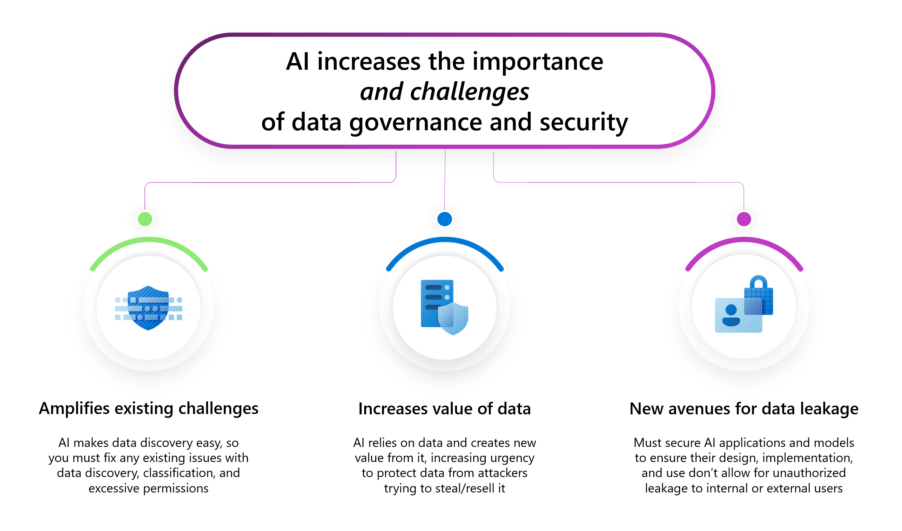
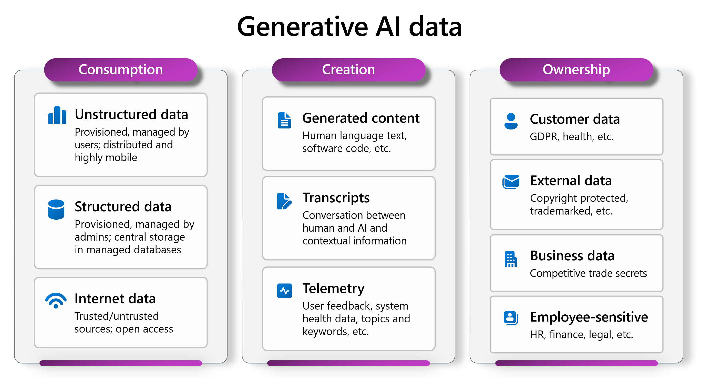

Data security is crucial for AI because AI systems can exacerbate existing issues with data classification, permissions, and governance. As AI makes data discovery easy, any problems with data handling are magnified, leading to potential data leakage, and unauthorized access. AI not only relies on data but also creates new data that gains value, making it a target for attackers who want to steal secrets or cause harm. Therefore, although data security isn't a new issue, AI makes getting data security right even more critical. Access control decisions should never be devolved to the AI system. AI should only have access to the same data as the user it's acting on behalf of.

The image provides a summary of the important challenges of AI data security. Using AI amplifies existing data security challenges, increases the value of data, and provides new avenues for data leakage.

The image provides a breakdown of the kinds of data that generative AI consumes and the kind of data it creates and the kind of data to which it has access. There's a huge range of data that needs to be taken into consideration when assessing and planning to implement AI data security.

