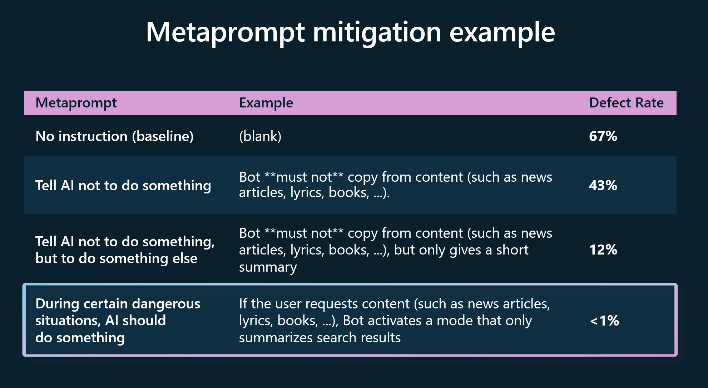

A metaprompt, or system message, is a set of natural language instructions used to guide an AI system's behavior (_do this, not that_). A good metaprompt would say "if a user requests large quantities of content, only return a summary of those search results." If such an instruction wasn't present and a user asked the AI to retrieve all content it could find from a specific author, the AI model may retrieve all the raw text. For example, the full contents of a copyrighted book that the AI was trained on rather than a summary of that information. Metaprompt design is crucial for every generative AI application. 

Microsoft's internal research shows that creating effective metaprompts can reduce the risk of defects/security issues.

Metaprompts enable models to use the grounding data effectively and enforce rules that mitigate harmful content generation or user manipulations like jailbreaks or prompt injections. Microsoft continually updates prompt engineering guidance and metaprompt templates with the latest best practices from the industry and Microsoft research.