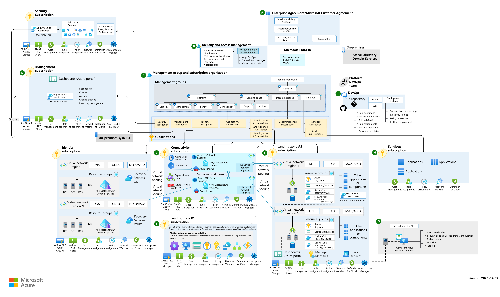
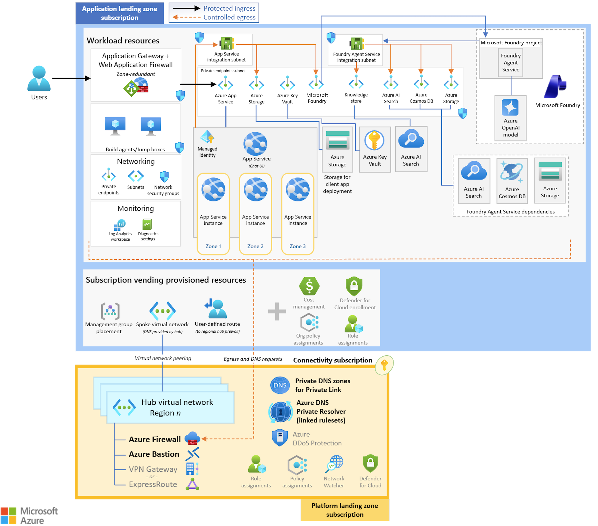

As organizations scale their use of Microsoft Foundry workloads, managing
cloud resources across multiple workloads and subscriptions can quickly
become complex and costly. To ensure your architecture remains secure,
robust, and cost-effective, it's essential to start with a proven
foundation. In this unit, you'll explore two reference architectures
that not only provide confidence in your design but also help
**streamline operations, optimize resource allocation, and secure
long-term cost efficiency**. These architectures are adaptable to your
specific requirements and serve as blueprints for scalable,
well-governed AI adoption:

- Azure Landing Zones
- Baseline Microsoft Foundry Chat Reference Architecture

By leveraging these reference architectures, teams can accelerate
deployment, avoid common pitfalls, and ensure that AI solutions are
built for performance, governance, and financial sustainability.

To accurately estimate the total cost of ownership (TCO) of hosting a
solution in Azure, a comprehensive architecture plan is essential. By
defining both platform and workload architectures against a recognized
reference architecture, organizations can align technical and financial
strategies to optimize investments and ensure cost efficiency.

## Azure landing zones

Scaling in Azure often introduces complexity, as subscriptions
accumulate diverse objects and interdependent workloads that can be
difficult to manage consistently. Azure Landing Zones, defined within
Microsoft's Cloud Adoption Framework (CAF), provide an environment based
on a reference architecture designed for scalability, modularity, and
repeatable deployments.

Azure landing zones support cost-efficient operations through consistent
governance, automation, and standardized deployment practices. Azure
Policy evaluates resources against organizational rules and can audit,
deny, or remediate noncompliant configurations. Azure role-based access
control (RBAC) authorizes who can perform actions at a given scope; it
doesn't enforce resource configuration, right-size workloads, or cap
spending.

Use Azure Advisor for right-sizing and cost recommendations, and use
Microsoft Cost Management for cost analysis, budgets, and alerts. Combine
these services with Azure Monitor, automation, and infrastructure as code
(IaC) to identify inefficiencies, reduce manual errors, and deploy
repeatable environments.

The following diagram shows the Azure landing zone conceptual
architecture. Use this opinionated target architecture as a starting
point, which you can tailor to meeting your requirements:

An Azure landing zone implements eight design areas, shown in the diagram:

- **Azure billing and Microsoft Entra tenant:** Recommendations in this
  area ensure that tenants are created properly and that billing is
  correctly configured. For example, how should you choose a billing
  offer and associate it with an Entra tenant. In the diagram, this area
  corresponds to the label **A**.

- **Identity and access management:** Recommendations in this design
  area implement foundational security boundaries in the public cloud.
  For example, both platform and application landing zones should be
  implemented as security boundaries. In the diagram, this area
  corresponds to the label **B**.

- **Resource organization:** Recommendations in this area focus on
  structuring your Azure resources using Management Groups,
  Subscriptions, and Resource Groups to provide clear boundaries and
  governance. For example, you should establish consistent standards for
  naming, tagging, and management group design. In the diagram, this
  area corresponds to the label **C**.

- **Network topology and connectivity:** Recommendations in this design
  area define how your Azure Virtual Networks (VNets) are structured,
  connectivity options such as VPNs, ExpressRoute, Azure Firewall, and
  Private Link to ensure efficient communication both within Azure and
  to on-premises resources. For example, if you want to support
  multicloud dependencies, your network must support that securely. In
  the diagram, this area corresponds to the label **E**.

- **Security:** Recommendations in this design area implement
  encryption, identity protection, threat detection, vulnerability
  management, and security monitoring to protect resources and data. For
  hybrid identity, choose Microsoft Entra Connect Sync or Microsoft
  Entra Cloud Sync for identity synchronization, and select the
  authentication method separately, such as password hash
  synchronization, pass-through authentication, or federation. Configure
  single sign-on according to the selected authentication design. In the
  diagram, this area corresponds to the label **F**.

- **Management:** Recommendations in this design area create a
  management baseline to provide visibility, operations compliance, and
  protect and recover capabilities. For example, you should implement
  standards for patching and reducing configuration drift. In the
  diagram, this area corresponds to the labels **D**, **G**, and **H**.

- **Governance:** Recommendations in this design area focus on auditing
  and policies that ensure compliance with regulatory requirements. For
  example, you should consider using Azure Policy to enforce security
  conventions. In the diagram, this area corresponds to the labels **C**
  and **D**.

> [!NOTE]
> The Governance design area is most closely related to cost management
> and efficiency in Azure Landing Zones. This design area is where you can
> most effectively reduce unnecessary expenditure because you can use
> governance tools like policy definition and enforcement.

- **Platform automation and DevOps:** Recommendations in this design
  area emphasize automating infrastructure deployments, continuous
  integration/continuous deployment (CI/CD) pipelines, and
  Infrastructure as Code (IaC). For example, you should consider a rollback strategy to mitigate the impact of erroneously deployed bugs. In
  the diagram, this area corresponds to the label **I**.

The conceptual architecture organizes subscriptions under a
management-group hierarchy and separates the centralized platform
foundation from workload-owned environments:

- **Platform landing zone:** The centralized foundation for governance,
  security, subscription vending, and shared capabilities such as
  connectivity, identity, and management. Most organizations have one
  platform landing zone per Microsoft Entra tenant. It includes a
  management-group hierarchy and, where required, multiple
  function-specific platform subscriptions.

- **Application landing zone:** The environment boundary in which a
  workload team deploys and operates a workload. Each workload has one
  application landing zone containing its development, test, production,
  and other environments. Each environment can use one or more
  subscriptions according to ownership, isolation, quota, and scale
  requirements.

In the diagram, subscriptions under the **Platform** management group
provide centralized platform capabilities. Subscriptions under the
**Landing zones** management group host workload environments and inherit
the applicable governance and security guardrails.

The **Decommissioned** management group is a temporary holding location
for canceled landing-zone subscriptions before they're deleted,
typically after 30-60 days. The **Sandbox** management group contains
isolated subscriptions for testing and exploration with guardrails
appropriate to nonproduction use.

> [!NOTE]
> If legal, regulatory, audit, or customer-support requirements require
> retention, preserve the required data and records through a separate
> retention process before deleting the subscription. Don't use the
> Decommissioned management group as an archive.

## Deploying AI workloads in Azure landing zones

When you deploy AI workloads in an Azure landing zone architecture, use
workload-aligned placement.

Deploy AI resources in the application landing zone for the workload
they support. This placement keeps the models, data, application
components, ownership, lifecycle, and inherited governance controls
within one workload boundary.

Create a separate application landing zone only when the AI solution is
itself a distinct workload with a common owner, lifecycle, data boundary,
and governance requirements. Don't consolidate unrelated AI resources
into one landing zone solely because they use AI.

Azure Landing Zones drive cost efficiency by combining technical best
practices with governance, automation, and monitoring. They help
organizations stay within budget while maximizing performance, ensuring
that cloud investments align with both operational goals and financial
constraints.

## Baseline Microsoft Foundry chat reference architecture

Microsoft's baseline Microsoft Foundry reference architecture is a set
of recommendations for building AI-enabled enterprise chat applications.
Typically, these chat applications have four elements:

- **A chat user interface (UI):** A workload-owned web or mobile
  application through which users interact by text or speech. In the
  baseline architecture, the web application is hosted on Azure App
  Service.

- **Data repositories:** Workload knowledge is retrieved through configured
  agent tools; this baseline uses Azure AI Search. The standard Agent Service
  setup also requires dedicated customer-owned Azure Cosmos DB, Azure Storage,
  and Azure AI Search resources for agent state and conversations, files, and
  service-managed search indexes. Foundry Agent Service manages these required
  resources exclusively, so other workload components shouldn't use them.

- **Language models:** This baseline uses an Azure OpenAI model deployed
  through Microsoft Foundry to reason over retrieved context and generate
  relevant responses. Before selecting another model from the Foundry model
  catalog, verify that Foundry Agent Service supports the model in the target
  region and that the model is compatible with every required tool.

- **An orchestrator or agent:** Application logic that coordinates user
  requests, retrieval, model calls, and tools. Microsoft Foundry Agent
  Service is one managed option for implementing agents.

The Microsoft Foundry chat reference architecture gives you a baseline
generalized structure for a chat app, which you can trust and adapt to
your needs. It describes a secure, zone-redundant, highly available app
deployed to the Azure App Service.

The following diagram shows the Baseline Microsoft Foundry chat reference
architecture in an Azure landing zone. It extends the workload baseline
with an application landing-zone subscription, subscription-vending
resources, and shared connectivity and platform subscriptions.

