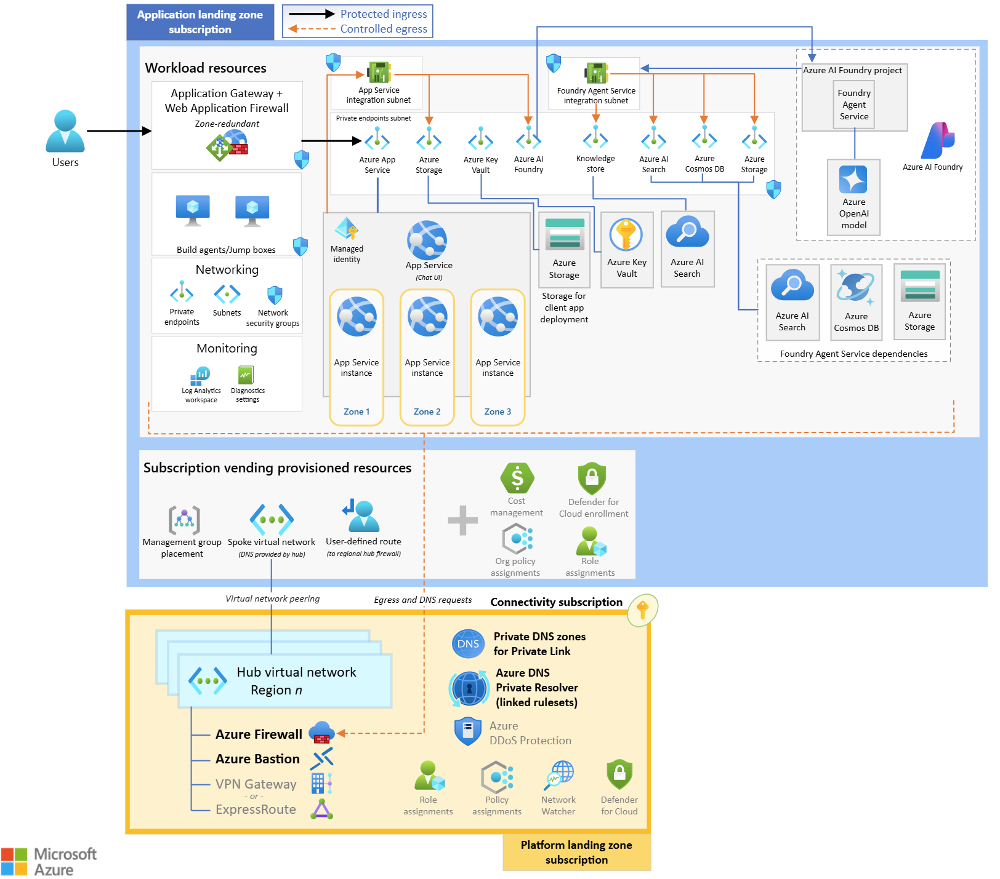

As organizations scale their use of Azure AI Foundry workloads, managing
cloud resources across multiple workloads and subscriptions can quickly
become complex and costly. To ensure your architecture remains secure,
robust, and cost-effective, it's essential to start with a proven
foundation. In this unit, you'll explore two reference architectures
that not only provide confidence in your design but also help
**streamline operations, optimize resource allocation, and secure
long-term cost efficiency**. These architectures are adaptable to your
specific requirements and serve as blueprints for scalable,
well-governed AI adoption:

- Azure Landing Zones
- Baseline Azure AI Foundry Chat Reference Architecture

By leveraging these reference architectures, teams can accelerate
deployment, avoid common pitfalls, and ensure that AI solutions are
built for performance, governance, and financial sustainability.

To accurately estimate the total cost of ownership (TCO) of hosting a
solution in Azure, a comprehensive architecture plan is essential. By
defining both platform and workload architectures against a recognized
reference architecture, organizations can align technical and financial
strategies to optimize investments and ensure cost efficiency.

## Azure landing zones

Scaling in Azure often introduces complexity, as subscriptions
accumulate diverse objects and interdependent workloads that can be
difficult to manage consistently. Azure Landing Zones, defined within
Microsoft's Cloud Adoption Framework (CAF), provide an environment based
on a reference architecture designed for scalability, modularity, and
repeatable deployments.

Azure Landing Zones help reduce costs and optimize performance by
providing a structured framework that combines governance, automation,
and standardized deployment practices. Built-in tools like Azure Policy
and Role-Based Access Control (RBAC) enforce cost-saving rules, prevent
resource sprawl, and ensure workloads are right-sized for actual usage.
Automation and Infrastructure-as-Code (IaC) can reduce manual effort and
errors, supporting consistent, cost-efficient deployments across
environments.

Additionally, Azure Landing Zones can offer insights into resource usage
and spending through tools like Azure Monitor and Cost Management. These
tools enable architects to identify inefficiencies, shut down unused
resources, and optimize workload placement across regions. By supporting
scalable and repeatable architectures, Azure Landing Zones allow
organizations to grow their cloud footprint in a controlled,
budget-conscious manner.

The following diagram shows the Azure landing zone conceptual
architecture. Use this opinionated target architecture as a starting
point, which you can tailor to meeting your requirements:

An Azure landing zone implements eight design areas, shown in the diagram:

- **Azure billing and Microsoft Entra tenant:** Recommendations in this
  area ensure that tenants are created properly and that billing is
  correctly configured. For example, how should you choose a billing
  offer and associate it with an Entra tenant. In the diagram, this area
  corresponds to the label **A**.

- **Identity and access management:** Recommendations in this design
  area implement foundational security boundaries in the public cloud.
  For example, both platform and application landing zones should be
  implemented as security boundaries. In the diagram, this area
  corresponds to the label **B**.

- **Resource organization:** Recommendations in this area focus on
  structuring your Azure resources using Management Groups,
  Subscriptions, and Resource Groups to provide clear boundaries and
  governance. For example, you should establish consistent standards for
  naming, tagging, and management group design. In the diagram, this
  area corresponds to the label **C**.

- **Network topology and connectivity:** Recommendations in this design
  area define how your Azure Virtual Networks (VNets) are structured,
  connectivity options such as VPNs, ExpressRoute, Azure Firewall, and
  Private Link to ensure efficient communication both within Azure and
  to on-premises resources. For example, if you want to support
  multicloud dependencies, your network must support that securely. In
  the diagram, this area corresponds to the label **E**.

- **Security:** Recommendations in this design area implement
  encryption, identity protection, threat detection, vulnerability
  management, and security monitoring to protect resources and data. For
  example, you should consider using Entra Connect cloud synchronization
  to provide single sign-on (SSO) for your Active Directory users. In
  the diagram, this area corresponds to the label **F**.

- **Management:** Recommendations in this design area create a
  management baseline to provide visibility, operations compliance, and
  protect and recover capabilities. For example, you should implement
  standards for patching and reducing configuration drift. In the
  diagram, this area corresponds to the labels **D**, **G**, and **H**.

- **Governance:** Recommendations in this design area focus on auditing
  and policies that ensure compliance with regulatory requirements. For
  example, you should consider using Azure Policy to enforce security
  conventions. In the diagram, this area corresponds to the labels **C**
  and **D**.

> [!NOTE]
> > The Governance design area is most closely related to cost
> > management and efficiency in Azure Landing Zones. This design area is
> > where you can most effectively reduce unnecessary expenditure because
> > you can use governance tools like policy definition and enforcement.

- **Platform automation and DevOps:** Recommendations in this design
  area emphasize automating infrastructure deployments, continuous
  integration/continuous deployment (CI/CD) pipelines, and
  Infrastructure as Code (IaC). For example, you should consider a roll  back strategy to mitigate the impact of erroneously deployed bugs. In
  the diagram, this area corresponds to the label **I**.

The conceptual architecture organizes subscriptions (show as yellow
boxes in the diagram above) by their management group. There are two
types of landing zone shown:

- **Platform landing zone**: A subscription that provides shared
  services to multiple applications. A platform landing zone ensures the
  cloud infrastructure is secure, compliant, and scalable.

- **Application landing zone**: A subscription for hosting an
  application. An application landing zone optimizes infrastructure for
  the specific needs of an individual application or service.

The subscriptions under the "Platform" management group represent the
platform landing zones. The subscriptions under the "Landing zone"
management group represent the application landing zones. A single Azure
landing zone includes both platform landing zones and application
landing zones.

Decommissioned landing zones contain applications that are no longer
used but you may need, for example, to provide support for customers.
Sandboxed landing zones are isolated environments in which you can test
and experiment with code and components without risking any impact on
production environments.

## Deploying AI workloads in Azure landing zones

If you're using AI workloads in an Azure landing zone architecture, you
can choose from two approaches:

- **Deploy AI workloads into existing application landing zones:** The
  landing zone design areas provide sufficient guidance to govern AI
  workloads well, just as they do for non-AI workloads. Therefore, you
  can deploy AI workloads into the existing application landing zone for
  the application they service. This approach keeps the AI workloads
  organized with the applications that use them.

- **Deploy AI workloads into a dedicated application landing zone:** Alternatively, you can choose to place all your AI workloads
  in a dedicated application landing zone. This approach applies
  policies and recommendations to all AI workloads consistently
  regardless of the application that use them.

Azure Landing Zones drive cost efficiency by combining technical best
practices with governance, automation, and monitoring. They help
organizations stay within budget while maximizing performance, ensuring
that cloud investments align with both operational goals and financial
constraints.

## Baseline Azure AI Foundry chat reference architecture

Microsoft's baseline Azure AI Foundry reference architecture is a set
of recommendations for building AI-enabled enterprise chat applications.
Typically, these chat apps have four elements:

- **A chat user interface (UI):** This component interacts with the user
  through text or speech. For example, this UI may be implemented with
  the Azure OpenAI web app.

- **Data repositories:** These stores of information contain data on the
  subject or domain the chat app targets. For example, they may be Azure
  Cosmos DB databases or Azure Storage subscriptions.

- **Language models:** These components reason with data from the
  repositories to build conversational and relevant responses. For
  example, you may use Azure AI Foundry Models.

- **An orchestrator or agent:** This component governs interactions
  between the previous three components and the user. For example, you
  can use an Azure AI Foundry Agent Service.

The Azure AI Foundry chat reference architecture gives you a baseline
generalized structure for a chat app, which you can trust and adapt to
your needs. It describes a secure, zone-redundant, highly available app
deployed to the Azure App Service.

The following diagram shows the Azure AI Foundry chat reference
conceptual architecture.

