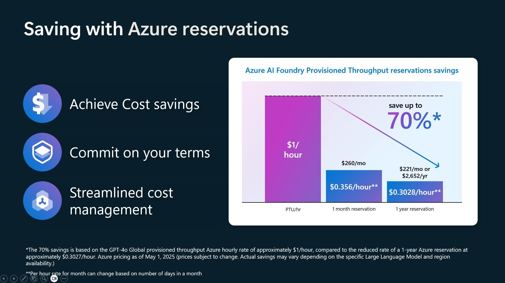

AI workloads present unique challenges due to their data-centric nature, nondeterministic behavior, and operational complexity. To maximize cost efficiency while maintaining performance and scalability, apply the following principles and strategies:

1. Cost-aware AI model selection. Choose models that balance performance and cost.
1. Apply Azure Policy to enforce cost-related rules in AI governance.
1. Add cost visibility and transparency with tagging strategies.
1. Efficient data management by minimizing data movement across regions to reduce egress costs.
1. Evaluate pay-as-you-go vs. commitment plans for Azure AI workloads.

## 1. Cost-aware AI model selection: Choose models that balance performance and cost

Selecting the right AI model is both a technical and financial decision. With the rise of Model-as-a-Service (MaaS) offerings and serverless APIs, Azure’s AI Model Catalog provides curated access to foundation models optimized for cost-effective deployment. Selecting the ideal model involves key strategies to balance performance, scalability, and budget.

- **Model Categories**
  - Models direct from Azure
    - Simplified licensing & support
    - Lower operational friction
    - Pay-as-you-go and provisioned throughput options
  - Models from partner & community
    - Unmatched breadth
    - Innovate with the best
    - Managed compute (bring your infra) or pay-as-you-go deployment options
- **Hosted fine-tuning**
  - Customize foundation models using your data
  - Cost varies by model and data volume; ideal for high-value
    personalization

### Pricing considerations

You should consider the following cost drivers when assessing the cost of an AI agent deployment:

| Cost driver         | Description                                                             |
|--------------------|-------------------------------------------------------------------------|
| Token usage        | Inference costs scale with number of tokens processed.                  |
| Fine-tuning volume | Charges based on data used to customize models.                         |
| Model type         | Larger models (for example, Mistral Large, Llama 3) typically cost more.       |
| Region             | Pricing may vary by Azure region.                                       |

### Model selection strategies

Model selection strategies should include matching the model to the
complexity of the task, evaluating the cost-to-performance ratio, and
leveraging preoptimized models.

When matching a model to task complexity, use smaller models for
classification, summarization, or retrieval and reserve large models for
nuanced generation or strategic reasoning.

When evaluating the cost-to-performance ratio, compare models using
metrics like cost-per-inference or accuracy-per-dollar, and use Azure
usage analytics and open benchmarks to guide selection.

When planning to leverage prebuilt models, consider that Azure AI
Foundry Models includes models from OpenAI, Microsoft Research, Meta,
Mistral AI, xAI, Black Forest Labs, Cohere, NVIDIA, HuggingFace and
more, which are prepackaged for rapid deployment and reduced
operational overhead.

You should also consider model router. The model router in Azure AI
Foundry is a powerful orchestration layer that dynamically selects the
most appropriate model for a given task, optimizing both performance and
cost. Rather than hardcoding model choices, developers can define
routing logic based on input characteristics, such as task type,
complexity, or domain. This enables intelligent delegation, sending
simple classification tasks to lightweight models while reserving
high-capacity LLMs for nuanced synthesis or reasoning. The router
supports fallback strategies, quota enforcement, and observability,
making it a critical component for scalable, cost-effective, multi-agent
systems. By abstracting model selection, it empowers teams to evolve
their architecture without disrupting agent logic or user experience.

### AI model selection best practices

- Use Azure Machine Learning for cost tracking and autoscaling.
- Apply grounding and input filtering to reduce token usage.
- Monitor usage patterns and retrain only when performance degrades.

## 2.  Applying Azure Policy to enforce cost-related rules in AI governance

As AI workloads scale across cloud environments, enforcing cost
discipline becomes essential, not just for budget control, but for
sustainable operations. Azure Policy provides a powerful mechanism to
embed cost-awareness directly into your governance boundaries.

### Azure Policy for cost enforcement

Azure Policy enables automated rule enforcement across your environment.
For cost governance, consider the following strategies:

- Restrict high-cost SKUs
  - Deny or audit use of premium VM sizes, GPU instances, or
    high-throughput storage.
  - Example: Use the "Not allowed resource types" policy to block
    costly SKUs in dev/test.
- Enforce budget tags
  - Require tagging of resources with cost center, environment, or owner
    metadata.
  - Enables granular cost reporting and accountability.
- Limit Resource Locations
  - Restrict deployments to cost-optimized regions or those with
    reserved capacity.
  - This reduces pricing variability and avoids quota-related
    escalations.
- Control AI Service usage
  - Apply policies to Azure AI Foundry, Azure OpenAI, and Azure AI
    Search.
  - Limit usage to approved models or endpoints to prevent uncontrolled
    consumption.
- Use Azure Landing Zones
  - Use governance, automation, and standardized deployment practices.

### AI-specific policy examples

Consider the following policy types to ensure cost effective AI agent solutions:

| Policy type             | Purpose                            | Example enforcement scope        |
|-------------------------|------------------------------------|----------------------------------|
| VM SKU restriction      | Prevent use of expensive compute   | Internal-only workloads          |
| Tag enforcement         | Ensure cost attribution            | All AI resources                 |
| Region restriction      | Optimize for pricing and availability | Training workloads            |
| Service access control  | Limit use of high-cost AI services | Dev/test environments            |

### Azure policy best practices

- Start with baseline policies from Azure landing zones, then layer AI-specific cost controls.
- Monitor policy compliance using **Azure Policy Insights**.
- Review policy impact regularly to balance cost control with innovation flexibility.

## 3. Adding cost visibility and transparency with tagging strategies

As AI workloads scale across Azure environments, maintaining cost
visibility becomes essential for financial accountability and
operational efficiency. Tagging strategies offer a simple yet powerful
way to attribute cloud costs to specific projects, teams, or workloads,
enabling granular tracking, budget enforcement, and informed
decision-making.

Tagging enables organizations to identify high-cost workloads and
optimize resource usage, allocate AI expenses to business units for
chargeback, detect cost anomalies tied to specific environments or teams
and support financial forecasting and strategic planning for AI
investments.

### Why tagging matters for AI cost governance

Tagging is a foundational governance practice that supports:

- **Cost attribution**: Assigning expenses to the correct business unit,
  project, or owner.
- **Budget accountability**: Enabling teams to monitor and manage their
  own consumption.
- **Operational clarity**: Simplifying reporting, forecasting, and
  anomaly detection.

Azure supports tagging across infrastructure (IaaS), platform services
(PaaS), and AI-specific resources, making it a versatile tool for cost
governance.

### Key tagging strategies for cost transparency

1. **Enforce mandatory cost tags**

Use Azure Policy to require tags such as:

- ProjectName
- CostCenter
- Environment (for example, dev, test, prod)
- Owner or Team

This ensures every resource is traceable to a responsible entity and
aligns with organizational budgeting structures.

2. **Apply tag inheritance**

Enable tag inheritance in Microsoft Cost Management to automatically apply
subscription, resource group, or billing account tags to child
resources. This reduces manual tagging errors and ensures consistent
attribution across nested resources.

3. **Standardize tag formats**

Define and enforce naming conventions for tag values to support
automated reporting. For example:

```
CostCenter: FIN-001
Environment: Production
Owner: ai-team@company.com
```

Consistent formats improve queryability and integration with financial
systems.

### Tagging best practices

- **Use Azure Policy definitions** to audit and enforce tagging rules across subscriptions.
- **Deploy tagging templates** via Azure Blueprints or Bicep modules to standardize across teams.
- **Integrate tags into CI/CD pipelines** to ensure resources are tagged at creation.
- **Monitor tag coverage** using Azure Policy Insights and Cost Management dashboards.

## 4. Efficient data management: Minimize data movement across regions to reduce egress costs

Data movement across regions can significantly impact cloud spending,
especially in AI workloads that rely on large-scale data processing.
Efficient data management practices, particularly minimizing
cross-region transfers, are essential for controlling egress costs and
optimizing overall cloud economics.

### Why data movement matters

When data is transferred between Azure regions or out of Azure entirely,
it incurs egress charges. These costs can accumulate quickly in
distributed architectures, especially when:

- AI models are trained in one region, but access data stored in
  another.
- Applications frequently query or replicate data across geographic
  boundaries.
- Backups or analytics pipelines span multiple regions without
  optimization.

Reducing unnecessary data movement is a direct lever for cost savings.

### Key strategies to minimize data movement

1. **Place data close to its users**
    - Deploy data storage in the same region as the consuming application or
  user base.
    - Reduces latency and avoids cross-region egress fees.
    - Ideal for inference workloads, dashboards, and real-time analytics.
1. **Use caching and content delivery networks (CDNs)**
    - Cache frequently accessed static data near users.
    - CDNs reduce repeated long-distance transfers and offload bandwidth
  usage.
    - Useful for read-heavy workloads and public-facing AI
  services.
1. **Consolidate workloads regionally**
    - Colocate compute, storage, and AI services within the same region.
    - Avoid fragmented deployments that trigger inter-region traffic.
    - Use Azure Resource Graph or Microsoft Purview to audit resource
  distribution.
1. **Optimize replication and backup strategies**
    - Evaluate whether cross-region replication is necessary for all
  workloads.
    - Use zonal redundancy when regional replication isn't required.
    - Apply compression and deduplication to reduce replication volume.

### Data management best practices

- **Audit data flows**: Use access logs and system generated data to identify
  high-volume transfers.
- **Apply policies**: Use Azure Policy to restrict resource deployment
  to approved regions.
- **Automate placement**: Integrate region-aware logic into CI/CD
  pipelines and provisioning scripts.
- **Monitor costs**: Use Microsoft Cost Management to track egress charges
  and identify optimization opportunities.

### Trade-offs and risks**

- Over-consolidation may reduce fault tolerance or violate compliance
  requirements.
- Caching introduces data freshness trade-offs. Ensure cache
  invalidation is well-managed.
- Regional restrictions must align with business continuity and disaster
  recovery plans.

## 5. Evaluating pay-as-you-go vs. commitment plans for Azure AI workloads

As AI adoption accelerates, organizations face growing pressure to
manage cloud costs without compromising performance. Azure offers two
primary pricing models for AI deployments: pay-as-you-go and
commitment-based plans through Provisioned Throughput reservations.
Understanding the trade-offs between these models is essential for
cost-effective scaling.

### Pay-as-you-go: flexibility with variable cost

The pay-as-you-go model charges hourly rates for Provisioned Throughput
Units (PTUs), allowing teams to scale usage dynamically. This is ideal
for:

- **Short-term experimentation**: No upfront commitment, perfect for
  testing new models or workloads.
- **Unpredictable demand**: Supports variable usage patterns without
  overprovisioning.
- **Rapid prototyping**: Enables fast deployment without financial
  lock-in.

However, this flexibility comes at a premium. Hourly rates can be
higher than reserved pricing, especially for sustained
workloads.

### Commitment plans: cost savings through reservations

Azure AI Foundry Provisioned Throughput reservations allow organizations
to prepurchase PTUs for one-month or one-year terms. Key benefits
include:

- **Up to 70% cost savings** compared to hourly pricing for steady
  usage.
- **Budget predictability** through fixed-term pricing aligned with
  financial planning.
- **Streamlined billing** with automatic application of discounts to
  matching deployments.

[](../media/ptu-reservation-big.jpg#lightbox)

Reservations are scoped by deployment type (Global, Data Zone, Regional) and region, but are model-agnostic, offering flexibility across AI workloads.

### Comparison summary

| Feature                     | Pay-as-you-go                     | Commitment (Reservation)             |
|----------------------------|-----------------------------------|--------------------------------------|
| Cost per PTU               | Higher hourly rate                | Discounted fixed rate                |
| Flexibility                | High                              | Moderate (fixed term, scoped region) |
| Ideal for                  | Testing, burst workloads          | Production, steady usage             |
| Budget control             | Variable                          | Predictable                          |
| Setup complexity           | Minimal                           | Requires planning and alignment      |

### Best practices for commitment plans

- **Deploy first**: Ensure workloads are active before purchasing reservations to avoid overcommitment.
- **Match attributes**: Align reservation scope, region, and deployment
  type with actual usage.
- **Monitor utilization**: Use Microsoft Cost Management to track
  reservation coverage and set budget alerts.
- **Plan renewals**: Enable autorenewal to maintain savings without
  service disruption.
