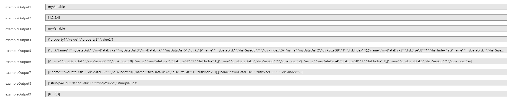

#### Add variables to your template.

Variables in ARM templates are used to simplify things. Rather than repeating complicated expressions throughout the template, you define a variable that contains the expression. Then, you reference that variable as needed throughout your template. Resource Manager resolves variables before starting the deployment operations. Wherever the variable is used in the template, Resource Manager replaces it with the resolved value.

Variable can be used for:
1. Standard variable definitions where you constructs a variable values and it will returns that values.
1. To construct arrays where you constructs an array of values stored in your variable values and it will returns each of those values based on the index you request when calling the variable.
1. To store objects that will be referred to, such as a [configuration variables](https://docs.microsoft.com/azure/azure-resource-manager/templates/template-variables#configuration-variables), that hold related values for configuring an environment. You define the variable as an object with the values. The following example shows an object that holds values for two environments - test and prod.

you can fin the [documentation](https://docs.microsoft.com/azure/azure-resource-manager/templates/template-variables) and [examples](https://docs.microsoft.com/azure/azure-resource-manager/templates/template-variables#example-templates) of their usage in the documentation.

for example, in the following template.  numerous types of variables are defined

:::code language="JSON" source="../samples/variable-samples.json" highlight="5-66":::

the output would be as follows:

