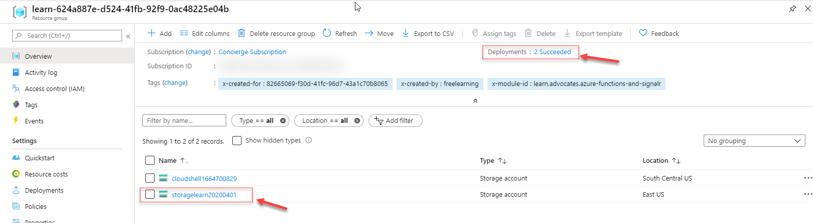
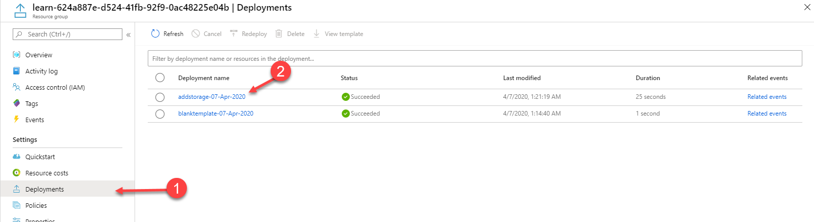

# Adding resources to your ARM template - Exercise

In this exercise, you will add a storage account definition to your existing template.  To do so, you will edit the template you created in the last unit.

1. Open Visual Studio Code and the template you created in the first exercise.  From the Azure shell provided here, type the following command.
       
```shell
code azuredeploy.json
```
              
2. In this step, you will modify the existing template to add the new resource.  You can copy and paste the code found below the note in the resource section of your ARM template.

> [!IMPORTANT]
> When copying the code. Please replace the **{provide-unique-name}** (including the curly brackets) with a unique storage account name. The storage account name must be between 3 and 24 characters in length, and can include numbers and lowercase letters only<br><br>You also need to set the **{location}** in the template, to the **same** location a resource group provided for you in the **sandbox**.  In order to get the resource group name and location use the following command.<br><br>**az group list --query "[?contains(name, 'learn')]" -o table**

Now, you can copy the code and change the highlighted sections into the resource section of your existing empty template.

:::code language="azurecli" source="../samples/Exercise2-resource.json" highlight="4-5":::

At this point your ARM template should now look like the following code snippet:

:::code language="azurecli" source="../samples/exercise2-add-resource.json":::

> [!NOTE]
>Notice that in this example we incremented the "contentVersion" value since we are making a significant change to the template.

In this exercise, you're adding a storage account to the empty template we created in unit 3. So, Let's look at the additions you entered:

1. **"type": "Microsoft.Storage/storageAccounts",** - To identify we are deploying a storage account.
1. **"apiVersion": "2019-06-01",** - The API version for storageAccounts is [2019-06-01](https://docs.microsoft.com/azure/templates/microsoft.storage/2019-04-01/storageaccounts)
1. **"name": "{provide-unique-name}",** - The unique name you want to give to this resource.
1. **"location": "eastus",** - The location of the resource.
1. **"sku": {"name": "Standard_LRS"},** - the '[sku](https://docs.microsoft.com/rest/api/storagerp/srp_sku_types)' is the type of storage the account will be set up for. the available types are Standard or premium, and the redundancy levels are LRS (Locally Redundant storage), GRS(Geo Redundant storage), RA-GRS(Read-Access Geo Redundant storage), ZRS (Zone Redundant Storage), GZRS (Geo and Zone Redundant Storage), and RA-GZRS (Read Access Geo and Zone Redundant Storage).


Notice that you didn't add all of the properties available to the Microsoft.Storage/storageAccounts resource to your template. Many of the properties mentioned [here](https://docs.microsoft.com/azure/templates/microsoft.storage/2019-06-01/storageaccounts) are optional, so you only define what is needed.

## Deploy The modified template

You can deploy the template to create the storage account. Give your deployment a different name so you can easily find it in the history.

Just as it was in the first exercise, you need to specify a resource group that will contain the resources. Before running the deployment command, you **must** create the resource group. However, in the **sandbox** provided here, you already have a resource group to target your deployment.

1. To get the name of the resource group in the sandbox, you can use an Azure CLI command. Type the code below in the sandbox to list the resource group name.

```shell
az group list --query "[?contains(name, 'learn')]" -o table
```

1. In order to use the resource group name in the deployment, we will store it in a variable in the shell by using the command:

```shell
RG=$(az group list --query "[?contains(name, 'learn')].name" -o tsv)
```

To run this deployment, you will use Azure CLI that is built in the Azure shell that is currently available in the sandbox provided for this exercise.  To deploy your new template version, use the code below.  This code will store the template name, the date (used to create the deployment name), and the constructed deployment name in variables to be used by the **az deployment** command as parameters.

```azurecli
templateFile="azuredeploy.json"
today=$(date +"%d-%b-%Y")
DeploymentName="addstorage-"$today

az deployment group create \
  --name $DeploymentName \
  --resource-group $RG \
  --template-file $templateFile
```


> [!NOTE]
>If the deployment failed, use the debug switch with the deployment command to show the debug logs. You can also use the verbose switch to show the full debug logs.

Two possible deployment failures that you might encounter:

- Error: Code=AccountNameInvalid; Message={provide-unique-name} is not a valid storage account name. Storage account name must be between 3 and 24 characters in length and use numbers and lower-case letters only.<br>In the template, replace {provide-unique-name} with a unique storage account name. See Add resource.

- Error: Code=StorageAccountAlreadyTaken; Message=The storage account named store1abc09092019 is already taken.<br>In the template, try a different storage account name.

### Verify your deployment

You can verify the deployment by exploring the resource group from the Azure portal.

1. Sign in to the sign into the [Azure portal for sandbox](https://portal.azure.com/learn.docs.microsoft.com?azure-portal=true).

>[!NOTE]
> When accessing the portal, please authenticate using the same account you used to access Microsoft Learn

1. From the left menu, select **Resource groups**.

1. Select the resource group you used to deploy your new template in the last command. The resource group will have a name similar to **learn-0ab1c234-d567-8e90-fabcd-12e34d56789f**. You will **now** see a storage account deployed within that resource group based on the resource defined in your template.

1. Notice in the upper right of the overview, You now have **2 Succeeded** deployment listed in the upper-right portion of the portal. And your storage account is showing as a resource in your resource group.

   

1. In the contextual menu on the left, click on **Deployments** and select the latest deployment to see the deployment details.

   

1. You see a summary of the deployment. You now see the storage account resources deployed.

   
---

You have now added a resource to your template.  The next unit will cover how to add parameters.