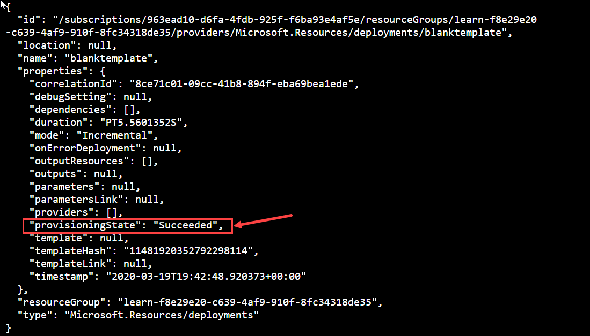
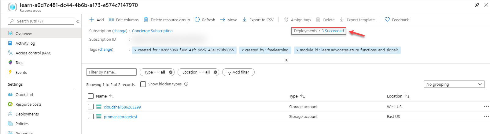
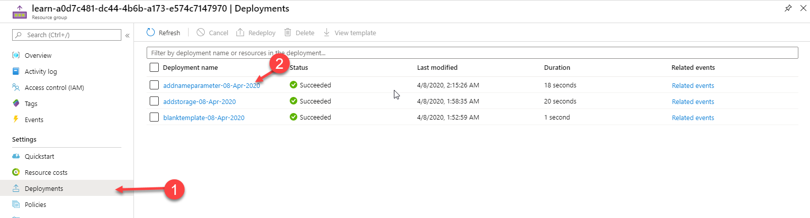
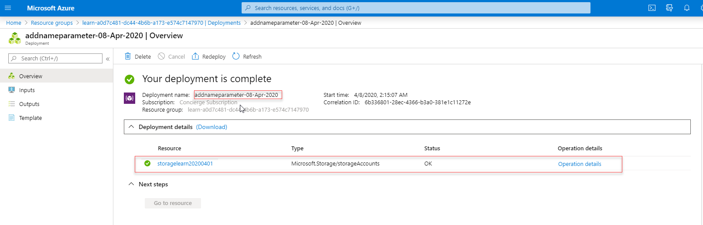
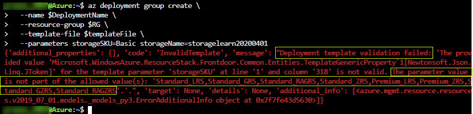

#### Review your template
At the end of the previous exercise, your template had the following JSON code in it:

```json
{
    "$schema": "https://schema.management.azure.com/schemas/2019-04-01/deploymentTemplate.json#",
    "contentVersion": "1.0.0.2",
    "apiProfile": "",
    "parameters": {},
    "variables": {},
    "functions": [],
    "resources": [
         {
             "type": "Microsoft.Storage/storageAccounts",
             "apiVersion": "2019-06-01",
             "name": "{provide-unique-name}",
             "location": "eastus",
             "sku": {
               "name": "Standard_LRS"
             },
             "kind": "StorageV2",
             "properties": {
               "supportsHttpsTrafficOnly": true
             }
          }
    ],
    "outputs": {}
}
```

You may have noticed that there's a problem with this template... The storage account name is **hard-coded**. You can only use this template to deploy the same storage account every time. To deploy a storage account with a different name, you would have to create a new template or modify the current one for every deployments, which obviously isn't a practical way to automate your deployments.

#### Make template reusable

To make your template reusable, you will switch from a hard-coded method to a deployment parameter method.  Where you'll provide a value for the storage account name every time you deploy it. In this exercise you will add a parameter for the storage account name.  That way you can pass in a new value for the storage account name every time you deploy using this template.

The JSON code in the following example shows what you need to change in your template. The storageName parameter is identified as a string. The max length is set to 24 characters to prevent any names that are too long.

In order to carry on with your exercises, you will add a storage account definition to your existing template.  To do so, you will edit the template you used in the first 2 exercises.

1. Open Visual Studio Code and the template you created in the first exercise.  From the Azure shell provided here, type the following command.
       
```azurecli
code azuredeploy.json
```
              
2. Copy and paste the following code in the resource section of your ARM template.

:::code language="JSON" source="../samples/exercise3-parameter-azuredeploy.json" highlight: "5-10,17":::

You'll notice that the code has changed from the last one.  In this exercise, we are adding parameters.  Therefore we have to define the parameter in the **parameters** section (line 5-10) and then insert the referral to the parameter in the **resources** section (line 17)

>[!NOTE]
>As it was the case in the second exercise, you'll notice that the value in the **"contentVersion"** section is incremented to **"1.0.0.2"** because again, you are making changes to your template.

#### Deploy template


This way of handling updates means your template can include all of the resources you need for an Azure solution. You can safely redeploy the template and know that resources are changed or created only when needed. For example, if you have added files to your storage account, you can redeploy the storage account without losing those files.

Now that you have modified the template, Let's deploy it. The following example deploys the template with Azure CLI.

Just as it was in the first two exercises, you need to specify a resource group that will contain the resources. Before running the deployment command. In the **sandbox** provided here, you already have a resource group to target your deployment.

1. To get the name of the resource group in the sandbox, you can use an Azure CLI command. Type the code below in the sandbox to list the resource group name. the second command will store that value in a variable for Azure CLI to use to deploy the template.

    ```azurecli
    az group list --query "[?contains(name, 'learn')]" -o table
    RG=$(az group list --query "[?contains(name, 'learn')].name" -o tsv)

    ```

To run this deployment you will use Azure CLI that is built-in the Azure shell that is currently available in the sandbox provided for this exercise.  To deploy your new template version, use the code below.  This code will store the template name, the date (used to create the deployment name) and the constructed deployment name in variables to be used by the **az deployment** command as parameters.

> [!IMPORTANT]
> Don't forget to change **{your-unique-name}** in the code below with the **same** name you used in the previous exercise.

Copy and execute this code block in the shell provided.

:::code language="azurecli" source="../samples/exercise3-storagenameparamdeploy.sh" highlight: "9":::

The deployment command returns results in a JSON format. Look for `ProvisioningState` to see whether the deployment succeeded.



---

### Verify deployment

You can verify the deployment by exploring the resource group from the Azure portal.

1. Sign in to the sign into the [Azure portal for sandbox](https://portal.azure.com/learn.docs.microsoft.com?azure-portal=true).

>[!NOTE]
> When accessing the portal, please authenticate using the same account you used to access Microsoft Learn

1. From the left menu, select **Resource groups**.

1. Select the resource group you used to deploy your new template in the last command. The resource group will have a name similar to **learn-0ab1c234-d567-8e90-fabcd-12e34d56789f**. You will **now** see a storage account deployed within that resource group based on the resource defined in your template.

1. Notice in the upper right of the overview, You now have **3 Succeeded** deployment listed in the upper-right portion of the portal. And your storage account is showing as a resource in your resource group.

   

1. In the contextual menu on the left, click on **Deployments** and select the latest deployment to see the deployment details.

   

1. You see a summary of the deployment. You now see the storage account resources deployed.

   

   ---

#### Customize by environment

The previous version of the template you used in exercise 2 always deployed a Standard_LRS storage account. You might want the flexibility to deploy different SKUs depending on the environment. In the following task you will changes the template to add a parameter for SKU. 

You will use the code below to update the template you have been working with.

1. Open Visual Studio Code and the template you created in the first exercise.  From the Azure shell provided here, type the following command.
       
```azurecli
code azuredeploy.json
```

2. Copy the whole file and paste over your template. As you may notice the new code includes a storageSKU parameter with a default value. This value is used when a value isn't specified during the deployment. It also has a list of allowed values. These values match the values that are needed to create a storage account. You don't want users of your template to pass in SKUs that don't work.

:::code language="JSON" source="../samples/exercise3-parameter-sku.json" highlight: "10-23,31-33":::

#### Redeploy template
You're ready to deploy again. Because the default SKU is set to Standard_LRS, you don't need to provide a value for that parameter.

Copy and execute this code block in the shell provided.  Remember to change **{your-unique-name}** in the code below with the **same** name you used in the previous exercise.

:::code language="azurecli" source="../samples/exercise3-skuparamdeploy.sh" highlight: "9":::


>[!NOTE]If the deployment failed, use the **--debug** switch with the deployment command to show the debug logs. You can also use the **--verbose** switch to show the full debug logs.

To see the flexibility of your template, let's deploy again. This time set the SKU parameter to Standard_GRS. You can either pass in a new name to create a different storage account, or use the same name to update your existing storage account. Both options work.

Again. Copy and execute this code block in the shell provided.  Remember to change **{your-unique-name}** in the code below with the **same** name you used in the previous exercise.

:::code language="azurecli" source="../samples/exercise3-skuparamdeploy-badsku.sh" highlight: "9":::

Finally, let's run one more test and see what happens when you pass in a SKU that isn't one of the allowed values. In this case, we test the scenario where a user of your template thinks **basic** is one of the SKUs.

The command fails immediately with an error message that states which values are allowed. Resource Manager identifies the error before the deployment starts.



You have now added a parameters to your template.  The next unit will cover how to add and us functions.