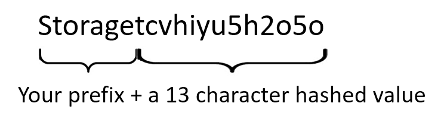
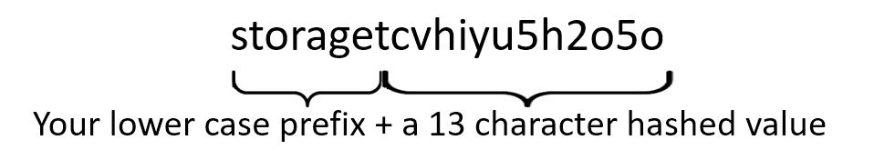

### Adding Functions to an ARM template

A function is the means by which you can build or uses a program or code snippet execute a block of code, which runs a specific task and/or to return processed values.

Within your template, you can create your own functions. User-defined functions are separate from the standard template functions that are automatically available within your template. Create your own functions when you have complicated expressions that are used repeatedly in your template.

In ARM template, there are multiple types of [ARM template functions](https://docs.microsoft.com/azure/azure-resource-manager/templates/template-functions)

##### Function types
1. Array and object functions
1. Comparison functions
1. Date functions
1. Deployment value functions
1. Logical functions
1. Numeric functions
1. Resource functions
1. String functions

A function is invoked when the Azure Resource Manager detects the square brackets "[]".  These brackets indicate that whatever is in between must be processed, and the result will be used as the value.

for example if you want to use a function to name a resource by adding a prefix in order to adhere to a naming convention. you could take the following steps.

If you want to generate a name for a storage account, there are a few requirements:
    - Storage account names must be between 3 and 24 characters in length and may contain numbers and lowercase letters only.
    - Your storage account name must be unique within Azure. No two storage accounts can have the same name.

Therefore you can use a function to ensure these rules are respected.

Without a function, you would have to supply a name or string like **"storage12345"**

1. However, you can replace the string with a function that will join a prefix with a unique ID to satisfy the second nomenclature rule such as **"[concat("Storage",uniqueString(resourceGroup().id))]**. The square brackets indicate that the syntax inside the brackets is a template expression. Resource Manager resolves the syntax rather than treating it as a literal value. The processed result will be a string starting with "storage" followed by a [unique string](https://docs.microsoft.com/azure/azure-resource-manager/templates/template-functions-string#uniquestring) based on the ID of the resource group ID since the **uniqueString** isn't a random string, it's the result of a hash function and the returned value is always 13 characters long.  So, our result would be something like the following

2. Now to comply with the first nomenclature rule (have you noticed that in the above example the prefix is NOT all lower case) to have a string that is "ALL LOWER CASE",  you would wrap the first function in another function.  In this case, the string type function **toLower(stringToChange)**.  so our name function would be **"[toLower(concat("Storage",uniqueString(resourceGroup().id)))]** giving you a result of.

Functions add flexibility to your template by dynamically getting values during deployment. In the next exercise, you will use a function to get the location of the resource group you're using for deployment.

