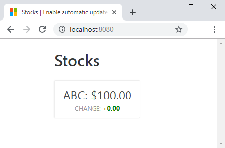

[!include[](../../../includes/azure-sandbox-activate.md)]

Before you begin, make sure you have the following software installed on your machine:

- [Node.js](https://nodejs.org/download/)
- [Visual Studio Code](https://code.visualstudio.com/download)
- [Azure Functions Core Tools](https://github.com/Azure/azure-functions-core-tools) (min. version 2.6.666)
- [Azure Functions extension for Visual Studio Code](https://marketplace.visualstudio.com/items?itemName=ms-azuretools.vscode-azurefunctions)
- [Azure Storage extension for Visual Studio Code](https://marketplace.visualstudio.com/items?itemName=ms-azuretools.vscode-azurestorage)

## Download sample app code

1. Run the following command on your local machine to clone the app from GitHub.

    ```bash
    git clone https://github.com/MicrosoftDocs/mslearn-advocates.azure-functions-and-signalr.git serverless-demo
    ```

    > [!IMPORTANT]
    > Do not run `npm install` until you have completed the steps that update the *local.settings.json*. A post-install script is included to set up your database and add some data to the database.

1. Run the following command to navigate to the new folder into which you cloned the repo:

    ```bash
    cd serverless-demo
    ```

1. The beginning state of the app is located in the **start** folder. Make sure you are in that folder for the rest of this module. Use the following command to open the *start* folder in Visual Studio Code:

    ```bash
    code start
    ```

    For your reference, the finished solution is available in the folder called **end**.

## Create a Storage account

Azure Functions requires a storage account, and you'll need it when you deploy the web app to the cloud later in the module.

1. Execute the following command in the Cloud Shell to define a name for your Azure Storage account.

    ```bash
    export STORAGE_ACCOUNT_NAME=mslsigrstorage$(openssl rand -hex 5)
    echo "Storage Account Name: $STORAGE_ACCOUNT_NAME"
    ```

    Keep note of  this  account name for the remainder of the module.

1. Run the following `az storage account create` command in the Cloud Shell to create a storage account for your function and static website.

    ```bash
    az storage account create \
      --name $STORAGE_ACCOUNT_NAME \
      --resource-group <rgn>[sandbox resource group name]</rgn> \
      --kind StorageV2 \
      --sku Standard_LRS
    ```

    It can take a few minutes to create a storage account. Wait for this step to finish before proceeding.

## Create an Azure Cosmos DB account

You store stock prices in an Azure Cosmos DB database, so you'll set that up in the sandbox account.

1. Run the following `az cosmosdb create` command in the Cloud Shell to create a new Azure Cosmos DB account in your sandbox resource group.

    ```bash
    az cosmosdb create  \
      --name msl-sigr-cosmos-$(openssl rand -hex 5) \
      --resource-group <rgn>[sandbox resource group name]</rgn>
    ```

    It can take a few minutes to create an Azure Cosmos DB account. Wait for this step to finish before proceeding.

## Update local settings

For the app to run, you need to add the connection settings for your cloud services to the local settings file.

1. Run the following commands in the Cloud Shell to get the connection strings for the resources we created in this exercise.

    ```bash
    STORAGE_CONNECTION_STRING=$(az storage account show-connection-string \
    --name $(az storage account list \
      --resource-group <rgn>[sandbox resource group name]</rgn> \
      --query [0].name -o tsv) \
    --resource-group <rgn>[sandbox resource group name]</rgn> \
    --query "connectionString" -o tsv)

    COSMOSDB_ACCOUNT_NAME=$(az cosmosdb list \
        --resource-group <rgn>[sandbox resource group name]</rgn> \
        --query [0].name -o tsv)

    COSMOSDB_CONNECTION_STRING=$(az cosmosdb list-connection-strings  \
      --name $COSMOSDB_ACCOUNT_NAME \
      --resource-group <rgn>[sandbox resource group name]</rgn> \
      --query "connectionStrings[?description=='Primary SQL Connection String'].connectionString" -o tsv)

    COSMOSDB_MASTER_KEY=$(az cosmosdb list-keys \
    --name $COSMOSDB_ACCOUNT_NAME \
    --resource-group <rgn>[sandbox resource group name]</rgn> \
    --query primaryMasterKey -o tsv)

    printf "\n\nReplace <STORAGE_CONNECTION_STRING> with:\n$STORAGE_CONNECTION_STRING\n\nReplace <COSMOSDB_CONNECTION_STRING> with:\n$COSMOSDB_CONNECTION_STRING\n\nReplace <COSMOSDB_MASTER_KEY> with:\n$COSMOSDB_MASTER_KEY\n\n"
    ```

1. Navigate to where you cloned the application and open the **start** folder in Visual Studio Code. Open **local.settings.json** in the editor so you can update the file.

1. In **local.settings.json**, update the variables `AzureWebJobsStorage`, `AzureCosmosDBConnectionString`, and `AzureCosmosDBMasterKey` with the values listed in the Cloud Shell and save the file. The *local.settings.json* file should only exist on your local computer.

## Run the application

1. In the Visual Studio Code terminal window, run the following command to install dependencies and set up the database:

    ```bash
    npm install
    ```

    > [!NOTE]
    > If a problem arises during the install process and the database is not correctly setup, you can run `npm run setup` to manually seed the database.

1. Press **F5** to start debugging the function app. The function app startup is shown in a terminal window.

1. To run the web application on your machine, open a second integrated terminal instance and run the following command to start the web app.

    ```bash
    npm start
    ```

1. The script automatically opens the browser and navigates to http://localhost:8080. If the browser fails to open automatically, you can navigate to http://localhost:8080 manually.

    

1. Return to Visual Studio Code, open a third terminal instance, and enter the following command to update the stock prices. Immediately return to the browser and observe that the values for stock ABC change within a few seconds.

    ```bash
    npm run update-data
    ```

When you're done, stop the running processes.

- To stop the web server, click the **kill process** (trash can icon) on the terminal window that is running the web server.

- To stop the functions app, click the **Stop** button or press **Shift + F5**.

<!--
    REVIEW:
    I would add in an instruction here to tell the learner how to update the  ABC stock price or add another one to the database, so we can see an update happening. I might be tempted to increase the polling delay so we can really see how polling has the potential to delay updates reaching the client.

    CONCLUSION:
    Added two more records in database seed.
-->
