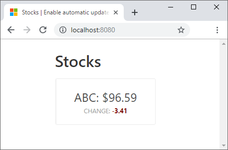

In order to update the application to support the new functionality, you need to create a few new functions and update the JavaScript on the client.

## Create a SignalR account

You'll need to add a SignalR account to your sandbox subscription. The first step is to add the SignalR extension to the Azure Command Line Interface (CLI).

1. To allow access to SignalR, add the extension by running the following command in  the Cloud Shell.

    ```bash
    az extension add -n signalr
    ```

1. Run the following command in the Cloud Shell to create a new SignalR account in the sandbox resource group.

    ```bash
    az signalr create \
      --name msl-sigr-signalr$(openssl rand -hex 5) \
      --resource-group <rgn>[sandbox resource group name]</rgn> \
      --sku Free_DS2 \
      --unit-count 1
    ```

## Update local settings

For the app to run, you need to add the SignalR connection string saved to your local settings.

1. Run the following commands in the Cloud Shell  to get the connection strings for the resources we created in this exercise.

    ```bash
    SIGNALR_CONNECTION_STRING=$(az signalr key list \
      --name $(az signalr list \
        --resource-group <rgn>[sandbox resource group name]</rgn> \
        --query [0].name -o tsv) \
      --resource-group <rgn>[sandbox resource group name]</rgn> \
      --query primaryConnectionString -o tsv)

    printf "\n\n<SIGNALR_CONNECTION_STRING>=\n$SIGNALR_CONNECTION_STRING\n\n"
    ```

1. Navigate to where you cloned the application and open the **start** folder in Visual Studio Code. Open **local.settings.json** in the editor so you can update the file.

1. In **local.settings.json**, update the variable `AzureSignalRConnectionString` with the value listed in the Cloud Shell and save the file.

## Manage client connections

The web client uses the SignalR client SDK to establish a connection to the server. The SDK retrieves the connection via a function named **negotiate** (by convention) to connect to the service.

1. Open the Visual Studio Code command palette by pressing **CTRL/CMD+Shift+P**.

1. Search for and select the **Azure Functions: Create Function** command.

1. When prompted, provide the following information.

    | Name                | Value                          |
    | ------------------- | ------------------------------ |
    | Template            | HTTP Trigger                   |
    | Name                | negotiate                      |
    | Authorization level | Anonymous                      |

    Refresh the Explorer window in Visual Studio Code to see the updates. A folder named *negotiate* is now available in your function app.

1. Open *negotiate/function.json* and add the following SignalR binding to the `bindings` array.

    ```json
    {
        "type": "signalRConnectionInfo",
        "name": "connectionInfo",
        "hubName": "stocks",
        "direction": "in",
        "connectionStringSetting": "AzureSignalRConnectionString"
    }
    ```

    This configuration allows the function to return the connection information to the server which is used to identify connected clients.

1. Next, open *negotiate/index.js* and replace the existing function code with the following code.

    ```javascript
    module.exports = async function (context, req, connectionInfo) {
        context.res.body = connectionInfo;
    };
    ```

    As the function is called, the SignalR connection is returned as the response to the function.

Now that the function to return the SignalR connection info is implemented, you can create a function responsible for pushing changes to the client.

## Detect and broadcast database changes

First, you need to create a new Azure Function that listens for changes in the database. This is possible by using the built-in Azure Cosmos DB bindings.

1. Open the Visual Studio Code command palette by pressing **CTRL/CMD+Shift+P**.
1. Search for and select the **Azure Functions: Create Function** command.
1. When prompted, provide the following information.

    | Name                                   | Value                          |
    | -------------------------------------- | ------------------------------ |
    | Template                               | Azure Cosmos DB Trigger        |
    | Name                                   | stocksChanged                  |
    | App setting for your Azure Cosmos DB account | AzureCosmosDBConnectionString  |
    | Database name                          | stocksdb                       |
    | Collection name                        | stocks                         |
    | Collection name for leases             | leases                         |
    | Create lease collection if not exists  | true                           |

    Now a folder named *stocksChanged* is created and contains the files for the new function. Open *stocksChanged/function.json* in Visual Studio Code.

1. Append the property `"feedPollDelay": 500` to the existing trigger binding definition. This setting tells Azure Cosmos DB how long to wait before checking for changes in the database. The application you're building is built around a push-based architecture. However behind the scenes, Azure Cosmos DB is continually monitoring the change feed to detect changes. The `feedPollDelay` refers to how the internals of Azure Cosmos DB recognizes changes, not how your web application exposes changes to the data.

<!-- 
    REVIEW:
    According to the docs, the feedPollDelay means "Gets or sets the delay in between polling a partition for new changes on the feed, after all current changes are drained" That doesn't seem to have anything to do with contacting connected clients. I also still am not sure there is anything different between this CosmosDB binding the one from the preceding exercise

    CONCLUSION
    Reworded paragraph to explain why there is a setting referencing "polling" in a push-based web app.
-->

The Azure Cosmos DB binding for your function should now look like the following code.

```json
{
  "type": "cosmosDBTrigger",
  "name": "documents",
  "direction": "in",
  "leaseCollectionName": "leases",
  "connectionStringSetting": "AzureCosmosDBConnectionString",
  "databaseName": "stocksdb",
  "collectionName": "stocks",
  "createLeaseCollectionIfNotExists": "true",
  "feedPollDelay": 500
}
```

Next, append the following SignalR output binding definition to the `bindings` collection.

```json
{
  "type": "signalR",
  "name": "signalRMessages",
  "connectionString": "AzureSignalRConnectionString",
  "hubName": "stocks",
  "direction": "out"
}
```

This binding allows the function to broadcast changes to clients.

The beauty of all the configuration is that the function code is simple. Update the *stocksChanged/index.js* file to reflect the following code.

```javascript
module.exports = async function (context, documents) {
    const updates = documents.map(stock => ({
        target: 'updated',
        arguments: [stock]
    }));

    context.bindings.signalRMessages = updates;
    context.done();
}
```

An array of changes is prepared by creating an object formatted to be read by SignalR. Every updated stock is provided to the `arguments` array along with a `target` property set to `updated`.

The value of the `target` property is used on the client when listening for specific messages broadcast by SignalR.

## Update the web application

Open *public/index.html* paste the the following code in place of the current DIV with the ID of `app`.

```html
<div id="app" class="container">
    <h1 class="title">Stocks</h1>
    <div id="stocks">
        <div v-for="stock in stocks" class="stock">
            <transition name="fade" mode="out-in">
                <div class="list-item" :key="stock.price">
                    <div class="lead">{{ stock.symbol }}: ${{ stock.price }}</div>
                    <div class="change">Change:
                        <span
                            :class="{ 'is-up': stock.changeDirection === '+', 'is-down': stock.changeDirection === '-' }">
                            {{ stock.changeDirection }}{{ stock.change }}
                        </span>
                    </div>
                </div>
            </transition>
        </div>
    </div>
</div>
```

This markup adds a transition element which allows Vue.js to add and remove CSS classes in order to achieve a subtle animation as stock data changes. When a stock is updated, the tile fades out and quickly back in to view. This way if the page is full of stock data, users can easily see which stocks have changed.

Next, add the following script block just above the reference to *index.html.js*.

```html
<script src="https://cdn.jsdelivr.net/npm/@aspnet/signalr@1.1.0/dist/browser/signalr.js"></script>
```

This script adds a reference to the SignalR SDK.

Now open *public/index.html.js* and replace the file with the following code.

```javascript
const LOCAL_BASE_URL = 'http://localhost:7071';
const REMOTE_BASE_URL = '<FUNCTION_APP_ENDPOINT>';

const getAPIBaseUrl = () => {
    const isLocal = /localhost/.test(window.location.href);
    return isLocal ? LOCAL_BASE_URL : REMOTE_BASE_URL;
}

const app = new Vue({
    el: '#app',
    data() {
        return {
            stocks: []
        }
    },
    methods: {
        async getStocks() {
            try {
                const apiUrl = `${getAPIBaseUrl()}/api/getStocks`;
                const response = await axios.get(apiUrl);
                app.stocks = response.data;
            } catch (ex) {
                console.error(ex);
            }
        }
    },
    created() {
        this.getStocks();
    }
});

const connect = () => {
    const connection = new signalR.HubConnectionBuilder()
                            .withUrl(`${getAPIBaseUrl()}/api`)
                            .build();

    connection.onclose(()  => {
        console.log('SignalR connection disconnected');
        setTimeout(() => connect(), 2000);
    });

    connection.on('updated', updatedStock => {
        const index = app.stocks.findIndex(s => s.id === updatedStock.id);
        app.stocks.splice(index, 1, updatedStock);
    });

    connection.start().then(() => {
        console.log("SignalR connection established");
    });
};

connect();
```

The changes you just made accomplished two goals: removed all polling logic from the client and added handlers to listen for messages coming from the server.

A new helper function is introduced which makes it easy for the application to work in local and deployed contexts.

```javascript
const LOCAL_BASE_URL = 'http://localhost:7071';
const REMOTE_BASE_URL = '<FUNCTION_APP_ENDPOINT>';

const getAPIBaseUrl = () => {
    const isLocal = /localhost/.test(window.location.href);
    return isLocal ? LOCAL_BASE_URL : REMOTE_BASE_URL;
}
```

The `getAPIBaseUrl` function returns the appropriate URL depending on whether the app is running locally or deployed to Azure. The placeholder `<REMOTE_BASE_URL>` is replaced by the storage account endpoint in a coming exercise when you deploy this application to the cloud.

<!-- 

    REVIEW:
    Consider moving this explanation of the URL switcher to the first exercise, since it's used there too 

    CONCLUSION:
    Updated code to only use the local variable for the beginning state of the app. Added the code for getAPIBaseUrl in this exercise and added an explanation paragraph.

-->

The Vue.js-related code is streamlined now that changes are pushed to the client. Consider this segment of the code you just pasted in to the script file:

```javascript
const app = new Vue({
    el: '#app',
    data() {
        return {
            stocks: []
        }
    },
    methods: {
        async getStocks() {
            try {
                const apiUrl = `${getAPIBaseUrl()}/api/getStocks`;
                const response = await axios.get(apiUrl);
                app.stocks = response.data;
            } catch (ex) {
                console.error(ex);
            }
        }
    },
    created() {
        this.getStocks();
    },
});
```

The same stocks array is used here as in the previous implementation, but all the polling code is removed and the logic for `getStocks` remains unchanged. The `getStocks` function is still called as the component is created.

Next, consider this segment of the client code:

```javascript
const connect = () => {
    const connection = new signalR.HubConnectionBuilder()
                            .withUrl(`${getAPIBaseUrl()}/api`)
                            .build();

    connection.onclose(()  => {
        console.log('SignalR connection disconnected');
        setTimeout(() => connect(), 2000);
    });

    connection.on('updated', updatedStock => {
        const index = app.stocks.findIndex(s => s.id === updatedStock.id);
        app.stocks.splice(index, 1, updatedStock);
    });

    connection.start().then(() => {
        console.log("SignalR connection established");
    });
};

connect();
```

When the page loads the `connect` function is called. In the body of the `connect` function, the first action is to use the SignalR SDK to create a connection by calling `HubConnectionBuilder`.  The result is a SignalR connection to the server.

In order to gracefully recover after the server has timed out, the `onclose` handler reestablishes a connection two seconds after the connection has closed by calling `connect` again.

As the client receives messages from the server, it listens for messages via the `on('updated',...` syntax. Once an update is received, the following actions take place:

- The changed stock is located in the array.
- The old version is removed.
- The new version is inserted at the same index position in the array.

Manipulating the array using this approach allows Vue to detect changes in the data and trigger animation effects to notify users of changes.

## Run the application

Now you can see the new version of the app running locally.

Press **F5** to start debugging the functions app.

Next, open a new terminal window in Visual Studio Code and run `npm start`:

```bash
npm start
```

The script automatically opens the browser and navigates to http://localhost:8080. If the browser fails to open automatically, you can navigate to http://localhost:8080 manually.

## Observe automatic updates

Now you can make change to the application's data and observe how to the data is automatically updated. Since the update to the browser happens nearly immediately, consider having Visual Studio Code open one side of your screen and the running application on the other. This way you can see the UI update right after you issue the command to update the database.

Return to Visual Studio Code and enter the the following command in a new integrated terminal. Again watch as the application automatically updates the stock ABC.

```bash
npm run update
```

After the database is updated, the UI looks something like the following screenshot:



When you are done, stop the web server and functions processes.