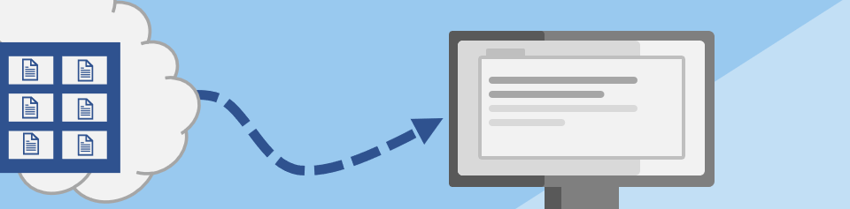

Now that we've tested the application on your local machine, and deployed the API, it's time to deploy the client. 

## Client SignalR architecture 

When the web page loads, the client application:

* Gets the current list of stocks from the `/api/getStocks` HTTP endpoint. 
* Connects to the SignalR endpoint. The connection is made to the `/api/negotiate` HTTP endpoint. 
* Listens for the stock changes from the `/api` connection from the SignalR endpoint. When the event is received, the client updates the stock price in the UI. These updates aren't seen in the network tab of the browser because the connection is persistent. .

## Deploy the client to Azure Static Web Apps

To host the client, we'll use Azure Static Web Apps. Azure Static Web Apps is a service that automatically builds and deploys web apps to Azure from a code repository.

The client needs to be built with the cloud API URL. The client build process, using WebPack, will replace the API URL with the cloud API URL. The URL is fetched from the .env file locally. To get this value in the GitHub Action, we need to set it as a secret in the GitHub repository.

