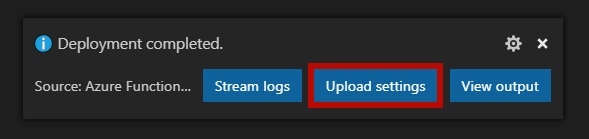

Up to this point you have only run the application on your machine. You will now deploy the app to Azure.

### Deploy the function app

1. Open the Visual Studio Code command palette via `CTRL/CMD+Shift+P`.

2. Search for and select the **Azure Functions: Deploy to Function App** command.

3. When prompted, provide the following information.

   | Name              | Value                                                        |
   | ----------------- | ------------------------------------------------------------ |
   | Subscription      | Select your subscription                                     |
   | Function app      | Select **Create New Function App in Azure**                  |
   | Function app name | Enter a unique name                                          |
   | Resource group    | Select the same resource group as your other resources in this tutorial |
   | Storage account   | Select the account you created earlier                       |

   A new function app is created in Azure and the deployment begins. The Azure Functions Visual Studio Code extension first creates the Azure resources and deploys the function app.

   Wait for deployment to complete.

Once complete, the Azure Functions extension reports the primary endpoint of the function in a message box.

Copy the endpoint and replace `<FUNCTION_APP_ENDPOINT>` in *index.html.js* with this value.

Next, extract the function app name from the endpoint and add it to the following script.

> [!NOTE]
> The function app name is the sub domain of the function app endpoint. For instance if the endpoint is http://myfunctionapp.azurewebsites.net, then the function app name is "myfunctionapp".

Replace the token `<FUNCTION_APP_NAME>` with the function app name and run the following script.

```bash
export $FUNCTION_APP_NAME=<FUNCTION_APP_NAME>
```

Another message box will also appear in Visual Studio code which asks you if you want to upload local settings. Click the **Upload settings** button to copy the values from *local.settings.json* to the server.



### Configure static websites in Azure Storage

Use the following steps to configure the Azure Storage account to host a static website.

1. Open the Visual Studio Code command palette via `CTRL/CMD+Shift+P`.
2. Search for and select the **Azure Storage: Configure static website** command.

   | Name              | Value                                                                        |
   | ----------------- | ---------------------------------------------------------------------------- |
   | Subscription      | Select your subscription                                                     |
   | Storage account   | Select storage account created you created at the beginning of this tutorial |
   | Hosting           | A dialog appears notifying you that website hosting is not enabled on your storage account. Click the **Enable website hosting** button. |
   | Default file      | Select the default value of **index.html** as the index document name for the account. |
   | Error document    | Press **Enter** to accept the default 404 error document path |
   | Deployment folder | Select the folder of the functions app |

### Enable function app cross origin resource sharing (CORS)

Although there is a CORS setting in **local.settings.json**, it is not propagated to the function app in Azure. You need to set it separately.

#### Add CORS origin

1. Open the Visual Studio Code command palette via `CTRL/CMD+Shift+P`.

2. Search for and select the **Azure Functions: Open in portal** command.

3. Select the subscription and function app name to open the function app in the Azure portal.

4. Under the **Platform features** tab, select **CORS**.

5. Add an entry with the static website **primary endpoint** as the value (make sure to remove the trailing `/`).

6. Click **Save** to persist the CORS settings.

#### Enable CORS credentials support

In order for the SignalR JavaScript SDK to function, support for credentials in CORS must be enabled.

Currently, this feature can only be enabled using the Azure command line interface (CLI) or REST APIs. You will execute a command in Azure Cloud Shell to enable this feature.

1. Return to the **Cloud Shell** in the browser.

2. Execute the following command, to update CORS settings.

   ```
   az resource update --resource-group $RESOURCE_GROUP_NAME --parent sites/$FUNCTION_APP_NAME --name web --namespace Microsoft.Web --resource-type config --set properties.cors.supportCredentials=true --api-version 2015-06-01
   ```

3. Once completed, CORS credentials support is enabled in the function app.

### Deploy the web application to Azure Storage

1. Open the Visual Studio Code command palette via `CTRL/CMD+Shift+P`.
2. Search for and select the **Azure Storage: Deploy to static website** command.
3. Select the subscription and Storage account.
4. When prompted for a folder, select **browse** and choose the **content** folder containing *index.html*.
5. A notification should appear that the upload was successful.
6. Click the button to open the app in a browser.

## Observe automatic updates

Now you can make change to the application's data and observe how to the data is automatically updated.

Again, consider having Visual Studio Code on one side of the screen and the running application on the other. This way you can see the UI update as changes are made to the database.

In Visual Studio integrated terminal, enter the following command and watch as the UI is automatically updated.

```bash
npm run update
```

** todo - add screenshot from azure