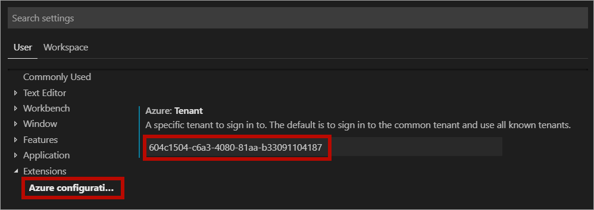
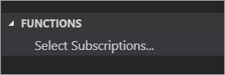
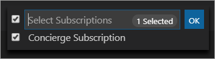
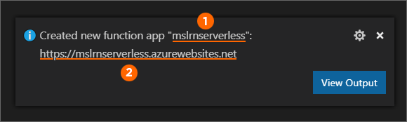
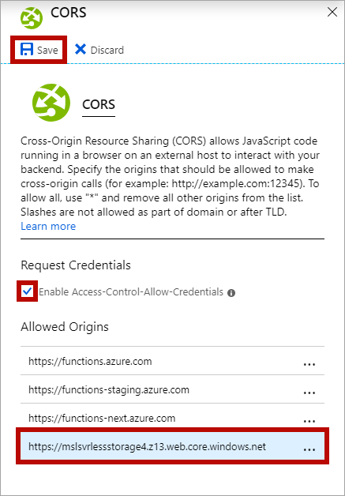
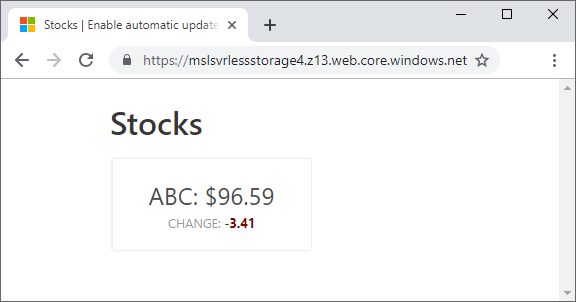

Up to this point you have only run the application on your machine. The next step is to deploy the app to Azure.

## Customize Visual Studio Code

Before you begin, there are two changes you need to make to Visual Studio Code. 

The first change grants Visual Studio Code access to the Azure subscription used by the sandbox.  This subscription was created when you activate the sandbox and allows you to use Azure services without incurring any costs.

The second customization tells the Azure Functions extension to use the advanced creation process. If you skip this step, the extension uses default values and won't create your function to work with the sandbox.

### Add concierge tenant to Visual Studio Code

The following steps associate the free Azure subscription created for you with Visual Studio Code. At the end of the tutorial you'll follow steps to restore Visual Studio Code back to its original settings. 

1. In the Cloud Shell, run the following command and copy the tenant ID to your clipboard.

    ```bash
    az account list --query "[?name=='Concierge Subscription'].tenantId" -o tsv
    ```

1. Open settings in Visual Studio Code. On Windows or Linux, select **File > Preferences > Settings**. On macOS, select **Code > Preferences > Settings**.

1. Navigate through **User Settings > Extensions > Azure configuration**

1. Enter the tenant in the **Azure: Tenant** textbox.



### Sign out and back in

Now that you've made these changes, you need to sign out and back into the Azure extension.

1. Press **F1** to open the Visual Studio Code command palette.

1. Search for and select **Azure: Sign Out**.

1. Press **F1** again.

1. Search for and select **Azure: Sign In** and sign in with the same account you used to sign into the Learn sandbox.

### Select subscription

1. Click on the Azure extension icon.

    

1. Under the *Functions* heading, click on **Select Subscriptions**.

    

1. Next, the command palette appears. Select **Concierge Subscription** and click **OK**.

    

Now Visual Studio Code is configured to use the sandbox resources and avoid any billing against your account.

## Deploy the function app

1. Press **F1** to open the Visual Studio Code command palette.

1. Search for and select the **Azure Functions: Deploy to Function App** command.

1. Follow the prompts to provide the following information.

   | Name              | Value                                                                    |
   | ------------------------------- | ------------------------------------------------------------------------ |
   | Function app                    | Select **Create new Function App in Azure... Advanced**                  |
   | Function app name               | Enter a globally unique name. Valid characters are `a-z`, `0-9`, and `-`.|
   | OS                              | Select **Windows**                                                       |
   | Plan                            | Select **Consumption**                                                   |
   | Language                        | Select **JavaScript**                                                    |
   | Resource group                  | Select **<rgn>[sandbox resource group name]</rgn>**                      |
   | Storage account                 | Select the account you created earlier                                   |
   | Application Insights resource   | Select **Skip for now**                                                  |

    A new function app is created in Azure and the deployment begins. The Azure Functions Visual Studio Code extension first creates the Azure resources and then deploys the function app.

    Once complete, the Azure Functions extension reports the primary endpoint of the function in a message box as shown by this screenshot.

    

    The functions app name (labeled as **1** in the image) is the unique name you provided as you created the app. The app end point (labeled as **2**) is the function app name followed by *azurewebsites.net*.

1. Open **public/index.html.js** and replace `<FUNCTION_APP_ENDPOINT>` with the function's endpoint.

1. Next, upload your local settings to Azure by opening the command palette via **F1** and select **Azure Functions: Upload local settings**. When prompted, choose the function app you just created, and choose to overwrite all settings.

## Configure static websites in Azure Storage

Use the following steps to configure the Azure Storage account to host a static website.

1. Open the Visual Studio Code command palette via **F1**.

1. Search for and select the **Azure Storage: Configure Static Website** command.

   | Name              | Value                                                             |
   | ----------------- | ----------------------------------------------------------------- |
   | Storage account   | Select the account you created earlier.                           |
   | Default file      | Select **index.html** as the index document name for the account. |
   | Error document    | Enter **index.html** for the default 404 error document path.     |

The error document path is the page the browser will load when a routing error occurs. This is important for JavaScript frameworks like Vue.js which have client-side routing.

## Deploy the web application to Azure Storage

1. Open the Visual Studio Code command palette via **F1**.

1. Search for and select the **Azure Storage: Deploy to Static Website** command.

   | Name              | Value                                                             |
   | ----------------- | ----------------------------------------------------------------- |
   | Storage account   | Select the Storage account you created earlier.                   |
   | Select folder     | Select **browse** and choose the *public* subfolder containing the web app. |

After the extension is done deploying your application, a notification appears that the upload was successful. The upload can take several minutes.

## Determine the primary endpoint address of the static website

1. In the command palette, search for **Azure Storage: Browse static website** and choose your Storage account. The site opens in the browser. At this point, the app won't run because of CORS requirements of Azure Functions.

1. Copy the URL in the browser, which is the endpoint of the static site hosted in your Storage account. You use the endpoint value to set up CORS settings for the function app in the next section.

Keep this browser window open. You will return refresh this window once the CORS settings are updated in your function app.

## Set up CORS in the function app

1. In the command palette, search for and select the **Azure Functions: Open in portal** command.

1. Select the function app name.

1. Once the portal is open in the browser, select the **Platform features** tab and under **API** select **CORS**.

1. Check the checkbox next to **Enable Access-Control-Allow-Credentials**.

1. Add an entry with the *static website* **primary endpoint** as the value (make sure to remove the trailing `/`). You can paste this value in from your clipboard.

1. Click **Save** to persist the CORS settings.

    

## Run the deployed application

Now you can make change to the application's data and observe how to the data is automatically updated.

1. Arrange Visual Studio Code on one side of the screen and the web browser running the static site on the other. This way you can see the UI update as changes are made to the database.

1. Refresh the browser. It may take a moment for stocks to appear as the serverless functions are running for the first time.

1. In Visual Studio integrated terminal, enter the following command and watch as the UI is automatically updated.

    ```bash
    npm run update-data
    ```

    
