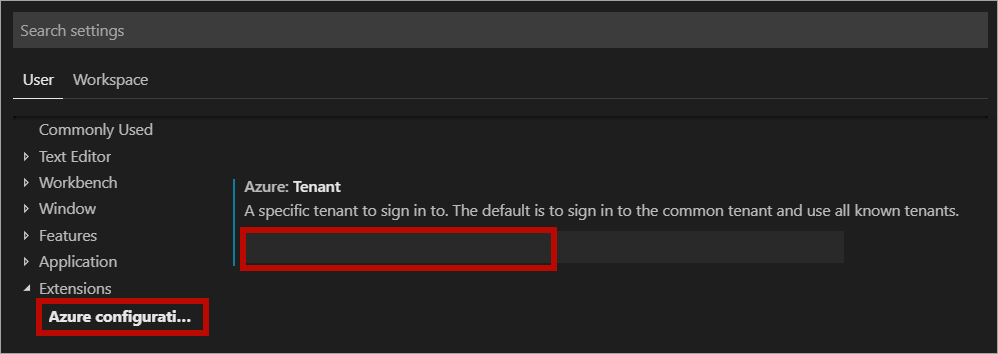

In this module, you updated the design of a stock price service from being polling-based to push-based. The goal was to keep web clients updated automatically as soon as changes to the data were available. 

First, you learned about the limitations of the existing solution, which looked for stock price changes on a schedule. Then, you replaced polling with a SignalR Service-based solution that pushes updates to clients as changes are available. Finally, the solution was deployed to the cloud with the static website hosted in Azure Storage.

The solution uses Azure Cosmos DB and Azure Functions in combination with SignalR to detect and broadcast changes in the database.

With this new application architecture your application enjoys the following benefits:

- An efficient web application architecture, where communication between the client and the server happens only when data is changed
- Simple data change detection using Azure Functions to listen to the Azure Cosmos DB change feed via the Azure Cosmos DB trigger
- Server-push architecture with a wide range of support for new and old browsers via SignalR
- Improved response time and reduced to a little over a half second to automatically update the UI.

To verify your implementation, you can reference the *end* folder or you can [view the code on GitHub](https://github.com/MicrosoftDocs/mslearn-advocates.azure-functions-and-signalr/tree/master/end).

<!-- Cleanup sandbox -->
[!include]

## Restore Visual Studio Code settings

The following steps return the settings of your Visual Studio Code instance back to how it was before you completed the tutorial. If you don't restore the previous settings, you won't be able to connect to your Azure subscriptions from Visual Studio Code.

### Remove tenant from configuration

1. On Windows or Linux, select **File > Preferences > Settings**. On macOS, select **Code > Preferences > Settings**.
2. Navigate through **User Settings > Extensions > Azure configuration**
3. Clear the tenant in the **Azure: Tenant** textbox.

### Sign out and back in

Once the tenant is removed from the Azure extension settings, open the command palette and select **Azure: Sign Out** and then **Azure: Sign In**.

## Additional Resources

- Learn more about [Azure Cosmos DB input bindings for Azure Functions](https://docs.microsoft.com/azure/azure-functions/functions-bindings-cosmosdb-v2)
