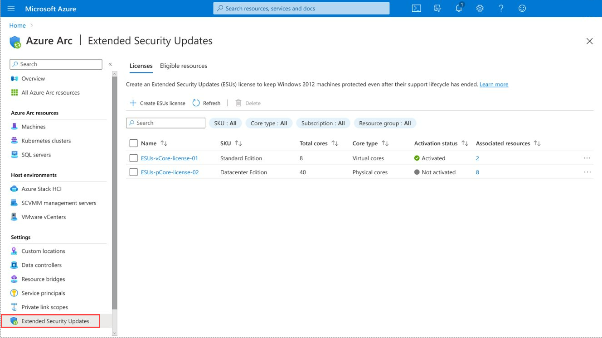
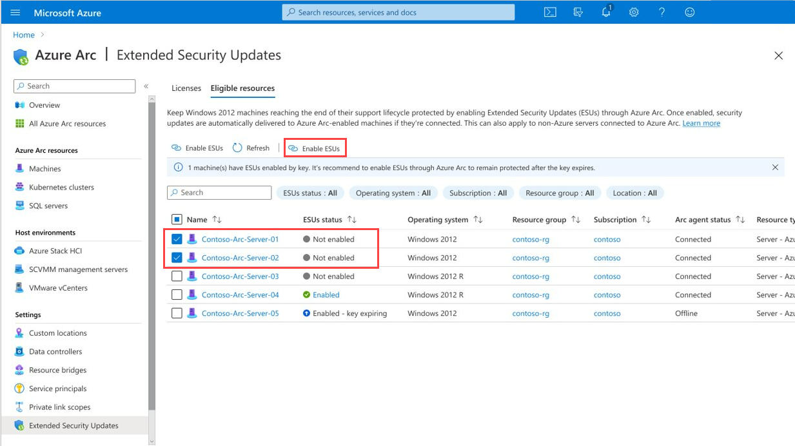
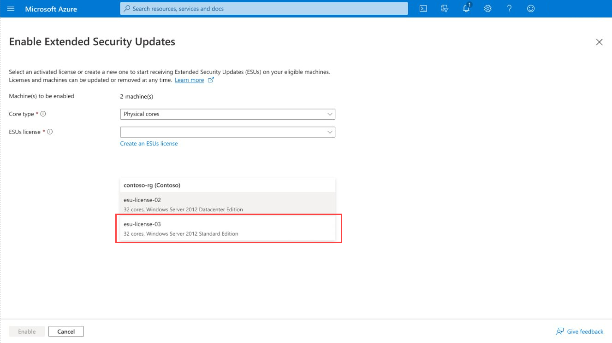

To prepare for activating Windows Server 2012 and 2012R2 ESUs on your Arc-enabled servers, follow these steps:

1. Sign in to the [Azure portal](https://portal.azure.com/).

2. In the search bar, enter "Servers - Azure Arc" and select the matching service entry.

3. Add your existing Windows Server 2012 or 2012 R2 computer to Azure Arc using PowerShell, SCCM, or Group Policy.

## Create ESU licenses for Arc enabled Servers

You use the Extended Security Updates section of the Azure Arc page of the Azure portal to create ESU licenses that you can then assign to Arc Enabled Servers. The Licenses tab of this page is shown in the exhibit.

To provision an ESU license, you select the Create ESU license option on this page. When performing this step, specify:

- The Windows Server SKU (Standard or Datacenter)
- Type of cores (Physical or Virtual)
- Number of 16-core and 2-core packs.

If you choose to license based on physical cores, the licensing requires a minimum of 16 physical cores per license. If you choose to license based on virtual cores, the licensing requires a minimum of 8 virtual cores per Virtual Machine. Licensing virtual cores is appropriate for scenarios where you may be running the VM on a third-party host or on a third party cloud. Virtual cores are also an appropriate choice when running Windows Server 2012 and 2012 R2 VMs on versions of Windows Server that still subject to mainstream or extended support.

If you're licensing a server used for virtualization, the Standard licensing can be applied to up to two hosted virtual machines (VMs) whilst Datacenter licensing has no limit to the number of VMs it can be applied to. Depending on the number of VMs hosted on the virtualization server, it may make sense to choose the Datacenter license instead of the Standard license.

You have the option of provisioning Extended Security Update licenses in a deactivated state so that they don't incur billing from creation. You can then activate these licenses when you're ready to provision them. You're also able to modify the number of cores associated with the license after provisioning.

## Allocate ESU license to an Arc-enabled server

To link an existing ESU license to an Arc-enabled server, select the Eligible Resources tab in the Extended Security Updates section of the Azure Arc page in the Azure portal. This page is shown in the next exhibit.

Select the computers for which you wish to enable ESUs and then choose Enable ESUs. On the Enable Extended Security Updates page, shown in the next exhibit, choose the ESU license that you wish to allocate to each computer. If you haven't already created the ESU licenses, you can also create a new ESU license when performing this step.

## Leverage additional Azure Services enabled by Azure Arc

Beyond access to Windows Server 2012 and 2012 R2 Extended Security Updates, Azure Arc-enabled servers enrolled in ESUs are also eligible for the following Azure management service at no extra cost:

- Azure Update Manager
- Azure Machine Configuration
- Azure Change Tracking and Inventory

These capabilities make it possible to assess and schedule patches, deliver security baselines and auditing, and inventory the software on your Azure Arc-enabled servers.

Azure Arc also provides customers with access to paid Azure management services like Microsoft Defender for Cloud Security Posture Management, Azure Monitor for Virtual Machine insights and performance metrics, and Microsoft Sentinel for Security Information Event Management. These services can help you improve the security and monitoring posture of End of Support infrastructure.
