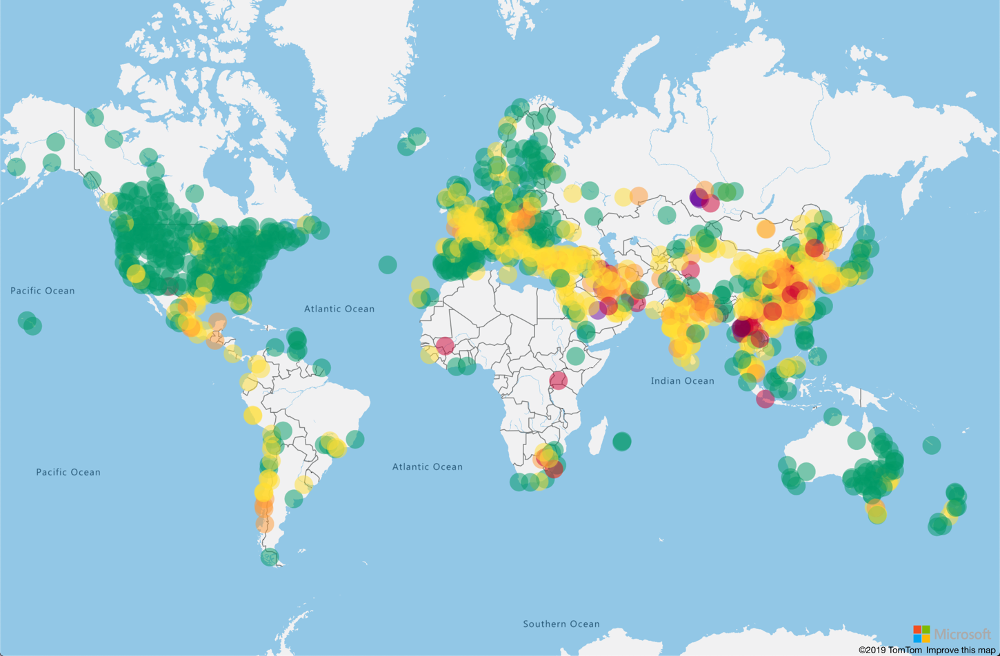

Air pollution can cause serious harm to human and animal health. Air pollution is caused by various factors that might occur naturally or result from specific activities. Factory output, burning some types of fuel, and wildfires all contribute to a rise in air pollution. This pollution is airborne, and it doesn't in the area where it was produced. Air pollution can be carried by the wind many kilometers and across the globe. For example, in late 2019, smoke from wildfires in Australia reached New Zealand, more than 2,000 kilometers away.

Air pollution is measured on the *Air Quality Index (AQI)*, a scale that ranges from 0 to 500. The higher the AQI value, the greater the health risk. An AQI value that's lower than 50 indicates little to no risk, but a value that's 300 or higher means the air is hazardous to everyone. 

The AQI looks at a few different pollutants:

- Ground-level ozone
- Particulates
- Carbon monoxide
- Sulphur dioxide
- Nitrogen dioxide

> [!TIP]
> You can read more about the AQI at [AirNow AQI Basics](https://www.airnow.gov/aqi/aqi-basics/?azure-portal=true).

In this module, you'll get air pollution data by using a free API, and then use Azure Maps to plot the data on an interactive map. Azure Maps is a collection of geospatial services that use fresh mapping data to provide geographic context to web and mobile applications. The services include APIs for maps, vehicle routing, weather, and geofencing. Azure Maps also has a web SDK that you can use to display a map on a webpage.

The app you'll create will look like this:

## Learning objectives

In this module, you'll:

- Learn about Azure Maps and the Maps web SDK
- Create an Azure Maps account
- Use the Azure Maps web SDK on a webpage
- Learn about GeoJSON, the data format of spatial data
- Load air quality data from an API and show it on a map

## Prerequisites

- Ability to use Python at a beginner level
- Experience using Visual Studio Code at a beginner level
- Python 3.6 or later installed and available on your path
- Visual Studio Code installed
- Python extension for Visual Studio Code installed

> [!TIP]
> If you want to learn how to set up and configure Visual Studio Code for Python development, complete [Set up your Python beginner development environment with Visual Studio Code](https://docs.microsoft.com/learn/languages/python-install-vscode/?azure-portal=true).