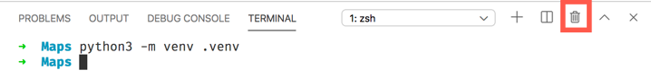

In this unit, you'll use the Flask web application framework to create a Python app. Then, you'll use the Azure Maps web SDK with your app to show a map on a webpage.

## Build the app

To build the app, first, we'll create project folders, configure the Python environment, and install the pip packages we need.

Then, we'll create an environment file and the application Python file.

Finally, we'll create a *home.html* file to show results.

### Create folders for the Python app

1. On your computer, create a folder to store the application code. 

1. Open Visual Studio Code, and then open the folder you created.

1. At the root of your application code folder, create a Python application file called <i>app.py</i>.
 
   When you create this Python file, Visual Studio Code activates the Python extension, so it's ready to build a Python app. You can see the progress of the extension activation in the status bar in the lower-left corner of Visual Studio Code.

1. At the root of your application code folder, create a folder named *templates*. This folder will hold the HTML templates that the Flask app will use.

### Configure the Python environment

1. In Visual Studio Code, select **Terminal** > **New terminal** to open the terminal.

1. In the terminal, enter the following command to create a Python virtual environment.

    On Windows:

    ```python
    python -m venv .venv
    ```

    On Linux or macOS:

    ```python
    python3 -m venv .venv
    ```

    This command creates a virtual environment inside the current folder. Visual Studio Code detects this change and prompts you to select the virtual environment for this folder. Select **Yes**.

    :::image type="content" source="../media/activate-venv-dialog.png" alt-text="Screenshot that shows the prompt to activate the virtual environment.":::

    > [!NOTE]
    > If you don’t see a dialog box that asks whether you want to select the virtual environment, you can manually select the Python interpreter version. In the Visual Studio Code status bar in the lower-left corner, select the Python version. At the top of the Visual Studio Code window, the Python interpreter selection opens. Select the Python version that is in the *./.venv/bin/python* folder.

1. Close the terminal by selecting the trash can icon.

    

1. Select **Terminal** > **New terminal** to reopen the terminal in the virtual environment.

   When the terminal is running in a Python virtual environment, notice that the prompt shows `(.venv)` as a prefix.

### Install pip packages

The package installer for Python is called *pip*. The application you'll create requires the following pip packages:

* `flask`: This package is a web framework for Python.
* `python-dotenv`: This package allows environment variables like the Azure Maps key to be loaded from environment files.
* `requests`: This package makes it easy to make web requests. We'll use it later to query for air quality data.

First, you'll create a text file that lists the required pip packages. Then, you'll run a command that installs the packages that are listed in the text file.

1. In Visual Studio Code, at the root of your application code folder, create a new text file named *requirements.txt*. Copy the following code into the text file:

    ```console
    flask
    python-dotenv
    requests
    ```

1. Save the file.

    > [!TIP]
    > In Visual Studio Code, if you want to automatically save files after each change, select **File** > **Auto Save**.

1. In the terminal, run this command to install the pip packages:

    ```console
    pip install -r requirements.txt
    ```

   > [!Note]
   > You can disregard any warning messages about the pip version.

### Create an environment file

The Flask app that you'll create will need to use your Azure Maps key to load the map control onto a webpage. A best practice is to store data like this in environment variables so that the data isn't checked in to source code control. You can set an environment variable to a specific value when you develop or publish your app. Flask uses the python-dotenv package to look for a file named *.env* at the root of your application code folder and then loads environment variables from this file.

> [!TIP]
> If you deploy this app to Azure by using Azure App Service, the values in the *.env* file must be added to an application settings file so that the values are automatically set as environment variables that the app can use.

To create the environment file:

1. At the root of your application code folder, create a new environment file named *.env*.

1. Copy the following statement into the environment file:

    ```console
    MAP_KEY=<your map key>
    ```

    Replace `<your map key>` with the value of the primary key you retrieved after you created the Azure Maps account in the preceding unit. Don't include quotation marks.

1. Save the file.

### Create the application Python file

1. In Visual Studio Code, in your app code folder, open the <i>app.py</i> file.

1. Copy the following code into the application file:

    ```python
    import os, json
    from flask import Flask, render_template, request
    import requests

    # Load the Azure Maps key from the .env file.
    MAP_KEY = os.environ["MAP_KEY"]

    # Initialize the Flask app.
    app = Flask(__name__)

    # Handle requests to the root of the website, returning the home page.
    @app.route("/")
    def home():
        # Create data for the home page to pass the Maps key.
        data = { "map_key" : MAP_KEY }
        # Return the rendered HTML page
        return render_template("home.html", data = data)
    ```

    This code handles requests to `/`, which is the root of the website. When this webpage is loaded, the app uses the key from your *.env* file to create data. The data is used to render the *home.html* file as a parameter named `data`.

1. Save the file.

### Create the home.html file

1. In Visual Studio Code, in the *templates* folder, create a new HTML file named *home.html*.

1. Copy the following code into the HTML file:

    ```html
    <!doctype html>
    <html>
    <head>
        <title>Air quality tracker</title>
        <!-- Ensures that Internet Explorer and Microsoft Edge use the latest versions and that they don't emulate earlier versions. -->
        <meta http-equiv="x-ua-compatible" content="IE=Edge">
        <meta charset='utf-8'>
        <!-- Ensures that the webpage looks good on all screen sizes. -->
        <meta name="viewport" content="width=device-width, initial-scale=1, shrink-to-fit=no">
        <!-- Import the Azure Maps control. -->
        <link rel="stylesheet" href="https://atlas.microsoft.com/sdk/javascript/mapcontrol/2/atlas.min.css" type="text/css">
        <script src="https://atlas.microsoft.com/sdk/javascript/mapcontrol/2/atlas.min.js"></script>
        <style>
            html,
            body {
                margin: 0;
            }
            #myMap {
                height: 100vh;
                width: 100vw;
            }
        </style>
    </head>
    <body>
        <div id="myMap"></div>
        <script type="text/javascript">
            window.addEventListener("DOMContentLoaded", function () {
                // Pick a predefined location of the Microsoft headquarters.
                map_center = [-122.136866, 47.642472]

                // If the user grants permission when prompted, get the user's location.
                if (navigator.geolocation) {
                    navigator.geolocation.getCurrentPosition(function (position) {
                        map_center = [position.coords.longitude, position.coords.latitude]
                    })
                }

                // Create an instance of the map control by using the map key from the Flask app.
                var map = new atlas.Map('myMap', {
                    authOptions: {
                        authType: 'subscriptionKey',
                        subscriptionKey: '{{ data.map_key }}'
                    }
                });

                // When the map is ready, center the map on the user's location.
                map.events.add('ready', function () {
                    map.setCamera({
                        center: map_center,
                        zoom: 5
                    })
                })
            })
        </script>
    </body>
    </html>
    ```

    This webpage renders a full-screen `div` element that has an ID of `myMap`. After the page is fully loaded, in the browser, the app requests the user's location. The app can get the user's location only if the user grants permission. If the user doesn't give the browser permission to access their location, the browser uses the location of the Microsoft headquarters in Redmond, Washington, USA.

    > [!NOTE]
    > Azure Maps uses longitude and latitude for map coordinates. Longitude measures around the Earth from east to west at 0° at the prime meridian (a line from the North Pole to the South Pole that runs through the United Kingdom). It goes east to 180° on the opposite side of the globe, roughly between Alaska and Russia, and west to the same place at -180°. Latitude goes north to south, with the North Pole at 90°, the equator at 0°, and the South Pole at -90°.

    The map control is then loaded into the `div` element. The Azure Maps key is set to `{{ data.map_key }}`. This is the Flask notation to render data in the HTML file. When this page is returned to the user's web browser, the value `{{ data.map_key }}` is replaced by the value of `map_key` set on the `data` object. This object was passed to the `render_template` call in the <i>app.py</i> file, and `map_key` is set to the Azure Maps primary key that loads from the *.env* file.

    When the control is ready, the map view is centered over the user's location by using a virtual camera. The zoom value shows how far above Earth the camera should be, and it determines how many meters of the map are shown per pixel on the screen. You can read more about the different zoom values in [Zoom levels and tile grid](/azure/azure-maps/zoom-levels-and-tile-grid?azure-portal=true).

1. Save the file.

In this unit, you used Flask to create a Python app. Next, run the app and view it in your webpage. 