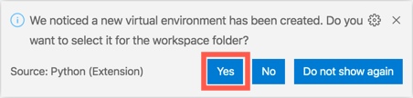

In this unit, you'll use Flask to create a Python app that shows the Azure Maps web SDK on a webpage.

## Build the app

To build the app, first, we'll create project folders, configure the Python environment, and install the Pip packages we need.

Then, we'll create an environment file and create the application Python file.

Finally, we'll create a home.html file to show results.

### Create the folders for the Python app

1. Create a folder on your computer to store the application code.

1. Open Visual Studio Code, and open the folder you created.

1. At the root of your application code folder, create a Python application file called *app.py*. 
 
   When you create this Python file, Visual Studio Code activates the Python extension, so it's ready to build a Python app. You can see the progress of the extension activation in the status bar in the lower-left corner of Visual Studio Code.

1. At the root of your application code folder, create a folder named *templates*. This folder will hold the HTML templates that the Flask app will use.

### Configure the Python environment

1. In Visual Studio Code, select **Terminal** > **New terminal** to open the terminal.

1. In the terminal, enter the following command to create a Python virtual environment.

    On Windows:

    ```python
    python -m venv .venv
    ```

    On Linux or macOS:

    ```python
    python3 -m venv .venv
    ```

    This command creates a virtual environment inside the current folder. Visual Studio Code detects this change and prompts you to select the virtual environment for this folder. Select **Yes** to select the new virtual environment.

    

    > [!NOTE]
    > If you don’t see a dialog box that asks whether you want to select the virtual environment, you can manually select the Python interpreter version. In the Visual Studio Code status bar in the lower-left corner, select the Python version. At the top of the Visual Studio Code window, the Python interpreter selection opens. Select the Python version that is in the *./.venv/bin/python* folder.

1. Stop the virtual environment and close the terminal by selecting the trash can icon.

    

1. Select **Terminal** > **New terminal** to restart the terminal using the virtual environment. 

   When the terminal is running in a Python virtual environment, notice that the prompt shows `(.venv)` as a prefix.

### Install the necessary pip packages

Pip is the package installer for Python. The application we'll create requires the following pip packages:

* `flask` - This package is a web framework for Python.
* `python-dotenv` - This package allows environment variables like the Maps key to be loaded from environment files.
* `requests` - This package makes it easy to make web requests and will be used later to query air quality data.

First, we'll create a text file that lists the pip packages we need. Then, we'll run a command that install the packages that are listed in the text file.

1. In Visual Studio Code, at the root of your application code folder, create a new text file named *requirements.txt*. Copy the following code into the text file:

    ```console
    flask
    python-dotenv
    requests
    ```

1. Save the file.

    > [!TIP]
    > If you want to automatically save files after each change, select **File** > **Auto Save**.

1. In the terminal, run this command to install the pip packages:

    ```console
    pip install -r requirements.txt
    ```

   > [!Note]
   > You can disregard any warning messages about the pip version.

### Create an environment file

The Flask app that you'll create will need to use your Azure Maps key to load the map control onto a page. A best practice is to store data like this in environment variables so that the data isn't checked in to source code control. Environment variables can be configured to different values when you develop or publish your app. Flask uses the python-dotenv package to look for a file named *.env* at the root of your app code folder and load environment variables from this file.

> [!TIP]
> If you deploy this app to Azure by using Azure App Services, the values in the *.env* file must be added to an application settings file so that they're automatically set as environment variables that the app can use.

To create the environment file:

1. At the root of your app code folder, create a new environment file named *.env.*.

1. Copy the following statement into the environment file:

    ```console
    MAP_KEY=<your map key>
    ```

    Replace `<your map key>` with the value of the primary key you retrieved after you created the Azure Maps account earlier. Don't include the quotation marks.

1. Save the file.

### Create the application Python file

1. In Visual Studio Code, in your app code folder, open the *app.py* file.

1. Copy the following code into the application file:

    ```python
    import os, json
    from flask import Flask, render_template, request
    import requests

    # Load the Azure Maps key from the .env file.
    MAP_KEY = os.environ["MAP_KEY"]

    # Initialize the Flask app.
    app = Flask(__name__)

    # Handle requests to the root of the website, returning the home page.
    @app.route("/")
    def home():
        # Create data for the home page to pass the Maps key.
        data = { "map_key" : MAP_KEY }
        # Return the rendered HTML page
        return render_template("home.html", data = data)
    ```

    This code handles requests to `/`, which is the root of the website. When this webpage is loaded, the app uses the key from your *.env* file to create some data. The data is used to render the home.html file as a parameter named `data`.

1. Save the file.

### Create the home.html file

1. In Visual Studio Code, in the templates folder, create a new HTML file named *home.html*.

1. Copy the following code into the HTML file:

    ```html
    <!doctype html>
    <html>
    <head>
        <title>Air quality tracker</title>
        <!-- Ensures that Internet Explorer and Microsoft Edge use the latest versions and that they don't emulate older versions. -->
        <meta http-equiv="x-ua-compatible" content="IE=Edge">
        <meta charset='utf-8'>
        <!-- Ensures that the webpage looks good on all screen sizes. -->
        <meta name="viewport" content="width=device-width, initial-scale=1, shrink-to-fit=no">
        <!-- Import the Azure Maps control. -->
        <link rel="stylesheet" href="https://atlas.microsoft.com/sdk/javascript/mapcontrol/2/atlas.min.css" type="text/css">
        <script src="https://atlas.microsoft.com/sdk/javascript/mapcontrol/2/atlas.min.js"></script>
        <style>
            html,
            body {
                margin: 0;
            }
            #myMap {
                height: 100vh;
                width: 100vw;
            }
        </style>
    </head>
    <body>
        <div id="myMap"></div>
        <script type="text/javascript">
            window.addEventListener("DOMContentLoaded", function () {
                // Pick a predefined location of the Microsoft headquarters.
                map_center = [-122.136866, 47.642472]

                // If the user grants permission when prompted, get the user's location.
                if (navigator.geolocation) {
                    navigator.geolocation.getCurrentPosition(function (position) {
                        map_center = [position.coords.longitude, position.coords.latitude]
                    })
                }

                // Create an instance of the map control by using the map key from the Flask app.
                var map = new atlas.Map('myMap', {
                    authOptions: {
                        authType: 'subscriptionKey',
                        subscriptionKey: '{{ data.map_key }}'
                    }
                });

                // When the map is ready, center the map on the user's location.
                map.events.add('ready', function () {
                    map.setCamera({
                        center: map_center,
                        zoom: 5
                    })
                })
            })
        </script>
    </body>
    </html>
    ```

    This webpage renders a full-screen `div` element that has an ID of `myMap`. After the page is fully loaded, the app attempts to get the user's location. The browser requests the user's permission to get their location, and it gets the location only if the user grants permission. Otherwise, the browser uses the location of the Microsoft headquarters in Redmond, Washington, USA.

    > [!NOTE]
    > Azure Maps uses longitude and latitude for the map coordinates. Longitude measures around the Earth from east to west, at 0° at the prime meridian (a line from the North Pole to the South Pole that runs through the United Kingdom). It goes east to 180° on the opposite side of the globe, roughly between Alaska and Russia, and west to the same place at -180°. Latitude goes north to south, with the North Pole at 90°, the equator at 0°, and the South Pole at -90°.

    The map control is then loaded into the `div` element. The Maps key is set to `{{ data.map_key }}`. This notation is the Flask notation to render data into the HTML file. When this page is returned to the user's web browser, the value `{{ data.map_key }}` is replaced by the value of `map_key` set on the `data` object. This object was passed to the `render_template` call in the *app.py* file, and `map_key` is set to the Azure Maps primary key that loads from the *.env* file.

    When the control is ready, a virtual camera centers the map view over the user's location. The zoom value shows how far above Earth the camera should be, and it determines how many meters of the map are shown per pixel on the screen. You can read more on the different zoom values in the [Zoom levels and tile grids documentation](/azure/azure-maps/zoom-levels-and-tile-grid?azure-portal=true).

1. Save the file.

## Run the app

You can set up Visual Studio Code to run and debug Flask apps. Then, use your browser to see the app in action.

To configure debugging for your app:

1. In Visual Studio Code, be sure that the *app.py* file is open in the editor. Debug options vary based on the file you have open.

1. In the activity bar, select the **Run** tab, or on the menu, select **View** > **Run**.

    :::image type="content" source="../media/run-app.png" alt-text="Screenshot that shows selecting Run for an open file in Visual Studio Code.":::

1. Under the **Run and Debug** button, select the **create a launch.json file** link.

    :::image type="content" source="../media/create-launch-file.png" alt-text="Screenshot that shows selecting the create a launch.json file link.":::

1. In the Command Palette, select **_Flask_ Launch and debug a Flask web application**.

    :::image type="content" source="../media/launch-debug-flask-app.png" alt-text="Screenshot that shows selecting Flask Launch and debug a Flask web application in the Command Palette.":::

   > [!Note]
   > If you don’t see a new file named *launch.json* in the *.vscode* folder in your app code folder, you can manually create the configuration file:
   >
   > - To the right of **Run**, select the gear icon. A new launch.json opens in the *.vscode* folder and the text in **Run** changes to "Python:Flask."
   >

1. When "Python:Flask" shows in **Run**, select the green triangle icon to run the application.

    :::image type="content" source="../media/run-flask-app.png" alt-text="Screenshot that shows the green triangle icon selected to run Flask.":::

    The app starts. The code output shows the local URL the app is running on:

    ```output
     * Serving Flask app "app.py"
     * Environment: development
     * Debug mode: off
     * Running on http://127.0.0.1:5000/ (Press CTRL+C to quit)
    ```

1. Position your cursor on the IP address link in the terminal output. Enter Ctrl+Click to open the application in your web browser. If you give the site permission to get your location, it centers on you. Otherwise, the app centers on the Microsoft headquarters in Redmond, Washington, USA.

    :::image type="content" source="../media/map-in-edge.png" alt-text="Screenshot of the map running in the Microsoft Edge web browser.":::   

   Try moving around the map by dragging, using the mouse wheel, or pinching to zoom in and out.

   When you're finished, stop the app by using the stop button on the debug toolbar in Visual Studio Code.

   :::image type="content" source="../media/stop-button.png" alt-text="Screenshot that shows the debug stop button in Visual Studio Code.":::

## Troubleshooting

### Exception has occurred: KeyError

If your app stops as soon as it runs and shows an exception with the message `Exception has occurred: KeyError`, your Azure Maps key hasn't been added to the *.env* file.

:::image type="content" source="../media/key-error.png" alt-text="Screenshot that shows an example of the error message Exception has occurred: KeyError.":::

Check the following:

* Is there a file called *.env* in the root of your application?
* The *.env* file should contain a key/value pair in the format `key=value`. The key must be `MAP_KEY`, and the value must be your primary key copied from the Azure Maps account.

### No data on the map

If you don't see any data on the map, but you do see the Microsoft logo, you aren't using a valid key for the map control. Check the value in the *.env* file to ensure that it's correct. The value shouldn't be in quotes.

## 500 Internal server error

If a `500 Internal Server Error` is returned, check the logs in the Visual Studio Code terminal. The following output example indicates that the *home.html* file isn't in the correct location:

```output
jinja2.exceptions.TemplateNotFound: home.html
```

The *home.html* file should be in the *templates* folder. Move the file and restart the Flask app.

In this unit, you used the Azure Maps web SDK to create a Flask app that displays a map for the user's location. Next, let's learn about the GeoJSON format for spatial data.