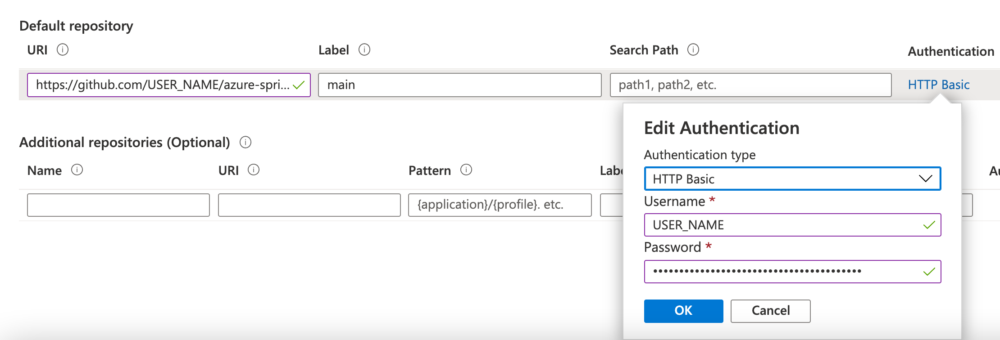

In this module, you will configure a [Spring Cloud Config Server](https://cloud.spring.io/spring-cloud-config), that will be entirely managed and supported by Azure Spring Cloud, to be used by Spring Boot microservices.

This Spring Cloud Config Server will get its configuration data from a Git repository, where Spring Boot configuration files will be stored. Storing configuration files using this mechanism has the following advantages:

- Your application's sensitive parameters (like your database password) will not be checked into your application code.
- The Git repository storing your configuration can be specifically secured, so that only an operations team has access to it.
- As the configuration files are stored in Git, you can tag them or roll back them, making it easy to manage your production environment.
- It provides a centralized place to store all your configuration data, for all your microservices.

## Create a Git repository for storing the application configuration

On your [GitHub account](https://github.com), create a new **private** repository where the Spring Boot configurations will be stored.

In the new private GitHub repository, add a new `application.yml` file, which will store configuration data for all our microservices.

Typically, each Spring Boot application includes such a file within the application binaries to contain application settings. A Spring Cloud Configuration Server allows such settings to be stored outside your application, which provides the following benefits:

- It allows storing sensitive parameters (like your database password) outside of your application.
- Your configuration is stored in a Git repository, so its data can be tagged or rolled back.
- It uses a specific Git repository, which can be secured separately.
- It provides a centralized place to store all your configuration data, for all your microservices.

For the moment, our `application.yml` will just store a message to check if the configuration is successful:

```yaml
application:
    message: Configured by Azure Spring Cloud
```

Commit and push the new file:

```bash
git add application.yml
git commit -m 'Add new Spring Boot configuration file'
git push
```

## Create a GitHub personal token

Azure Spring Cloud can access Git repositories that are public, secured by SSH, or secured using HTTP basic authentication. We will use that last option, as it is easier to create and manage with GitHub.

Follow the [GitHub guide to create a personal token](https://help.github.com/en/articles/creating-a-personal-access-token-for-the-command-line) and save your token. When asked to select scopes, check off the entire "repo" section (as shown below) and nothing else.


Once the token is generated, leave that tab open until the end of this section.

## Configure Azure Spring Cloud to access the Git repository

1. Go to [the Azure portal](https://portal.azure.com/?WT.mc_id=java-11899-judubois).
1. Go to the overview page of your Azure Spring Cloud server and select "Config server" in the menu.
1. Configure the repository we previously created:
    1. Add the repository URL, for example `https://github.com/<YOUR_USERNAME>/azure-spring-cloud-config` or `git@github.com:<YOUR_USERNAME>/azure-spring-cloud-config.git`.

     > [!TIP]
     > Make sure you include the `.git` ending in the URL, or you use the qualified URI.

    1. Add your branch in `Label`. It defaults to `main` on GitHub, but older repositories or alternate Git providers might still use `master`.
    1. Click on **Authentication** and select **HTTP Basic**.
    1. The __username__ is your GitHub login name.
    1. The __password__ is the personal token we created in the previous section.
1. Click on **Apply** and wait for the operation to succeed.
1. Click on **Validate** and wait for the operation to succeed.



## Review

We have now created a private configuration repository. We have enabled Azure Spring Cloud to create a configuration server with the configuration files from this repository.

In the next section, we will create an application that consumes this configuration, specifically the custom message we defined in `application.yml`.
