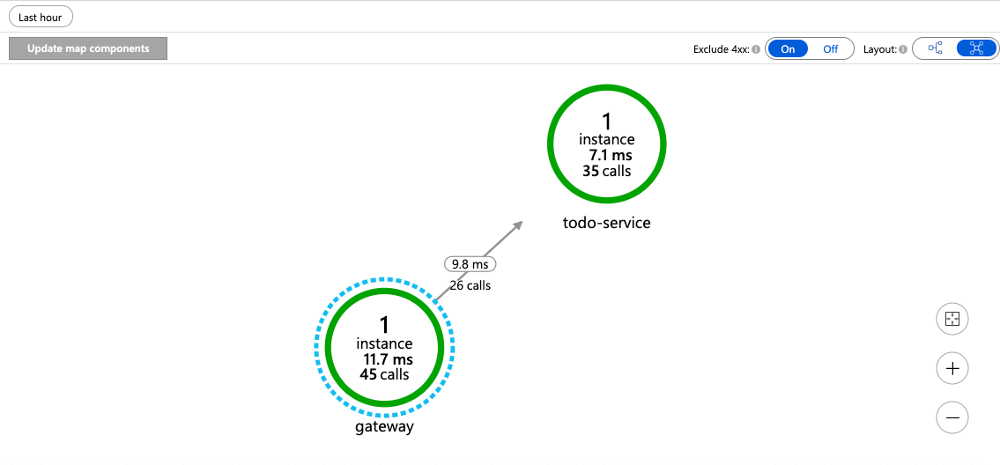

In this unit, we look Azure Spring Cloud's distributed tracing mechanism, to better understand microservices issues.

We now have a complete microservices stack:

- A Spring Boot microservice, that stores its data in MySQL.
- A todo-gateway based on Spring Cloud Gateway.

However, even with only those two components, it already is quite challenging to monitor and study performance issues in our architecture.

To solve that issue, we're going to use Application Performance Monitoring (APM):

1. Go to [the Azure portal](https://portal.azure.com/?WT.mc_id=azurespringcloud-mslearn-judubois).
2. Go to the overview page of your Azure Spring Cloud cluster and select **Application Insights** in the menu.
3. This setting should already be on **Enable**.
4. You'll have access to an **application map**, storing your tracing data.

> [!TIP]
> Tracing data can take a couple of minutes to be ingested by the system, so use this time to generate some load, and wait for the data to arrive.

You should now have access to a full application map and to a search engine that allows to find performance bottlenecks.

