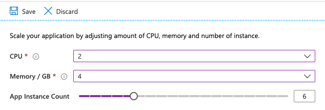

Spring Boot microservices and gateways running inside Azure Spring Cloud can be scaled vertically or horizontally:

- Vertical scaling means you increase (or decrease) the CPU and RAM of a given service.
- Horizontal scaling means you can add (or remove) nodes for a given service.

## Scaling the "todo-service" microservice

1. Go to [the Azure portal](https://portal.azure.com/?WT.mc_id=azurespringcloud-mslearn-judubois).
2. Go to the overview page of your Azure Spring Cloud cluster and select **Apps** in the menu.
3. Select the **todo-service** application.
4. Select **Scale up** in the left hand-side menu. You can now scale your service horizontally, for example you can give it 2 CPUs and 4 Gb of RAM.
5. Select **Scale out** in the left hand-side menu. You can also scale your service vertically. For example, you can select your service and use **Manual scale** to have 2 instances of your service.

