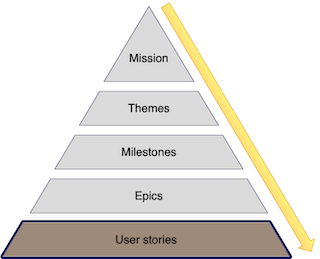
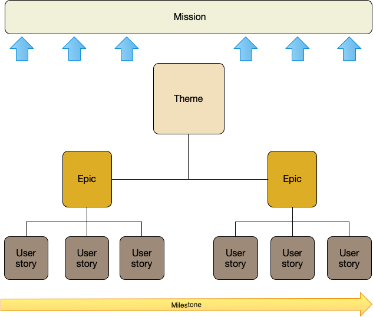

:::row:::
  :::column:::
       
  :::column-end:::
        :::column span="3":::

User stories are the base artifacts for Agile planning. A user story is a high-level definition of a requirement. It should contain enough information that the requirement is understood, and a reasonable estimate of the effort required to build it can be made.

User stories are written throughout the development life cycle, but the core of them are written when you create an epic. Typically, the whole team involved, and often stakeholders from the business or even customers, and the stories are written in a workshop-like forum. Further stories will evolve as the epic proceeds, to address new requirements or to split existing stories that have become too complex. Some stories will even evolve into epics in their own right if they turn out to be complex or emerge as functionality worth extending.

 :::column-end:::
:::row-end:::

A good user story contains:

* Summary of the requirement, no more than one or two sentences.
* Priority, to tell us how important the story is to the product.
* Series of "stories" about the requirement, that describes what we expect from it.
* Test of the story's success.
* Estimate of the effort the story will take. 

Let’s look at an example story for our recommendation engine.

* Summary: Build a content-based recommendation algorithm. 
* Priority: 1
* Stories
  * As a customer, I want to see recommendations based on my prior purchases, so I can find the best items to buy.
  * etc. ...
* Test: The algorithm returns three content-based recommendations for a customer’s user ID.
* Estimate: 3 days.

## Subject

Our user story starts with a summary of the objective of the story, in our case building a recommendation algorithm.

## Priority

We give the story a priority, here `1`. This priority is derived from the prioritization frameworks we discussed earlier in the module. Remember in our 2x2 prioritization plot that stories in the top-left quadrant were the most important, here priority `1` would likely be one of those stories.

## Stories

We then list a series of "stories" about the feature we're building. Those "stories" typically follow a format something like:

> As a < type of user >, I want < some goal > so that < some reason >

They tell the story of what the user wants, expects, and needs from the requirement. 

## Test

The test of the story is the acceptance criteria, which indicates successful completion of the story. In our case, our algorithm returning three recommendations for each user. Other tests might include the accuracy of the feature or its performance.

## Estimate

The estimate is the amount of effort we believe the story will take to complete. Estimates can be complicated and hard to get right. There are [many](https://www.berteig.com/how-to-apply-agile/9-agile-estimation-techniques/) [ways](https://techbeacon.com/app-dev-testing/fast-estimation-better-approach-agile-estimation) of estimating work. A simple, initial, approach is to estimate the amount of time a story will take in days and/or hours. Initially, your estimates might be a little imprecise but as you complete stories you can validate your estimates against reality. This process will hopefully help you refine and develop more accurate estimates over time. 

> [!WARNING]
> Estimates can be contentious. It's often hard to estimate how much effort is involved in a story. If you or the team get it wrong then avoid recriminations. Instead, focus on identifying why the estimate was wrong and doing better next time. More learning, less blame.

Your estimates also help you crudely ascertain how many people you need building your product. If you want to build 20 stories in a month that require more effort than your team can deliver, then you know you need to hire more people to build your product.

## Summary

This story is a formal user story; many organizations use more lightweight and informal representations. If a story feels like it has too much detail, then the traditional approach is to split the story into smaller stories.

From here, we can now also see the whole structure of a road map, and how each component, from user stories to the mission rolls up into the plan to build your product.
