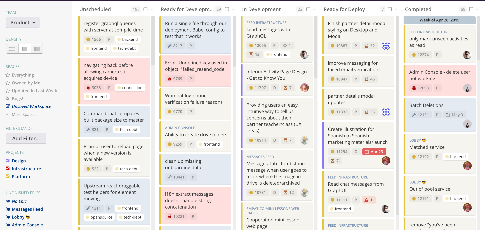
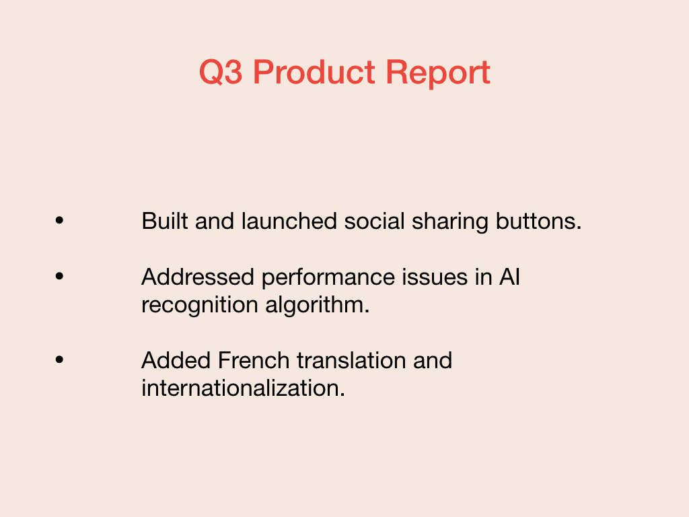

As you build your product road map, you also need to  know who you are building your road map for. Every audience of a road map will have different expectations. Since your road map can’t be all things to all people, you’ll need to consider different formats or documents for these different audiences.

At Fabrikam, the audiences for our product road map are:

## Your product engineering team

The engineers, designers, and product managers working on the product. They are looking for lower-level tactical information, sprint, and story-level, that will tell them what to work on right now:

* What do we plan to do this sprint.
* The status of the work they are doing right now.

This audience will be the primary and default audience for your product road map and this module is designed to produce an artifact that is most suited to help that audience.

## Your executive team and investors

Your executive team are interested your high-level goals, the total time and cost of development work, and how it achieves the company's strategic objectives. Most likely the executive audience will be interested in the reporting outputs from your product management process.

* What you plan to do in the near future, for example the next quarter. What are you going to do next?
* What you have and are achieving currently, for example this quarter. Are you on schedule?
* The ongoing and planned time and cost of your development.

Most product managers take the outputs of past and current work being done by the product engineering team and develop a presentation for their executive team. 

The same or a similar presentation is also useful for investors, who are interested in how the product is growing and improving, and what you have planned next, so they can understand how you're spending their money.

## Customers

Your customers (and your Sales and Marketing team) want to see what features you're adding that will give the product more capabilities or make it easier to use. This presentation is usually a distillation of the presentation a product manager provides to an executive team, minus the effort required to develop it and couched in marketing terms.

