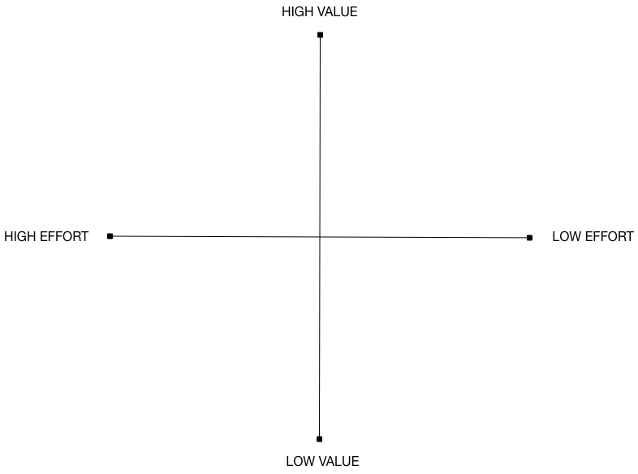
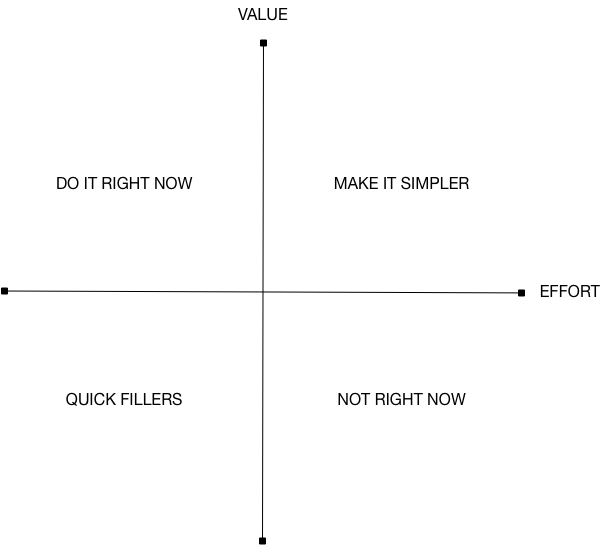

One of the critical aspects of a product road map is knowing what to work on and when or prioritization. You’re never going to have the resources to work on every aspect of your product at once, so you need to prioritize the work.

The prioritization process helps you decide what you should work on, when you should do it, and the order you should work on things in. It helps ensure that, of the thousands of ideas you probably have for your product, that you develop the important ones and put the rest into your backlog. The process also helps you balance out the relative value of an idea versus its cost. Sometimes an amazing idea is going to be expensive, in labor or cost, to develop versus the impact or value it's going to generate for your product. This process helps you decide if that cost is worth it.

There are numerous approaches to prioritization and many frameworks, such as the Lean Startup book's 2×2 grids or weighted scoring models, that you can apply to your work. One of the simplest and easiest prioritization frameworks are 2x2 grids. It requires little setup. Let's look at how to use it.

## 2x2 grids

At Fabrikam, We start the process by drawing a large "+" on a large piece of paper or a white board. We mark high and low "Value" and "Effort" along the vertical and horizontal axes respectively.

"Value" represents the value generated for your customers by the product item we want to prioritize. 

"Effort" represents the effort required to deliver on that item.

The 2×2 grid now has four quadrants.

### Top-left quadrant "Do it right now"

Features in this quadrant have the highest value, with the lowest effort. These features should be first in your list of features to work on.

### Top-right quadrant "Make it simpler"

Features in this quadrant are high value but also high complexity. They are too complex to be built in their current form. Look at each of these features and break them into smaller pieces and then remap those pieces against the 2x2.

### Bottom-left quadrant "Quick fillers"

Features are low value but also low effort. These features are great fillers if you have some space in your schedule between larger features, or can often be assigned to junior engineers as learning exercises, or even offer inspiration for hack-days.

### Bottom-right quadrant "Not right now"

These features offer some, limited, value, and take considerable effort to implement. These features are items you'd prioritize last, if at all. 

### Plotting your features

To do your prioritization, use Post-It notes to record all the features you have in mind and start plotting them on the grid. You want to measure both the value the feature will return and the effort it will require. 

Measuring the value of the feature can be hard. It's important to be as objective as possible and to consider user feedback and data rather than simply your "gut instinct" on a feature. To help with this process, it's best to do this measurement as a team. Different people will see the value of a feature differently based on their experiences and background.

A good set of criteria to consider for measuring value is:

* Customer/user impact
    * How many customers will this feature reach? A larger feature that’s invaluable to some of your customers is likely to be of lesser relative value than a smaller feature that is valuable to all of your customers.
* Revenue/Acquisition
    * Will this feature drive revenue or help you acquire more customers?
*Quality
    *Does this feature improve the quality of your product?
* Marketing/Brand
    * Does this feature enhance or enable marketing or brand awareness?

This process should be a fast exercise, don't agonize over these decisions.

When measuring effort, choose a consistent approach, like measuring effort in days. You don't have to exactly precise here, for prioritization purposes broad accuracy is sufficient.

Once you've placed all the features, you should be able to see how objective your prioritization has been. If you've done a good job, you should have a broadly even distribution of cards across each quadrant. More likely though you'll likely have clusters in the top two quadrants: people tend to be attached to their ideas and ascribe high value to them, even if they try to be objective.

There's a simple solution to balancing out this clustering. Just redraw the Value/Effort axes so there are roughly the same number of cards inside each quadrant!

You'll need to revisit this process regularly, usually at least once a month to ensure your prioritization remains up-to-date with new features and reflects changes in your plans, strategy, and feedback from users.

The 2x2 grid is a great lightweight process but there are plenty of other options you can try if it doesn't suit. Whatever happens, you need to choose some framework. What we’ve discovered in working with teams though, is that nothing deflates morale more than a seemingly arbitrary process of prioritization, this lack of process doesn’t foster good team relations and productivity. So, pick an approach, establish, and agree to it with your team, and be transparent about the process, especially any exceptions you make to the process like "the CEO says we should build..."!
