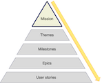

:::row:::
  :::column:::
        
  :::column-end:::
        :::column span="3":::

Now we've seen some background product road map, let's look at the components that make up a road map. The product road map is the strategic guide to building your product. Every road map should be driven by the mission of your product, the answer to the "Why you're building the product?" question.

If you can’t answer this question or haven’t yet done so, then you need to rethink building a road map or developing the product in the first place! 

 :::column-end:::
:::row-end:::

This mission is often articulated as your "elevator pitch": a pitch given in the 2-3 minutes it takes you to ride an elevator. The Fabrikam team's mission is:

> Hi, I'm Jane Smith, the CEO of Fabrikam. Last year, I went to a friend's wedding, and I was really taken with one of my fellow guest's outfit. I forgot to ask her where she got the outfit at the wedding, but when I got home, I realized I had a photo of the outfit. I tried to use the picture to find the outfit but found the experience frustrating and ultimately unsuccessful. That inspired me to build Fabrikam, an app which uses machine learning and AI to identify fashion brands from photographs and makes it easier for you to find and buy the clothes you love.

The product's mission is usually an extension of your elevator pitch with a clearer articulation of the problem you're trying to solve and how you're going to solve it.

## What's the problem

State the high-level problem you're trying to solve. Addressing this problem should be at the heart of your product. At Fabrikam, we know the identifying a clothing item and its brand from an image is hard and time-consuming. Even if you can, it's often difficult to track the item down to a store to buy it.

## What's the solution

Once you've articulated the problem, you need to understand the high-level solution you're building to solve the problem. In our case, we're building an app that makes it easier to identify the clothes you want using machine learning and AI. And that then allows you to buy those clothes without leaving the app.

## Everyone owns the mission

Everyone in your Product, Design, and Engineering teams should be able to give the product’s "elevator pitch" and understand and absorb the "why" of the product: the problem you're tying to solve and how you propose to solve it.

This "elevator pitch" mission provides those teams with a reference point to validate the work they are doing is the right work and that it is adding value to the product. Both are key drivers for engineer happiness. If you can’t connect work to the mission (or engineering tooling that accelerates your development) in some way, then it’s probably a good indication that it is work you should not be doing.
