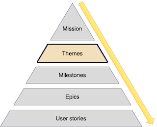

:::row:::
  :::column:::
    
  :::column-end:::
        :::column span="3":::

Once we have our mission, we should identify the key themes we're going to work on to achieve the mission. Themes are components that that roll up into delivering some aspect of the overall mission. A good theme can be clearly traced back to the mission but also has direct and immediate outcomes and measures. They represent the product instantiation of the company's current objectives: the glue between the mission and the tactical work to be done to execute on the mission.

Themes should be tied to measures and metrics that demonstrate the impact of shipping the features within the theme, for example, if the theme is to acquire new customers, then the measure might be a customer acquisition target: "Add 100,000 new customers to Fabrikam." 

 :::column-end:::
:::row-end:::

Themes allow you to set high-level goals for your product and keep track of everything contributing to that goal. You break down the journey to mission success into the current themes you need to focus on to continue that journey. A theme might be: "Acquire more customers!", "Reduce customer churn" or "Increase stability of notifications." They could also reflect internal priorities: "Streamline deployment!" or "Reduce test suite run time."

> [!TIP]
> Themes are also an excellent level in your product road map from which to gather data for communicating progress to stakeholders. 

At Fabrikam, the mission is to make it easier to find and buy the clothes you want. Fabrikam's short-term strategic objectives are to grow the user base, retain customers, and make the customer experience better. So, for our first road map at Fabrikam, we have identified three product themes that contribute to these objectives:

### Acquiring more customers

> We’re going to acquire 10,000 customers.

### Reducing customer churn

> We're going to reduce customer churn by 20%.

### Increase checkouts

> We're going to reduce the number of abandoned carts by 25%.

These, and other themes are such as "acquiring customers", will likely be repeated throughout a product’s lifespan, so it’s important to be as explicit as possible about the theme and what it achieves in this particular incarnation. This explication also ensures you keep your theme focused and help you make it achievable.
