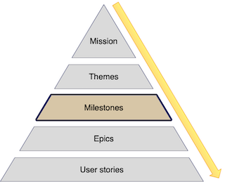

:::row:::
  :::column:::
       
  :::column-end:::
        :::column span="3":::

A milestone is the time you'll use to complete some work. It might be a month, three months, or another period. We generally represent milestones as time, either explicitly by adding a target date or using a time-based interval like months or weeks. Sometimes though a milestone might be an objective instead: version 1 of a product.

Each milestone has themes associated with it. A milestone also allows you to report what you’re going to achieve to address that milestone and will enable you to measure progress towards that goal. This component is likely what your leadership team or customer will be most interested in your reports on. So, you need to be realistic about what you can achieve in a milestone.

 :::column-end:::
:::row-end:::

At Fabrikam, we use quarterly (three months) milestones. So our current milestone is Quarter 1 of this year:

> During Q1 we plan to focus on three themes: "Acquire more customers!", "Reduce customer churn", and "Increase checkouts."

To work out what you can complete in a milestone, you'll need to work out how long the work you have planned will take. We'll talk more about estimates in the unit on user stories later in this module. You should also know the resources available to you and hence be able to solve for what’s possible in a milestone using this data. Again, having a tool that handles milestones and estimates automatically is useful.

Startups tend to be fast-moving, priorities, resourcing, and requirements change quickly, so most people don’t plan milestones beyond short and medium periods, for example, 1-6 months. Anything beyond that starts to become more like guesswork than planning. We suggest planning three milestones, say month 1, month 2, and month 3, so you know what you’re doing now and broadly what you plan to do in the following months.
