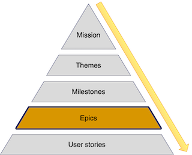

:::row:::
  :::column:::
       
  :::column-end:::
        :::column span="3":::

Contained inside of your themes are epics. Epics are collections of the work needed to deliver on the theme. Earlier in the module we indicated one of our themes was:

### Reducing customer churn

> We're going to reduce customer churn by 20%.

We'd look at this goal in the theme and identify how we might achieve that. This process means identifying new features we could build, aspects of the app we could tune, or even things we could remove. For our customer churn theme we've worked with the whole team and identified two features that should help us reduce our customer churn.

* Working on the look and feel of the UI.
* Adding a recommendation engine.

 :::column-end:::
:::row-end:::

Each of these features will be made up of many pieces of work, called user stories, that we'll need to manage and deliver. To keep all of these pieces of work organized, we collect them into an epic. So the elements needed for our recommendation engine feature would be collected together in an epic called "Recommendation Engine," containing user stories for:

* The recommendation algorithm and model.
* A data pipeline to feed the engine.
* The back-end of the engine.
* An interface to return recommendations to the customer.

Each epic should have a description and measures of success. For our recommendation engine, this description and measure might be:

> An engine that returns product recommendations based on customer’s prior purchases. The recommendation engine must return the customer a minimum of 3 recommendations within 1ms.

Like themes and milestones, epics are about achievable and measurable goals. You might be thinking "we're measuring a lot of elements in our road map," but this measurement is key to having a realistic road map. At every level of the road map, you can determine progress towards objectives, what success looks like, have a clear measure of it, and adjust the objectives and measures if circumstances change. This measurement allows you to understand where the product is in terms of completion and success and is critical to managing your product’s delivery.