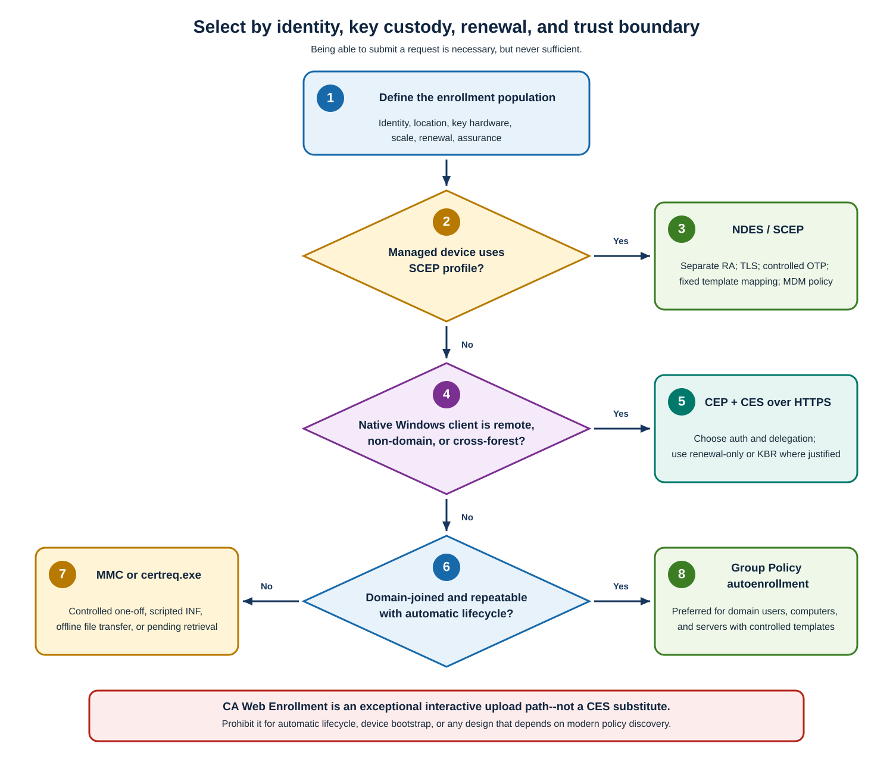

Certificate enrollment is the process of requesting and obtaining a digital certificate from a certification authority (CA). In Active Directory Certificate Services (AD CS), you can submit requests manually or use autoenrollment to automate the process based on policies and certificate templates. Both approaches support obtaining new certificates and renewing existing ones before they expire, helping prevent interruptions to authentication and encrypted communications.

The following AD CS role services handle enrollment policy and certificate requests:

- **Certificate Enrollment Policy Web Service (CEP)** publishes Windows enrollment policy over HTTPS. It retrieves certificate templates and enrollment requirements from Active Directory Domain Services (AD DS), so Windows clients can discover enrollment options without direct directory access. CEP supplies policy only; CES handles request submission.
- **Certificate Enrollment Web Service (CES)** submits native Windows requests to a CA. It receives requests over HTTPS, forwards them to the CA over RPC/DCOM, and returns issued certificates or request status. Together with CEP, it supports enrollment and renewal for remote or non-domain Windows clients without direct CA connectivity.
- **Network Device Enrollment Service (NDES)** acts as a registration authority for the **Simple Certificate Enrollment Protocol (SCEP)** used by many managed or constrained devices. It selects a configured certificate template based on the requested key usage, submits the device's request to the CA, and returns the issued certificate. Devices keep their private keys locally and don't need domain membership or direct CA access.

Windows direct enrollment normally uses Remote Procedure Call/Distributed Component Object Model (**RPC/DCOM**).

A **double hop** occurs when an intermediary such as CES must use the incoming caller's identity to access a separate CA. Double hop designs require an explicit Kerberos delegation model, including correctly registered service principal names (**SPNs**), rather than ordinary authentication alone.

> [!NOTE]
> A request's **disposition** is a term used to describe the response of the CA to the request: issued, pending, denied, or failed.

Certificate enrollment is an end-to-end assurance path. A method that can carry a request is unacceptable if it can't establish the intended identity, keep the key at the required endpoint or hardware, discover the correct policy, renew before expiry, cross the authentication boundary safely, or produce a certificate the relying party can trust.

> [!NOTE]
> A **cryptographic service provider (CSP)** is the legacy Windows provider model, while a Cryptography Next Generation **key storage provider (KSP)** supplies modern software or hardware-backed key operations.

## Enrollment-method options

The following table compares how each enrollment method establishes identity, discovers policy, crosses network boundaries, and handles the certificate lifecycle. Use it first to eliminate methods that can't meet the required identity or renewal model.

| Method | Supported identities | Domain/network/disconnected support | Policy discovery and template selection | Authentication, credential exposure, delegation, double hop | Initial/renewal/pending/replacement |
|---|---|---|---|---|---|
| **Certificates MMC** | Current user or Local Computer; service identity only when run in its actual profile/context | Best for domain-connected Windows; can use configured CEP for remote/non-domain Windows | Native enrollment policy enumerates readable, compatible, published templates; user selects an eligible template | Uses current Windows identity for enterprise policy/RPC, or configured CEP/CES auth. Administrator testing can hide target-identity ACL/provider failures | Interactive initial enrollment and renewal; can complete pending requests and choose renewal/new-key options exposed by policy; no fleet automation |
| **Group Policy autoenrollment** | Domain user and computer identities; services only where a supported service-account lifecycle is deliberately engineered | Preferred on domain-joined Windows with AD/GPO reachability; CEP/CES can extend native client policy over HTTPS | Automatic template discovery from policy; requires Read + Enroll + Autoenroll, CA publication, compatibility, and GPO. Processes renewal, pending state, and supersedence | Kerberos/Windows identity internally. Through CES, authentication/delegation depends on endpoint mode. No operator credential prompt should be required for normal runs | Preferred automatic initial enrollment, renewal, pending update, and template-driven replacement; doesn't guarantee old-certificate removal or service rebinding |
| **Direct `certreq.exe`** | User or machine according to switches/context; controlled service workflows; offline/file requests | Domain or workgroup; online CA submission normally needs RPC/DCOM, while request files can cross an approved transfer boundary | INF and request attributes select template explicitly; little user-friendly discovery; operator must validate compatibility and publication | Uses caller identity to submit unless a separate web/file workflow is used. Avoid embedding credentials. RPC/DCOM and remote CA auth can expose double-hop constraints in wrappers | Complete new, submit, retrieve, accept, renew workflows; pending handled by request ID; replacement and cleanup are operator/script responsibilities |
| **CA Web Enrollment** | Interactive requester; useful for uploading externally generated PKCS #10/PKCS #7, including non-Windows key owners | Browser reaches HTTPS `/certsrv`; no native perimeter/forest policy model; file transfer supports disconnected creation | Browser pages/manual upload; not equivalent to native template policy discovery and automated provisioning | IIS authentication; off-CA deployment can require delegation to the target CA. Browser/manual credential and request handling increase operator risk. HTTPS is mandatory | Manual individual request, renewal-file upload, pending status, certificate/chain/CRL download; no modern automatic replacement lifecycle |
| **CEP + CES** | Native Windows user/computer enrollment client; supports remote, non-domain, and cross-forest designs subject to identity mapping | HTTPS from client; CEP reaches AD DS policy, CES reaches CA by DCOM. Suitable when client has no direct AD/RPC path | CEP returns policy; multiple policy URIs and priorities supported. CES submits only; CEP and CES are complementary | Windows integrated, username/password, or client certificate. Delegation is required for some remote-CA initial-enrollment modes; renewal-only/KBR can reduce it. TLS and endpoint identity are critical | Automated initial enrollment where configured, renewal, renewal-only, and key-based renewal; client retains pending state. KBR authenticates with an existing key and isn't automatically same-key renewal |
| **NDES / SCEP** | Network/mobile/device identity represented by SCEP request; not general Windows user/computer template enrollment | Device reaches HTTPS SCEP endpoint; NDES reaches AD DS/CA. Common with device management and constrained network devices | Device doesn't browse arbitrary templates. NDES maps SCEP key usage to configured Signature, Encryption, or GeneralPurpose template | One-time challenge or integrated policy/MDM authorization; NDES service and RA certificates submit to CA. Protect admin challenge endpoint, service account, TLS, and RA keys | Bootstrap and renewal depend on device/management implementation; pending and rich Windows autoenrollment semantics are limited; replacement/cleanup are integration responsibilities |

## Keys, network, scale, and limitations

After selecting the methods that satisfy your organization's identity and lifecycle requirements, use the following table to compare key custody, protocol exposure, scale, failure behavior, and implementation limits.

| Method | Key generation and storage | Protocols and exposure | HA, scale, and failure behavior | Template/workload limits, overhead, auditability, modern limitations |
|---|---|---|---|---|
| **Certificates MMC** | Key is generated on the requesting endpoint in software KSP/CSP, TPM, smart card, or supported HSM selected by template/client; private key shouldn't leave endpoint | LDAP/Kerberos and CA RPC/DCOM for direct enterprise enrollment, or HTTPS for CEP/CES | Human-driven; CA availability and policy cache determine success. No useful scale automation | Supports native template features but is operator-dependent. Strong per-request visibility; poor consistency at scale |
| **Group Policy autoenrollment** | Endpoint-local provider/hardware; private key remains at endpoint unless template deliberately enables export or archival of eligible encryption keys | GPO/AD DS policy plus CA RPC/DCOM; or HTTPS CEP/CES with internal service dependencies | Scales through policy and CA distribution. Retries at policy/autoenrollment triggers; failure can affect large populations silently without monitoring | Best native template integration and audit correlation; Windows/domain policy centric; service rebinding and non-Windows use remain external |
| **Direct `certreq.exe`** | Normally endpoint-local; INF can select machine/user store, provider, TPM/HSM, and exportability. Offline signing keeps private key at origin | Local request creation; CA RPC/DCOM for `-submit`, or controlled file transfer/HTTPS upload | Scriptable and deterministic; caller must implement CA selection, retry, pending retrieval, idempotence, and cleanup | Supports detailed PKCS #10/CMC controls; easy to misstate subject/SAN or run under wrong identity. Audit request ID, requester, INF, and output |
| **CA Web Enrollment** | Key can be created externally and only the public request uploaded; browser-era local key-generation capabilities vary and shouldn't be a modern design dependency | HTTPS 443 to IIS; web server to CA. Harden IIS, authentication, request size, logging, and delegation | Standard IIS availability patterns, but pending state and operator download are manual. A web farm must preserve correct back-end behavior | Broad client/file interoperability, but limited automated policy, provisioning, renewal, and modern hardware-key orchestration. Treat as legacy exception |
| **CEP + CES** | Native Windows client generates/stores key locally in supported software, TPM, smart card, or HSM provider; private key doesn't transit CES | HTTPS 443 client-to-CEP/CES; CEP-to-AD DS LDAP; CES-to-CA DCOM/RPC. Validate TLS, proxy behavior, firewall, and relay resistance | Publish multiple distinct URIs; native clients randomize/iterate endpoints. A single non-application-aware VIP can reduce fault tolerance. Keep endpoint configuration equivalent | Native Windows/template semantics; endpoint/auth/config complexity and delegation risk. Strong IIS/CA/client audit correlation required |
| **NDES / SCEP** | Device normally generates the key locally; capabilities depend on device SCEP implementation and secure hardware. NDES receives a signed request, not the private key | HTTPS to `/certsrv/mscep`; restricted admin challenge endpoint; NDES-to-CA/AD DS. No direct internet exposure of CA | Scale through multiple carefully configured RA nodes/management connectors. OTP state and RA identity can require affinity or integration-specific design; RA cert expiry is a hard failure | Fixed template mappings and SCEP feature constraints; weaker policy expression than native enrollment. Audit challenge issuance, device correlation, NDES/IIS, and CA request |

### Network and relay-resistance controls

The following table identifies the minimum network paths for each service model and the authentication controls needed to reduce credential relay and unintended CA exposure.

| Path | Minimum expected exposure | Relay-resistance decision |
|---|---|---|
| Direct enterprise enrollment | Client to CA TCP 135 plus the approved Windows dynamic RPC range; DNS/Kerberos and AD DS ports for identity/policy as required | Keep RPC internal, require authenticated domain traffic, segment issuing CAs, and never publish CA RPC/DCOM to the internet |
| CA Web Enrollment | Client to IIS TCP 443; web tier to target CA over local or protected RPC/DCOM path | Disable HTTP, require a valid HTTPS name/chain, prefer Kerberos or certificate authentication, restrict NTLM, and enable IIS Extended Protection for Authentication where the current Windows security update and tested proxy/TLS topology support it |
| CEP/CES | Client to each endpoint TCP 443; CEP to AD DS; CES to CA TCP 135 plus dynamic RPC | Use HTTPS end to end or a channel-binding-aware proxy, unique SPNs, constrained delegation, not unconstrained delegation, least-privilege service identities, restricted NTLM, and Extended Protection where supported/tested |
| NDES/SCEP | Device/management system to IIS TCP 443; NDES to AD DS/CA over protected internal ports | Keep `/mscep_admin` off the public path, require one-time authorization, validate TLS at the device, restrict source networks, and don't let a reverse proxy normalize an unauthenticated HTTP path into trusted HTTPS |

**Extended Protection for Authentication** uses service binding and, where available, TLS channel-binding information to make relayed Windows credentials less useful to another endpoint. If TLS is terminated by a proxy, verify whether channel binding remains valid through the tested topology; don't silently downgrade protection merely to make an authentication method work.

## Enrollment targets

The following table maps common certificate enrollment targets to a preferred enrollment method, acceptable exceptions, and choices that should be rejected because they weaken identity, lifecycle, or network controls.

| Population | Preferred | Acceptable with compensating controls | Prohibited legacy/inappropriate choice |
|---|---|---|---|
| Domain-joined users/computers | GPO autoenrollment using AD-built identity and scoped template groups | MMC or `certreq.exe` for controlled exception; CEP/CES where direct connectivity is unavailable | CA Web Enrollment as routine automation; requester-supplied identity merely because it's easy |
| Windows servers | Computer autoenrollment for host identity; controlled `certreq.exe` for service aliases/HSM workflows | CEP/CES for perimeter/branch servers; MMC during a documented one-off | Exportable shared key by default; Web Enrollment as a renewal strategy |
| Non-domain Windows systems | CEP/CES over HTTPS with explicit bootstrap and certificate-based KBR where justified | `certreq.exe` plus approved offline transfer for isolated systems; manual Web Enrollment upload for rare heterogeneous requests | Direct enterprise autoenrollment assumptions; username/password exposed indefinitely when certificate renewal can replace it |
| Remote domain clients | CEP/CES with Windows integrated or client-certificate renewal endpoint; distinct resilient URIs | VPN then ordinary autoenrollment; username/password initial bootstrap with tight TLS/credential controls | Publishing CA RPC/DCOM to the internet; treating `/certsrv` as CES |
| Managed network/mobile devices | Device management SCEP profile through separately hosted NDES | Vendor-supported direct SCEP with tightly governed OTP and mapping | Broad GeneralPurpose template, reusable/static challenge, or NDES on the issuing CA |

Compensating controls include short certificate validity, narrow template groups, nonexportable hardware keys, named TLS endpoints, application-aware load balancing, protected bootstrap credentials, manager approval for exceptions, request/identity correlation, and explicit old-certificate cleanup.

## CA Web Enrollment versus CES

CA Web Enrollment and CEP/CES both use HTTPS, but they expose different client, policy, and lifecycle models. The following table highlights the differences that matter when choosing between a manual file workflow and native Windows enrollment over HTTPS.

| Capability | CA Web Enrollment | CEP/CES |
|---|---|---|
| Client model | Browser/manual file upload and download | Native Windows policy and enrollment client |
| Policy | Limited interactive pages; no equivalent CEP policy model | CEP discovers templates/policy; CES submits |
| Scale/lifecycle | Individual manual requests, pending checks, downloads | Automated provisioning, renewal, pending processing, and failover across URIs |
| Perimeter/cross-forest | Not the intended native policy solution | Designed for HTTPS enrollment when direct domain connectivity is absent |
| Key hardware | External tools may create a request, but browser flow doesn't orchestrate modern provider policy | Native client can use template-selected software, TPM, smart card, or HSM provider |
| Security boundary | IIS plus possible delegation to CA; manual handling | Explicit auth modes, delegation rules, renewal-only, and KBR; more capable but more complex |

Retain CA Web Enrollment only for a justified interactive upload/download need, secure it with HTTPS, minimize authentication surface, and monitor IIS/CA correlation. Don't deploy it as a substitute for automatic HTTPS enrollment.

> [!NOTE]
> CA Web Enrollment depends on ActiveX, which makes it challenging to use with modern browsers.
