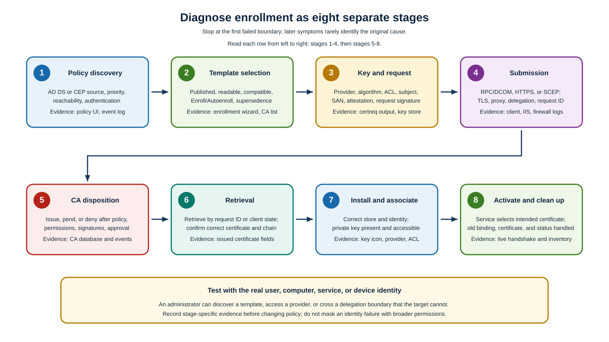

An INF request is a certificate enrollment request whose identity, key, provider, and certificate settings are defined in a plain-text setup information (`.inf`) file. Using an INF file with `certreq.exe` makes enrollment repeatable and lets you create, submit, retrieve, and install a certificate in separate stages, which helps you diagnose failures without exposing the private key.

[](../media/enrollment-stages.svg#lightbox)

The following code sample is for a **controlled server TLS template that explicitly permits the named requester to supply the exact DNS identity**. 

>[!WARNING]
>Don't use this sample against a general authentication template or use arbitrary SAN values. If the template builds identity from AD DS, omit requester-supplied Subject/SAN and let policy populate them.

**`request.inf`**

```ini
[Version]
Signature="$Windows NT$"

[NewRequest]
Subject = "CN=<PkiWebHost>"
MachineKeySet = TRUE
Exportable = FALSE
KeyAlgorithm = RSA
KeyLength = 3072
HashAlgorithm = sha256
ProviderName = "Microsoft Software Key Storage Provider"
ProviderType = 0
RequestType = PKCS10
KeyUsage = 0xa0

[Extensions]
2.5.29.17 = "{text}"
_continue_ = "dns=<PkiWebHost>"

[RequestAttributes]
CertificateTemplate = <TemplateName>
```

This INF enrollment requests a certificate with an RSA 3072-bit machine key in the Microsoft Software KSP, prevents export, and produces a PKCS #10 certificate signing request: a signed structure that carries the public key and requested certificate fields, but never the private key.

- `KeyUsage = 0xa0` requests digital signature and key encipherment, which must match the TLS workload and template.
- The `2.5.29.17` extension is for the SAN.
- `CertificateTemplate` is a request attribute that selects the enterprise template; it doesn't override publication, permissions, or CA policy. 

**Certificate Management over CMS (CMC)** is an alternative request format used when a workflow needs controls such as enrollment-agent signatures or key archival. Before use, replace placeholders and confirm that `<PkiWebHost>` is in the approved service inventory, the requester controls that name, and `<TemplateName>` is a server-only template that permits requester-supplied identity. For an AD-built identity template, remove the supplied Subject and SAN instead of copying this sample unchanged.

## Procedure: Create, submit, retrieve, accept

In this procedure, you'll generate an endpoint-local private key, submit its request, handle issued or pending disposition, and associate the returned certificate with the original key. You need the following permissions: Local administrator for `MachineKeySet = TRUE`; Enroll on `<TemplateName>` and Request Certificates on `<CAName>`; certificate manager only if approval is required.

Run the following command in an elevated command line session to generate the private key and PKCS #10 request locally; keep both the resulting key container and `request.req` associated with this enrollment transaction.

```powershell
certreq.exe -new request.inf request.req
```

Running this command generates the `request.req` file. The selected machine provider stores the private key.

Specify the approved CA connection string to send the request to the intended CA and retrieve the issued certificate from that same CA later.

```powershell
certreq.exe -submit -config "<CAConfig>" request.req issued.cer
```

Running this command returns an issued certificate or a pending disposition with `<RequestId>`. Record the CA config and request ID.

If the CA leaves the request pending, an authorized certificate manager must first validate the required evidence and issue it. Then use the recorded request ID and CA connection string to retrieve that specific certificate.

```powershell
certreq.exe -retrieve -config "<CAConfig>" "<RequestId>" issued.cer
```

Running this command retrieves `issued.cer` from the same CA and corresponds to `<RequestId>`.

Next run the following command on the Windows client endpoint that created the request so Windows can install the certificate and associate it with the existing private key.

```powershell
certreq.exe -accept issued.cer
```

Running this command installs the certificate in the Local Computer\My store and associates it with the original private key. Accepting on a different computer endpoint doesn't create or derive the private key. In this scenario the private key is only present on the original requesting host.

> [!NOTE]
> The issued certificate doesn't contain the private key. This example creates a nonexportable key, so generate a new key and certificate request on another host rather than trying to move this key. For a key created as exportable, the standard transfer method is to export the certificate and private key to a protected PFX file and import it on the destination host.

The Certificates MMC provides the interactive equivalent of native policy discovery, request, renewal, and installation. On the CA, the **Pending Requests** node exposes requests awaiting disposition, while **Issued Certificates** records the request ID, requester, template, serial number, and final disposition after an authorized issue or denial decision.

> [!NOTE]
> Export the public certificate only when another system needs it, and never export the private key merely to simplify installation.

## Diagnose certificate enrollment failures

If you're diagnosing a certificate enrollment failure, use the following table to separate the enrollment lifecycle into diagnostic stages. Start at the first unproven stage rather than changing template permissions in response to a later transport, disposition, installation, or activation failure.

| Stage | Question | Evidence and common failure |
|---|---|---|
| Policy discovery | Did the actual identity reach the intended AD/CEP policy source? | Certificate enrollment policy UI, Group Policy result, CertificateServicesClient logs, DNS/TLS/auth. Wrong policy priority or unreachable CEP |
| Template selection | Is template published, readable, compatible, correct subject type, and eligible? | Wizard visibility, `certutil.exe -catemplates` on CA, template ACL. Read missing, older recipient, supersedence mismatch |
| Key/request creation | Can the identity use the provider/hardware and create the required subject/SAN/attestation? | `certreq.exe` error, TPM/HSM logs, provider inventory, request dump. Wrong context, PIN/UI prompt, unsupported algorithm |
| Submission | Can client reach and authenticate to RPC/DCOM, CES HTTPS, Web Enrollment, or NDES? | Firewall trace, IIS logs, TLS chain/name, proxy, SPN/delegation. Don't confuse HTTP success with CA submission |
| CA disposition | Did publication, CA/template permission, policy, signatures, and approval permit issuance? | CA events and database disposition/message. Request may correctly pend or deny |
| Retrieval | Did the client return to the same CA/request and obtain the issued object/chain? | `<RequestId>`, CA config, `certreq.exe -retrieve`, CES/client state |
| Installation/key association | Is certificate in the correct user/computer store with the original private key and usable ACL? | Certificates MMC key icon, provider/container, service-account access. Acceptance on wrong host/context |
| Activation/cleanup | Did the relying service select the intended certificate, and what happened to the old one? | Live TLS/EAP test, service configuration, thumbprint, archived/store view, revocation and inventory |

Always reproduce as the actual user, computer, service account, or device. An administrator may have Read/Enroll, local provider access, proxy bypass, and delegation rights that the production identity lacks.
