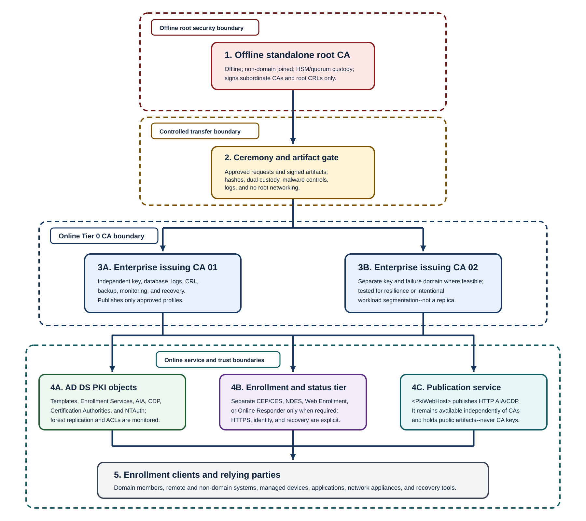

A CA hierarchy delegates signing authority. Each additional tier can create a meaningful policy or custody boundary, but it also adds certificates, publication objects, revocation dependencies, ceremonies, renewal events, and recovery paths.

## CA functions by tier

The following table explains the authority delegated to each possible hierarchy tier and the operational consequences of adding that tier.

| Tier | Function | Normal online state | Typical issuance | Design consequences |
|---|---|---|---|---|
| Root CA | Trust anchor and ultimate delegation authority | Offline for a protected production root | Subordinate CA certificates and root CRLs | Compromise affects the entire hierarchy. Custody and recoverability dominate throughput. |
| Policy/intermediate CA | Separates policy domains, legal entities, assurance classes, or subordinate administrative boundaries | Often offline or tightly controlled; design-specific | Issuing CA certificates and intermediate CRLs | Adds explicit policy isolation but increases path depth, object size, renewal, and publication burden. |
| Issuing CA | Issues end-entity and selected service certificates | Online | User, computer, server, device, signing, encryption, OCSP signing, or other approved profiles | Availability and enrollment scale matter. Compromise affects its issued population and any authentication authority it holds. |

## One-tier, two-tier, and three-tier comparison

> [!NOTE]
> Even though AD CS supports complex topologies, few organizations go beyond two tiers, with an offline root and one or more issuing CAs.

The following table compares common hierarchy depths. Use it to select the simplest topology that enforces the required custody or policy boundary and still meets recovery objectives.

| Topology | When it may fit | Assurance | Availability behavior | Complexity and recovery |
|---|---|---|---|---|
| One-tier online enterprise root | Lab, disposable test, or a narrowly scoped environment with explicitly accepted compromise scope | Lowest separation; root key is continuously exposed to online compromise | One CA failure stops all issuance and root CRL operations | Lowest component count but highest-consequence recovery; replacing the root affects every trust distribution |
| Two-tier offline standalone root plus online issuing CA(s) | Common production starting point | Root key is isolated; issuing compromise can be contained below the root | Existing certificates can validate while an issuer is down if publication remains healthy; multiple issuers improve enrollment/renewal continuity | Moderate ceremonies and recovery; manageable chain depth |
| Three-tier root, policy/intermediate, issuing | Distinct policy/legal/geographic domains require cryptographic delegation boundaries | Strong policy separation if controls are genuinely different | More components can isolate failures, but every extra CA and CRL is a validation dependency | Highest operational burden, path size, renewal coordination, and recovery testing |

> [!NOTE]
> Start with a protected offline standalone root and one or more online enterprise issuing CAs. Add a policy tier only when it enforces a boundary that can't be expressed safely through issuing-CA separation, templates/profiles, administration, or relying-party policy.

### When you might need another tier

Add a policy/intermediate tier only when the answer to at least one of these questions identifies a durable boundary that the organization will operate and audit:

- Are different legal entities or regulated assurance regimes prohibited from sharing a direct issuing authority?
- Must one policy domain be removable without replacing the enterprise root?
- Are independent custodians required to authorize subordinate issuance?
- Does a cross-organization policy mapping require a dedicated intermediate?
- Can the organization fund and test the extra CA keys, CRLs, renewals, publication, monitoring, backups, and ceremonies for the life of every dependent certificate?

If the answer is merely "three tiers look more secure," don't add the tier.

## Offline versus online

An offline CA is a controlled operating mode, not a server that happens to be shut down. The offline CA is only brought online under specific circumstances.

An offline-root design defines:

- Non-domain membership and no routine network connectivity.
- Physical custody, secure storage, tamper evidence, and controlled boot media.
- Local identities and HSM roles that don't depend on online AD DS.
- Approved ceremony scripts for subordinate issue/renewal/revocation and root CRL publication.
- Stable AIA/CDP paths configured before issuance.
- Controlled transfer media, malware checks, custody logs, and artifact hashes.
- A schedule that brings the root online before its CRL, CA certificate, credentials, hardware, or support state becomes unusable.
- Tested backup and recovery on compatible hardware/provider versions.
- Ability to apply software updates in air-gapped environment.

An online issuing CA has the opposite operating profile. It needs restricted Tier 0 administration on a dedicated host, continuous service with sufficient database and log capacity, monitoring, patching, and HSM availability. Reliable publication and revocation signing, governed templates, network-limited enrollment access, and recovery within the issuance and renewal objectives are all part of the online trust boundary.

> [!NOTE]
> Security involves tradeoffs. Whilst having the most secure PKI possible is necessary for some deployments, there are some low security environments where the cost of managing the processes around an offline CA aren't commensurate with the necessities of the overall network infrastructure.

## Hierarchy decision criteria

Approve a topology design only when:

- Every CA tier enforces a named boundary.
- The root can stay offline without missing CRL and subordinate lifecycle deadlines.
- The path length and object size pass every relying-party test.
- Renewal windows allow parent certificates to sign usable subordinate lifetimes.
- Publication remains reachable independently of CA uptime.
- The organization can recover every CA identity, database, configuration, and HSM dependency.
- Root replacement, issuer compromise, and issuer loss have documented containment paths.
