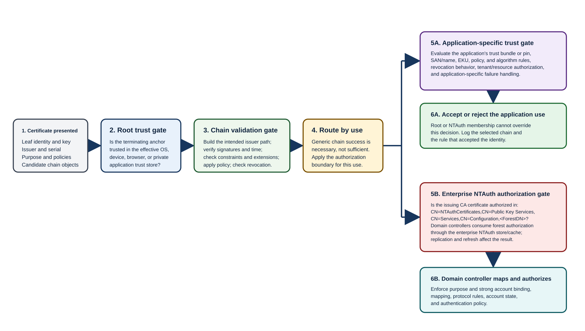

Certificate acceptance is a sequence of independent authorizations. The following table separates four authorization layers that are often confused during deployment and troubleshooting.

| Trust decision | Where it's expressed | What it authorizes | What it doesn't authorize |
|---|---|---|---|
| **Root trust** | OS, device, browser, application, or managed Trusted Root store | Treats the configured certificate as a trust anchor for path evaluation | Any subordinate for AD DS authentication; any name; any EKU; any application-specific use |
| **Chain trust** | Leaf/intermediate signatures, constraints, validity, revocation, policies, and candidate stores/AIA | Establishes a valid path from leaf to an accepted anchor | That the issuer is approved for AD authentication or that the application accepts the identity |
| **Enterprise NTAuth trust** | `cACertificate` values on the forest `NTAuthCertificates` object and the machine's enterprise NTAuth cache | Authorizes listed CA certificates as issuers for certificate-based AD DS authentication scenarios | Root distribution, generic chain completion, account mapping, certificate validity, or an application's private trust decision |
| **Application-specific trust** | Application trust store, allowlist/pin, EKU/name/policy rules, service configuration | Authorizes the certificate for that application transaction | AD DS logon authority or broad OS trust unless explicitly configured |

## Enterprise NTAuth location and use

Enterprise NTAuth is a forest-level allowlist of CA certificates authorized for applicable certificate-based AD DS authentication. Its directory object uses the following distinguished name:

```text
CN=NTAuthCertificates,CN=Public Key Services,CN=Services,CN=Configuration,<ForestDN>
```

It's a `certificationAuthority` object whose multi-valued `cACertificate` attribute contains authorized CA certificates. The configuration partition replicates forest-wide.

For certificate-based AD DS authentication, domain controllers:

1. Build and validate the presented certificate chain under the applicable authentication policy.
1. Determine the CA that issued the authentication certificate.
1. Consult Enterprise NTAuth authorization, normally through the machine enterprise-store cache, to determine whether that CA is authorized to issue certificates used for AD DS authentication.
1. Continue with certificate purpose, identity, account mapping and strong binding (the rules that securely associate certificate identity data with the intended AD account), revocation, account state, and protocol checks.

On a Windows computer, the corresponding enterprise-store cache is represented under the following registry path:

```text
HKLM\SOFTWARE\Microsoft\EnterpriseCertificates\NTAuth\Certificates
```

Group Policy and certificate autoenrollment client processing normally refresh the enterprise store from AD DS. Replication or cache delay can make one domain controller behave differently from another.

Treat each NTAuth change as a change to forest authentication authority. Windows enterprise CAs normally publish their own CA certificate into Enterprise NTAuth as part of enterprise integration, but a standalone, third-party, migrated, or cross-forest CA **isn't** authorized merely because its root is trusted. When such a CA is intentionally allowed to issue AD DS authentication certificates, forest administrators must publish the exact eligible issuing CA certificate through change control.

NTAuth should contain only reviewed issuers with a current AD authentication use, not every CA in a hierarchy "just in case." A CA renewal can create another CA certificate generation, so plan its addition, overlap, replication verification, dependency review, and eventual removal. Removing an entry can break still-valid authentication certificates; addition, replacement, and removal therefore require the same care as other forest trust changes.

## Forest boundaries

AD CS enterprise objects reside in an AD DS forest's configuration partition. These objects include certificate templates, Enrollment Services metadata, AIA/CDP objects, Certification Authorities, and NTAuth. An AD trust doesn't merge those objects or automatically authorize a CA in another forest.

For multi-forest enrollment, decide separately:

- Which forest owns the certificate profile and issuance policy.
- How the requester authenticates and how attributes are obtained.
- How enrollment rights are represented and audited.
- Whether native enrollment, CEP/CES, a registration authority, or another managed channel crosses the boundary.
- How root and intermediate trust are distributed in every forest/device estate.
- Whether the external issuer is authorized in each forest's NTAuth object.
- How template, CA certificate, CRL, and NTAuth changes replicate and are monitored.
- Which forest's incident authority can suspend issuance or remove trust.

> [!NOTE]
> **Security consequence:** Cross-forest issuance can allow one forest's CA or enrollment administrators to create credentials accepted in another forest. Require explicit reciprocal governance; a network or AD trust alone isn't approval.

## Extranet and non-domain boundaries

The following table maps common client populations to suitable enrollment directions and highlights the controls that must cross each boundary.

| Population | Suitable design direction | Boundary controls | Common mistake |
|---|---|---|---|
| Domain member on corporate network | Enterprise CA through autoenrollment, MMC, or `certreq.exe`; direct enrollment where network policy allows | Template authorization, Kerberos, RPC/DCOM restrictions, and CA access control lists (ACLs) | Assuming administrator testing represents the actual computer/user identity |
| Domain member off-network | CEP/CES over HTTPS when its authentication and renewal model fits | TLS, strong client authentication, delegation design, proxy/firewall, service accounts, load balancing | Treating CES as a generic unauthenticated tunnel to the CA |
| Non-domain Windows client | CEP/CES or controlled manual request depending identity and scale | Explicit root/chain distribution, policy credentials, subject/SAN validation, key location | Believing root installation gives enrollment authorization |
| Managed network/mobile device | NDES/SCEP through a device-management authority when SCEP constraints are acceptable | NDES service/RA identity, one-time-password or management authorization, template mapping, HTTPS, separate server | Publishing a broadly privileged authentication template to NDES |
| Public/extranet service | Central issuance through a controlled management plane; validation publication reachable from all clients | No direct CA exposure, stable public AIA/CDP/OCSP, application trust, DNS/TLS controls | Putting the CA or Web Enrollment directly in the perimeter |
| Disconnected system | Controlled file-based request/response and explicit trust distribution, or a designed intermittent CES path | Media custody, identity approval, request integrity, key generated on endpoint, renewal lead time | Generating and transporting private keys centrally without an approved requirement |
