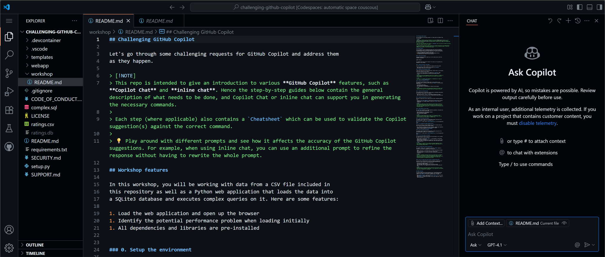

GitHub Copilot is an AI pair programmer that helps you write code faster and with less effort. Copilot works alongside you directly in your code editor, seamlessly integrating AI into your workflow. It provides intelligent code suggestions and completions based on the context of your code, helping you write code more efficiently and accurately. 

General support features:

- Language Support: Supports multiple programming languages and frameworks, adapting to the code you're working on.
- IDE Integration: Works directly in your code editor, providing suggestions and completions as you write code. Is available within the GitHub Codespaces environment.

GitHub Copilot's autocomplete features:

- Code line completions and suggestions are based on the context of your code.
- Suggestions can be single lines of code, entire functions, or even entire classes.

Copilot suggestions can help you write code faster and with fewer errors, improving your productivity and efficiency.

GitHub Copilot Chat's AI assistance features include:

- Chat Interface: Provides a chat interface for interacting with GitHub Copilot, asking and receiving answers to coding-related questions.
- Code Explanation: Provides explanations for selected code snippets, helping you understand syntax, programming concepts, test cases, debugging, and more, without requiring you to navigate documentation or search online forums.
- Documentation Generation: Generates explanations or documentation for selected code or entire workspaces, helping you understand and document your codebase.
- Test Case Generation: Helps in generating test cases for your code, saving time, and improving code quality.
- Code fixes: Provides suggestions for refactoring code and fixing common issues, improving code quality and maintainability.

By using AI to assist with coding tasks, GitHub Copilot can help you focus on higher-level design and problem-solving, rather than getting bogged down in syntax and implementation details.

## Understanding GitHub Codespaces

GitHub Codespaces provides a cloud hosted development environment, ready to use and accessible from any computer with an internet connection and standards compliant web browser. You use GitHub Codespaces within your browser and when a codespace is loaded, you interact with it as you would any traditional IDE. GitHub Codespaces provides you with an environment that includes all the essential languages, tools, and utilities you need to code effectively. 

You can also use the terminal pane within a GitHub Codespace to run commands, such as python scripts.

## Creating a GitHub Codespace

To begin developing using GitHub Codespaces, you can create a codespace from a template or from any branch or commit in a GitHub repository. When you create a codespace from a template, you can start from a blank template or choose a template suitable for the work you're doing.

For example, you can:

- Create a codespace from your GitHub repository.
- Push code from the codespace to your GitHub repository.
- Use VS Code to develop code within the codespace.
- Customize the codespace with custom images.

To open a codespace from your GitHub account, start at the landing page of your repository, choose the Code button, and then choose Create codespace on the repository on the Codespaces tab.

## Customizing GitHub Codespaces

You can customize your project for GitHub Codespaces by committing configuration files to your repository (also known as configuration-as-code), which creates a repeatable codespace configuration for all users of your project. Each codespace you create is hosted by GitHub in a Docker container that runs on a virtual machine. You can choose the type of virtual machine you want to use depending on the resources you need.

You can configure the development container for a repository so that any codespace created for that repository gives you a tailored development environment, complete with all the tools and runtimes you need to work on a specific project. A development container file is a JSON file that lets you customize the default container image that runs your codespace. You can use this JSON file to configure VS Code settings, run custom code, manage network traffic port forwarding, and configure other settings. 

## GitHub Copilot in GitHub Codespaces

One of the tools you can use within a GitHub Codespace is GitHub Copilot.  You can verify that GitHub Copilot and Copilot Chat are available in your GitHub Codespaces environment by checking the Extensions tab and searching for GitHub Copilot and choosing the Install option if GitHub Copilot isn't already present.

You can use the GitHub Copilot icon to open the Copilot Chat panel. You can use the chat panel to interact with code and other artifacts within the GitHub Codespace interface.
