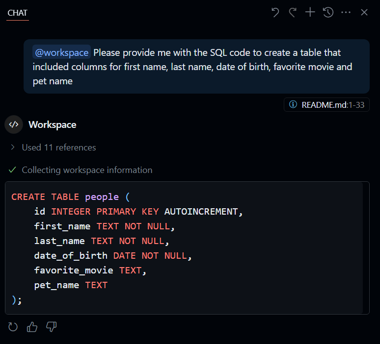

GitHub Copilot can be used to interact with all types of code, this includes interacting with popular programing languages and providing you with the option of writing, debugging, and optimizing SQL code.

GitHub Copilot can perform the following tasks related to SQL code:

- Query Explanation: Use Copilot to explain complex SQL queries to better understand their logic and structure.
- Query Optimization: Ask Copilot for suggestions to optimize slow or inefficient queries, such as removing unnecessary JOINs, optimizing SELECT DISTINCT, or refactoring subqueries.
- Query Refactoring: Request Copilot to rewrite queries for better readability or maintainability, e.g., replacing CROSS JOINs or simplifying nested queries.
- Generating Queries: Have Copilot generate new SQL queries based on your data requirements, such as SELECT, INSERT, UPDATE, or DELETE statements.
- Data Validation: Use Copilot to help write SQL queries that validate data integrity or check for specific conditions in your database.
- Schema Exploration: Ask Copilot to help you write queries that explore or document your database schema (e.g., listing tables, columns, or relationships).
- Test Generation: Request Copilot to generate SQL-based tests or assertions to verify query results or database state.
- Error Debugging: Ask Copilot to help debug SQL errors or suggest fixes for common issues (e.g., syntax errors, missing indexes).
- Prompt Creation: Have Copilot generate prompts or templates for creating high-performing queries from scratch.

GitHub Copilot provides better outcomes when your prompts are more specific. If you provide general prompts, you're likely to receive general answers. If you provide more detail in your prompts and ask more detailed questions, you're more likely to get detailed answers.

For example, you could use GitHub Copilot to provide you with the SQL code to create a table that included columns for first name, last name, date of birth, favorite movie, and pet name by issuing the following prompt:

_@workspace Please provide me with the SQL code to create a table that included columns for first name, last name, date of birth, favorite movie and pet name_

## Understanding an application that includes SQL

For example, if you opened a codespace were presented with an application that included SQL code, you could query GitHub Copilot with the following prompt to understand more about the project in the following manner:

_@workspace Please briefly explain the structure of this project.
What should I do to run it?_

## Understand SQL code

You can use the /explain prompt to understand specific code. For example, a project might contain a file named complex.sql, which contains the query that is being executed in the application. To understand the contents of complex.sql, you can select it within the Explorer pane of GitHub Codespaces and then use the /explain prompt in the chat.

Rather than selecting the whole file, you're able to select sections of the code and ask GitHub Copilot to provide a detail about those sections. 

## Optimize and refactor SQL queries

Sometimes you're presented with queries that are slow or inefficient because there are unnecessary JOINS, tables queried don't have indexes or contain redundant nested subqueries. Using GitHub Copilot, you can select a query and prompt for any optimizations that may improve performance.

Similarly, you can request Copilot to rewrite queries for better readability or maintainability, asking Copilot to provide comments to explain functionality for future developers who may need to review the code.

An example prompt might be:

_"Add detailed comments to the complex.sql file explaining the purpose and functionality of each CTE, SQL clause, and calculation. Make sure to describe what each section of the query does, including how the year is extracted, how the rolling average is computed, the logic behind the performance ratio, and the meaning of each CASE statement. The comments should make it easy for someone unfamiliar with the file to understand the logic and intent of the entire query."_

## Validate integrity of data

Use Copilot to help write SQL queries that validate data integrity or check for specific conditions in your database. For example, you could prompt GitHub Copilot to perform one of the four types of integrity checks:

- Uniqueness / duplicate checks
- Referential integrity (foreign key violations)
- Domain integrity (values within expected ranges)
- Business rule checks (custom logic violations)

An example query might be:

_"Write a SQL query that checks for orphaned foreign keys between Orders and Customers tables."_

## Database schema documentation

You can ask GitHub Copilot to help you write queries that explore or document your database schema. By giving GitHub Copilot the context of the database you're working with, you'll be able to determine whether the code that interacts with that database can be optimized. While GitHub Copilot doesn't deeply analyze the execution plans of queries, but understanding the context of the SQL database you're interacting with, it can provide better advice.

## SQL test generation

You can request that GitHub Copilot to generate SQL-based tests or assertions to verify query results or database state. Copilot can suggest appropriate testing frameworks based on your project type. To configure your testing environment, enter the /setupTests command in the chat input field and follow GitHub Copilot's guidance to configure your project.

GitHub Copilot can help you write tests for your application code by generating test code that covers your codebase. This includes unit tests, end-to-end tests, and tests for edge cases.

## Debugging SQL errors

You can ask GitHub Copilot to help debug SQL errors or suggest fixes for common issues. For example, you can select a file or block of code and ask GitHub Copilot to locate and correct any syntax errors.  

By having GitHub Copilot provide you with full table schema and indexes, you can then have GitHub Copilot generate representative queries against the tables and suggest any additional indexes, which might improve performance.

## GitHub Copilot prompt creation

You can use GitHub Copilot to generate prompts to create code that performs better than existing code. When interacting with GitHub Copilot, provide as much detail in the question as possible to increase the chance that the answer provided meets your requirements. To accomplish this:

1. Have an understanding of the code. This understanding can be derived from existing interaction with GitHub Copilot.
1. Select the original code and open GitHub Copilot Chat.
1. Provide as much detail as possible. For example, you might provide GitHub Copilot chat with the following prompt:

_Given the following requirements:_
_The database is SQLite and contains tables relevant to movie ratings (see the structure in complex.sql)._
_The query should efficiently aggregate and return the top-rated movies by region, minimizing execution time and avoiding unnecessary operations (such as redundant CASTs, unnecessary JOINs, or SELECT DISTINCT if not needed)._
_The result should include movie title, average rating, region, and any other relevant fields._
_The query must complete in under 1.5 seconds on a large dataset.
All business logic and correctness must be preserved as in the original complex.sql._
_Write a high-performance SQL query that fulfills these requirements, and explain any optimizations you apply._
