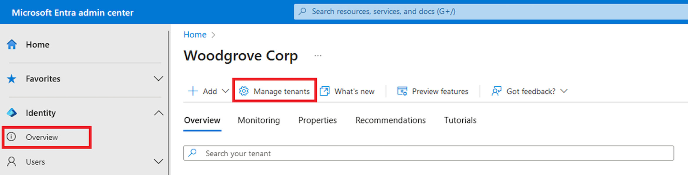
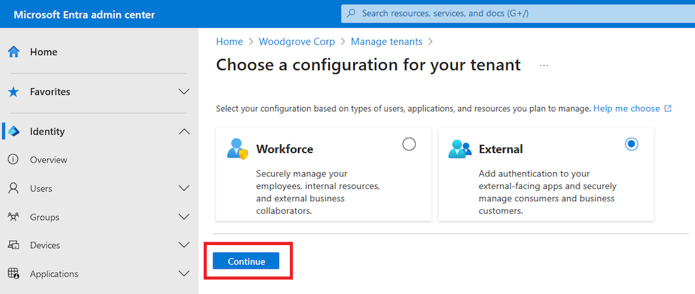

To create a tenant within an existing Azure subscription, perform the following steps:

1. In the [Microsoft Entra admin center](https://entra.microsoft.com/), browse to **Identity** > **Overview** . Then, select **Manage tenants**.

    

1. On the **Manage tenants** page, select **Create**.
1. Select **External**, and then select **Continue**.

    

1. On the **Basics** tab, in the **Create a tenant** page, enter the following information: Type your desired **Tenant Name** (for example Woodgrove live demo). Type your desired **Domain Name** (for example woodgrovelive). Select your desired **Location**. This selection can't be changed later. Then, select **Next: Add a subscription**.
1. On the **Add a subscription** tab, enter the following information: Next to **Subscription**, select your subscription from the menu. Next to **Resource group**, select a resource group from the menu. If there are no available resource groups, select **Create new**, add a name, and then select **OK**. If **Resource group location** appears, select the geographic location of the resource group from the menu. Then, select **Review + Create**.
1. If the information that you entered is correct, select **Create**. The tenant creation process can take up to 30 minutes.
1. You can monitor the progress of the tenant creation process in the **Notifications** pane. Once the tenant is created, you can access it in both the Microsoft Entra admin center and the Azure portal.
1. Use the **Settings** icon in the top menu to **Switch** to your customer tenant you created from the **Directories + subscriptions** menu. If the tenant you created doesn't appear in the list, refresh the page (using the web browser refresh button).
1. Browse to **Home** > **Tenant overview** to start configuring your tenant.

The Microsoft Entra External ID tenant is ready to use.
